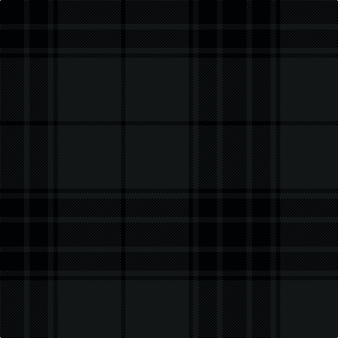

In pattern [KKKKKKK](/stripes/kkkkkkk/).

This was sourced from house-of-tartan.  It is a [7 stripe tartan](/stripes/stripes7/).

Original link http://www.house-of-tartan.scotland.net/house/TartanViewjs.asp?colr=Def&tnam=10119

## Thread count
K/34 Ka8 K26 Ka8 K6 Ka90 K/6

## Palette
Each colour and the base-6 reference it is a variant of.

| Colour | Shade | Base |
|---|---|---|
| K | <code style="background-color:#010204;">#010204</code> `oklch(8.4% 0.012 255.9)` <small>#010204</small> | K <code style="background-color:#000000;">#000000</code> |
| Ka | <code style="background-color:#121617;">#121617</code> `oklch(19.6% 0.007 214.5)` <small>#121617</small> | K <code style="background-color:#000000;">#000000</code> |

# Sample pattern

## Nearest tartans

The nearest existing variants by ΔTartan distance, with this tartan at the top so the swatches line up against it.

ΔTartan

Tartan

Sett

—

<a href="/ttd/edit/#slug=k17k4k13k4k3k45k3~x2">Black Spirit Fashion Tartan Tartan Number: 10119. Earliest known date: ACS Tartan See products available Copyright © Blair Urquhart, Comrie, 2015</a> <a class="nn-out" href="/setts/s7/k17k4k13k4k3k45k3~x2/" title="open its dictionary page">↗</a>

2.19

<a href="/ttd/edit/#slug=k4dt2k43dt20k4dt2k2dt4k2dt2k4dt20k43dt2k4dt2~x2">Dark Island</a> <a class="nn-out" href="/setts/s16/k4dt2k43dt20k4dt2k2dt4k2dt2k4dt20k43dt2k4dt2~x2/" title="open its dictionary page">↗</a>

2.76

<a href="/ttd/edit/#slug=k46dg6k6dg6k42dg47k12">Taiheiyo Club, Inc.</a> <a class="nn-out" href="/setts/s7/k46dg6k6dg6k42dg47k12/" title="open its dictionary page">↗</a>

2.83

<a href="/ttd/edit/#slug=dy6dg2dy29dg29dy2dg6~x2">Harmony 11 #2</a> <a class="nn-out" href="/setts/s6/dy6dg2dy29dg29dy2dg6~x2/" title="open its dictionary page">↗</a>

2.89

<a href="/ttd/edit/#slug=k44dg12dt1o6~x2">Heslop, William D Name Tartan Tartan Number: 10331. Earliest known date: 2011 This tartan was created for the Heslop family descended from William Douglas Heslop, who was born on 1st December 1857. His father, John Heslop was born in Lurdenlaw by Kelso in 1825 and his mother, Jessie Turnbull, was born in Jedburgh in 1826. They married in 1849 and sailed to the USA. The tartan may be worn by anyone with the surname Heslop. The copyright owner is William D Heslop. See products available Copyright © Blair Urquhart, Comrie, 2015</a> <a class="nn-out" href="/setts/s4/k44dg12dt1o6~x2/" title="open its dictionary page">↗</a>

2.91

<a href="/ttd/edit/#slug=dt4k43k20dt7y2~x2">Deighan (Edinburgh)</a> <a class="nn-out" href="/setts/s5/dt4k43k20dt7y2~x2/" title="open its dictionary page">↗</a>

2.97

<a href="/ttd/edit/#slug=do5k2do28k10do26k4do4~x2">Dunbar, John Telfer (Personal)</a> <a class="nn-out" href="/setts/s7/do5k2do28k10do26k4do4~x2/" title="open its dictionary page">↗</a>

3.03

<a href="/ttd/edit/#slug=db13dt13dg21db34dt55do3">Bouncing Blackie (Personal)</a> <a class="nn-out" href="/setts/s6/db13dt13dg21db34dt55do3/" title="open its dictionary page">↗</a>

3.12

<a href="/ttd/edit/#slug=k120db4k12dt36dg3k6">Scottish Football Association (Corp)</a> <a class="nn-out" href="/setts/s6/k120db4k12dt36dg3k6/" title="open its dictionary page">↗</a>

3.14

<a href="/ttd/edit/#slug=dg8dt27dg11do2dg11dt27dg8r2~x2">Hector, James</a> <a class="nn-out" href="/setts/s8/dg8dt27dg11do2dg11dt27dg8r2~x2/" title="open its dictionary page">↗</a>

3.23

<a href="/ttd/edit/#slug=do11n1do4n8r1~x8">Cairns, David (Personal)</a> <a class="nn-out" href="/setts/s5/do11n1do4n8r1~x8/" title="open its dictionary page">↗</a>

## Neighbour map

Every grey dot is one of 14299 variants placed by the first two principal components of the ΔTartan feature space (44% of its variance). Red is this tartan; blue dots are its nearest — click one to open its page.

<svg viewBox="0 0 640 380" role="img" style="max-width:100%;height:auto;border:1px solid #e0e0e0;border-radius:4px;display:block" xmlns="http://www.w3.org/2000/svg"><image href="/nn/cloud.v1.png" width="640" height="380"/><a href="/setts/s16/k4dt2k43dt20k4dt2k2dt4k2dt2k4dt20k43dt2k4dt2~x2/"><circle cx="626.0" cy="300.3" r="4" fill="#3465a4"><title>Dark Island</title></circle></a><a href="/setts/s7/k46dg6k6dg6k42dg47k12/"><circle cx="576.1" cy="366.0" r="4" fill="#3465a4"><title>Taiheiyo Club, Inc.</title></circle></a><a href="/setts/s6/dy6dg2dy29dg29dy2dg6~x2/"><circle cx="621.8" cy="366.0" r="4" fill="#3465a4"><title>Harmony 11 #2</title></circle></a><a href="/setts/s4/k44dg12dt1o6~x2/"><circle cx="626.0" cy="297.4" r="4" fill="#3465a4"><title>Heslop, William D Name Tartan Tartan Number: 10331. Earliest known date: 2011 This tartan was created for the Heslop family descended from William Douglas Heslop, who was born on 1st December 1857. His father, John Heslop was born in Lurdenlaw by Kelso in 1825 and his mother, Jessie Turnbull, was born in Jedburgh in 1826. They married in 1849 and sailed to the USA. The tartan may be worn by anyone with the surname Heslop. The copyright owner is William D Heslop. See products available Copyright © Blair Urquhart, Comrie, 2015</title></circle></a><a href="/setts/s5/dt4k43k20dt7y2~x2/"><circle cx="533.0" cy="302.7" r="4" fill="#3465a4"><title>Deighan (Edinburgh)</title></circle></a><a href="/setts/s7/do5k2do28k10do26k4do4~x2/"><circle cx="626.0" cy="356.2" r="4" fill="#3465a4"><title>Dunbar, John Telfer (Personal)</title></circle></a><a href="/setts/s6/db13dt13dg21db34dt55do3/"><circle cx="528.7" cy="353.0" r="4" fill="#3465a4"><title>Bouncing Blackie (Personal)</title></circle></a><a href="/setts/s6/k120db4k12dt36dg3k6/"><circle cx="626.0" cy="264.9" r="4" fill="#3465a4"><title>Scottish Football Association (Corp)</title></circle></a><a href="/setts/s8/dg8dt27dg11do2dg11dt27dg8r2~x2/"><circle cx="508.8" cy="315.9" r="4" fill="#3465a4"><title>Hector, James</title></circle></a><a href="/setts/s5/do11n1do4n8r1~x8/"><circle cx="545.1" cy="340.1" r="4" fill="#3465a4"><title>Cairns, David (Personal)</title></circle></a><circle cx="626.0" cy="352.6" r="5" fill="#c00000"/></svg>

ID: /setts/s7/k17k4k13k4k3k45k3~x2/
