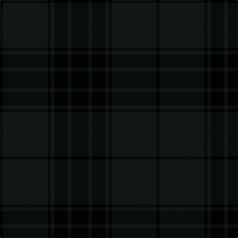

In pattern [KKKKKKK](/patterns/kkkkkkk/).

This was sourced from house-of-tartan.  It is a [7 stripes tartan](/stripes/stripes7/).

Original link http://www.house-of-tartan.scotland.net/house/TartanViewjs.asp?colr=Def&tnam=10119

## Thread count
K/6 Ka90 K6 Ka8 K26 Ka8 K/34

## Palette
Each colour and its ΔE from the base-6 reference it is a variant of.

| Colour | Shade | Base | ΔE (OKLab) |
|---|---|---|---|
| K | <code style="background-color:#010204;">#010204</code> `#010204` | K <code style="background-color:#000000;">#000000</code> | 0.08 |
| Ka | <code style="background-color:#121617;">#121617</code> `#121617` | K <code style="background-color:#000000;">#000000</code> | 0.20 |

# Sample pattern

## Nearest tartans

The nearest existing variants by ΔTartan distance.

1. [Dark Island](/setts/s16/k4b2k43b20k4b2k2b4k2b2k4b20k43b2k4b2x2~b282828-k101010/) — ΔT 2.20
1. [Taiheiyo Club, Inc.](/setts/s7/k46g6k6g6k42g47k12~g003820-k101010/) — ΔT 2.77
1. [Harmony 11 #2](/setts/s6/g6ga2g29ga29g2ga6x2~g005020-ga503c14/) — ΔT 2.82
1. [Heslop, William D Name Tartan Tartan Number: 10331. Earliest known date: 2011 This tartan was created for the Heslop family descended from William Douglas Heslop, who was born on 1st December 1857. His father, John Heslop was born in Lurdenlaw by Kelso in 1825 and his mother, Jessie Turnbull, was born in Jedburgh in 1826. They married in 1849 and sailed to the USA. The tartan may be worn by anyone with the surname Heslop. The copyright owner is William D Heslop. See products available Copyright © Blair Urquhart, Comrie, 2015](/setts/s4/k44g12b1r6x2~b003c64-g002414-k181818-r700000/) — ΔT 2.89
1. [Deighan (Edinburgh)](/setts/s5/b4k43ka20b7g2x2~b1b1b1b-g696969-k01002c-ka101010/) — ΔT 2.91
1. [Dunbar, John Telfer (Personal)](/setts/s7/b5k2b28k10b26k4b4x2~b441800-k101010/) — ΔT 2.98
1. [Bouncing Blackie (Personal)](/setts/s6/b13ba13g21b34ba55bb3~b14143c-ba1c1c1c-bb441800-g003820/) — ΔT 3.03
1. [Scottish Football Association (Corp)](/setts/s6/k120b4k12ba36g3k6~b203078-ba14283c-g006038-k101010/) — ΔT 3.12
1. [Hector, James](/setts/s8/g8b27g11ba2g11b27g8r2x2~b003c64-ba441800-g003820-r880000/) — ΔT 3.13
1. [City of Armadale Australian District Tartan Tartan Number: 5868. Earliest known date: pre 2003 No details known. City of Armadale is in Western Australia. Strictly speaking this should not be categorised as District without documented authorisation from a local government or business body for the area concerned. See products available Copyright © Blair Urquhart, Comrie, 2015](/setts/s10/k21ka2k2ka2k3ka15ka29ka2ka2ka4x2~k101010-ka000000/) — ΔT 3.19

## Neighbour map

Every grey dot is one of 15726 variants placed by the first two principal components of the ΔTartan feature space (44% of its variance). Red is this tartan; blue dots are its nearest — click one to open its page.

<svg viewBox="0 0 640 380" role="img" style="max-width:100%;height:auto;border:1px solid #e0e0e0;border-radius:4px;display:block" xmlns="http://www.w3.org/2000/svg"><image href="/nn/cloud.v1.png" width="640" height="380"/><a href="/setts/s16/k4b2k43b20k4b2k2b4k2b2k4b20k43b2k4b2x2~b282828-k101010/"><circle cx="626.0" cy="270.7" r="4" fill="#3465a4"><title>Dark Island</title></circle></a><a href="/setts/s7/k46g6k6g6k42g47k12~g003820-k101010/"><circle cx="575.8" cy="347.5" r="4" fill="#3465a4"><title>Taiheiyo Club, Inc.</title></circle></a><a href="/setts/s6/g6ga2g29ga29g2ga6x2~g005020-ga503c14/"><circle cx="623.0" cy="342.6" r="4" fill="#3465a4"><title>Harmony 11 #2</title></circle></a><a href="/setts/s4/k44g12b1r6x2~b003c64-g002414-k181818-r700000/"><circle cx="626.0" cy="273.1" r="4" fill="#3465a4"><title>Heslop, William D Name Tartan Tartan Number: 10331. Earliest known date: 2011 This tartan was created for the Heslop family descended from William Douglas Heslop, who was born on 1st December 1857. His father, John Heslop was born in Lurdenlaw by Kelso in 1825 and his mother, Jessie Turnbull, was born in Jedburgh in 1826. They married in 1849 and sailed to the USA. The tartan may be worn by anyone with the surname Heslop. The copyright owner is William D Heslop. See products available Copyright © Blair Urquhart, Comrie, 2015</title></circle></a><a href="/setts/s5/b4k43ka20b7g2x2~b1b1b1b-g696969-k01002c-ka101010/"><circle cx="532.2" cy="278.9" r="4" fill="#3465a4"><title>Deighan (Edinburgh)</title></circle></a><a href="/setts/s7/b5k2b28k10b26k4b4x2~b441800-k101010/"><circle cx="626.0" cy="335.8" r="4" fill="#3465a4"><title>Dunbar, John Telfer (Personal)</title></circle></a><a href="/setts/s6/b13ba13g21b34ba55bb3~b14143c-ba1c1c1c-bb441800-g003820/"><circle cx="529.2" cy="320.3" r="4" fill="#3465a4"><title>Bouncing Blackie (Personal)</title></circle></a><a href="/setts/s6/k120b4k12ba36g3k6~b203078-ba14283c-g006038-k101010/"><circle cx="626.0" cy="242.7" r="4" fill="#3465a4"><title>Scottish Football Association (Corp)</title></circle></a><a href="/setts/s8/g8b27g11ba2g11b27g8r2x2~b003c64-ba441800-g003820-r880000/"><circle cx="508.2" cy="292.0" r="4" fill="#3465a4"><title>Hector, James</title></circle></a><a href="/setts/s10/k21ka2k2ka2k3ka15ka29ka2ka2ka4x2~k101010-ka000000/"><circle cx="456.8" cy="275.2" r="4" fill="#3465a4"><title>City of Armadale Australian District Tartan Tartan Number: 5868. Earliest known date: pre 2003 No details known. City of Armadale is in Western Australia. Strictly speaking this should not be categorised as District without documented authorisation from a local government or business body for the area concerned. See products available Copyright © Blair Urquhart, Comrie, 2015</title></circle></a><circle cx="626.0" cy="325.9" r="5" fill="#c00000"/></svg>

ID: /setts/s7/k17ka4k13ka4k3ka45k3x2~k010204-ka121617/
