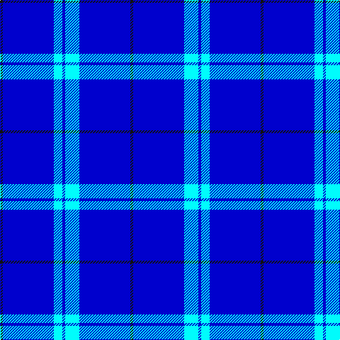

In pattern [KBWBWBK](/patterns/kbwbwbk/).

This was sourced from register-of-tartans.  It is a [7 stripes tartan](/stripes/stripes7/).

Original link https://www.tartanregister.gov.uk/tartanDetails.aspx?ref=11405

## Thread count
K/4 B72 LB12 B4 LB20 B72 K/4

## Palette
Each colour and its ΔE from the base-6 reference it is a variant of.

| Colour | Shade | Base | ΔE (OKLab) |
|---|---|---|---|
| B | <code style="background-color:#0000CD;">#0000CD</code> `#0000CD` | B <code style="background-color:#2A418A;">#2A418A</code> | 0.14 |
| K | <code style="background-color:#101010;">#101010</code> `#101010` | K <code style="background-color:#000000;">#000000</code> | 0.17 |
| LB | <code style="background-color:#00FCFC;">#00FCFC</code> `#00FCFC` | W <code style="background-color:#F7F7F7;">#F7F7F7</code> | 0.17 |

# Sample pattern

## Nearest tartans

The nearest existing variants by ΔTartan distance.

1. [Agua](/setts/s6/w13r2b13r2b70w3~b0000cd-re1523d-w82cffd~x2/) — ΔT 1.52
1. [Steffen, Markus (Personal)](/setts/s6/b35w4b10r3ra3r3~b00009c-r8b1c62-rab0171f-wffffff~x4/) — ΔT 2.07
1. [Royal Warrant Holders](/setts/s8/b61y3ba2w2b20w2b4y4~b0000ff-ba202060-we0e0e0-ye8c000~x2/) — ΔT 2.33
1. [Auchairne](/setts/s6/b10ba6b3ba62w4ba5~b8080d0-ba000050-we0e0e0~x2/) — ΔT 2.66
1. [Waugh](/setts/s5/b100g10k5g10r8~b000080-g65909a-k000000-rb22222/) — ΔT 2.69
1. [Duke of York (Royal)](/setts/s8/b61r6w2r8y2b3y2b15~b00008c-r8c0000-wfcfcfc-yc88c00~x2/) — ΔT 2.76
1. [Sultan of Qaboo's Air Force](/setts/s6/b24ba6b10ba6b32y3~b1c0070-ba5c8ca8-ye8c000~x2/) — ΔT 2.83
1. [Gulfmark (Corporate)](/setts/s5/b72ba6b12ba17w6~b2c2c80-ba2888c4-we0e0e0~x2/) — ΔT 2.84
1. [Jouy (La Chapelle Saint Sulpice) (Personal)](/setts/s13/b5w5b5w5b15w1y2w1b21ya2b5k2ya4~b0000ff-k000000-wffffff-yff8c00-yaffff00~x2/) — ΔT 2.87
1. [RAAF](/setts/s9/b66w2b10w2b10w2b12r3ba24~b1c0070-ba5c8ca8-rc80000-we0e0e0~x2/) — ΔT 2.88

## Neighbour map

Every grey dot is one of 15726 variants placed by the first two principal components of the ΔTartan feature space (44% of its variance). Red is this tartan; blue dots are its nearest — click one to open its page.

<svg viewBox="0 0 640 380" role="img" style="max-width:100%;height:auto;border:1px solid #e0e0e0;border-radius:4px;display:block" xmlns="http://www.w3.org/2000/svg"><image href="/nn/cloud.v1.png" width="640" height="380"/><a href="/setts/s6/w13r2b13r2b70w3~b0000cd-re1523d-w82cffd~x2/"><circle cx="560.3" cy="168.6" r="4" fill="#3465a4"><title>Agua</title></circle></a><a href="/setts/s6/b35w4b10r3ra3r3~b00009c-r8b1c62-rab0171f-wffffff~x4/"><circle cx="463.6" cy="196.7" r="4" fill="#3465a4"><title>Steffen, Markus (Personal)</title></circle></a><a href="/setts/s8/b61y3ba2w2b20w2b4y4~b0000ff-ba202060-we0e0e0-ye8c000~x2/"><circle cx="588.1" cy="141.0" r="4" fill="#3465a4"><title>Royal Warrant Holders</title></circle></a><a href="/setts/s6/b10ba6b3ba62w4ba5~b8080d0-ba000050-we0e0e0~x2/"><circle cx="550.0" cy="190.2" r="4" fill="#3465a4"><title>Auchairne</title></circle></a><a href="/setts/s5/b100g10k5g10r8~b000080-g65909a-k000000-rb22222/"><circle cx="498.1" cy="185.9" r="4" fill="#3465a4"><title>Waugh</title></circle></a><a href="/setts/s8/b61r6w2r8y2b3y2b15~b00008c-r8c0000-wfcfcfc-yc88c00~x2/"><circle cx="548.3" cy="144.0" r="4" fill="#3465a4"><title>Duke of York (Royal)</title></circle></a><a href="/setts/s6/b24ba6b10ba6b32y3~b1c0070-ba5c8ca8-ye8c000~x2/"><circle cx="508.8" cy="256.1" r="4" fill="#3465a4"><title>Sultan of Qaboo's Air Force</title></circle></a><a href="/setts/s5/b72ba6b12ba17w6~b2c2c80-ba2888c4-we0e0e0~x2/"><circle cx="494.3" cy="234.1" r="4" fill="#3465a4"><title>Gulfmark (Corporate)</title></circle></a><a href="/setts/s13/b5w5b5w5b15w1y2w1b21ya2b5k2ya4~b0000ff-k000000-wffffff-yff8c00-yaffff00~x2/"><circle cx="336.0" cy="116.8" r="4" fill="#3465a4"><title>Jouy (La Chapelle Saint Sulpice) (Personal)</title></circle></a><a href="/setts/s9/b66w2b10w2b10w2b12r3ba24~b1c0070-ba5c8ca8-rc80000-we0e0e0~x2/"><circle cx="492.1" cy="136.3" r="4" fill="#3465a4"><title>RAAF</title></circle></a><circle cx="479.6" cy="198.1" r="5" fill="#c00000"/></svg>

ID: /setts/s7/k1b18w5b1w3b18k1~b0000cd-k101010-w00fcfc~x4/
