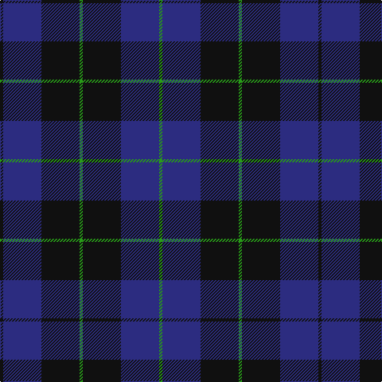

This page is one **sett** — a single exact thread-count. It belongs to the [tartan](/tartans/k1db12k12g1k12db12g1/)
(the same proportion at any scale), whose colour order is pattern [GBKGKBK](/stripes/gbkgkbk/).

Sourced from tartans-authority.  It is a [7 stripe tartan](/stripes/stripes7/).

Original link http://www.tartansauthority.com/tartan-ferret/display/2521/

## Also known as

This cloth is also recorded under:

- Marchmont Personal

2 attestations — the source records this cloth was collapsed from (oldest owns this page)

<ul>
<li>1997 — Marchmont (Personal) (tartans-authority, <a href="http://www.tartansauthority.com/tartan-ferret/display/2521/">record</a>)</li>
<li>undated — Marchmont Personal Tartan Tartan Number: 2521. Earliest known date: 1997 Designed by Keith Lumsden of Scottish Tartans Society. A tartan for personal blankets and clothing. See products available Copyright © Blair Urquhart, Comrie, 2015 (house-of-tartan, <a href="http://www.house-of-tartan.scotland.net/house/TartanViewjs.asp?colr=Def&tnam=2521">record</a>)</li>
</ul>

## Thread count
K/4 DB48 K48 G4 K48 DB48 G/4

## Palette
Each colour and the base-6 reference it is a variant of.

| Colour | Shade | Base |
|---|---|---|
| DB | <code style="background-color:#2C2C80;">#2C2C80</code> `oklch(35.0% 0.138 276.6)` <small>#2C2C80</small> | B <code style="background-color:#2A418A;">#2A418A</code> |
| G | <code style="background-color:#289C18;">#289C18</code> `oklch(60.6% 0.191 141.6)` <small>#289C18</small> | G <code style="background-color:#006100;">#006100</code> |
| K | <code style="background-color:#101010;">#101010</code> `oklch(17.3% 0.000 89.9)` <small>#101010</small> | K <code style="background-color:#000000;">#000000</code> |

# Sample pattern

## Nearest tartans

The nearest existing variants by ΔTartan distance, with this tartan at the top so the swatches line up against it.

ΔTartan

Tartan

Sett

—

<a href="/ttd/edit/#slug=k1db12k12g1k12db12g1~x4">Marchmont (Personal)</a> <a class="nn-out" href="/setts/s7/k1db12k12g1k12db12g1~x4/" title="open its dictionary page">↗</a>

0.80

<a href="/ttd/edit/#slug=k15db4k15db28r2~x2">MacKay (Blue) #2</a> <a class="nn-out" href="/setts/s5/k15db4k15db28r2~x2/" title="open its dictionary page">↗</a>

0.93

<a href="/ttd/edit/#slug=db37r10dg22db11dg3r3~x2">Perthshire, New /Tourist Board</a> <a class="nn-out" href="/setts/s6/db37r10dg22db11dg3r3~x2/" title="open its dictionary page">↗</a>

1.05

<a href="/ttd/edit/#slug=db8k39db8k39db87r6">Largan (?)</a> <a class="nn-out" href="/setts/s6/db8k39db8k39db87r6/" title="open its dictionary page">↗</a>

1.06

<a href="/ttd/edit/#slug=k6db10k10b1k1b1k10b6~x4">Oban</a> <a class="nn-out" href="/setts/s8/k6db10k10b1k1b1k10b6~x4/" title="open its dictionary page">↗</a>

1.15

<a href="/ttd/edit/#slug=db2k11db5k1db5k1~x6">Gagetown (School)</a> <a class="nn-out" href="/setts/s6/db2k11db5k1db5k1~x6/" title="open its dictionary page">↗</a>

1.23

<a href="/ttd/edit/#slug=db12k12g1k12db12g1db12k12g1k12db12k1~x4">Marchmont (Personal)</a> <a class="nn-out" href="/setts/s12/db12k12g1k12db12g1db12k12g1k12db12k1~x4/" title="open its dictionary page">↗</a>

1.23

<a href="/ttd/edit/#slug=k3db23k17r2~x2">Wellington Variation</a> <a class="nn-out" href="/setts/s4/k3db23k17r2~x2/" title="open its dictionary page">↗</a>

1.24

<a href="/ttd/edit/#slug=db5k2db14k14db2lr2~x2">Royal Scotsman Train (Corporate)</a> <a class="nn-out" href="/setts/s6/db5k2db14k14db2lr2~x2/" title="open its dictionary page">↗</a>

1.25

<a href="/ttd/edit/#slug=db1k3db1k3db8r1~x4">Morgan (MacKay Blue) Clan Tartan Tartan Number: 264. Earliest known date: 1842 The design comes from the Vestiarium Scoticum (1842). The authors, the Sobieski Stuart brothers, enjoyed a popular following among the Scottish gentry in the early Victorian era, and in the spirit of the times, added mystery, romance and some spurious historical documentation to the subject of tartan. Of the better known tartans, the book offers some minor variation, but in other cases it provides the only recorded version of many tartans in use today. See products available Copyright © Blair Urquhart, Comrie, 2015</a> <a class="nn-out" href="/setts/s6/db1k3db1k3db8r1~x4/" title="open its dictionary page">↗</a>

1.35

<a href="/ttd/edit/#slug=k20db2k6db2k4db27w2db8~x2">Pride of Kinross</a> <a class="nn-out" href="/setts/s8/k20db2k6db2k4db27w2db8~x2/" title="open its dictionary page">↗</a>

## Neighbour map

Every grey dot is one of 14299 variants placed by the first two principal components of the ΔTartan feature space (44% of its variance). Red is this tartan; blue dots are its nearest — click one to open its page.

<svg viewBox="0 0 640 380" role="img" style="max-width:100%;height:auto;border:1px solid #e0e0e0;border-radius:4px;display:block" xmlns="http://www.w3.org/2000/svg"><image href="/nn/cloud.v1.png" width="640" height="380"/><a href="/setts/s5/k15db4k15db28r2~x2/"><circle cx="378.4" cy="270.1" r="4" fill="#3465a4"><title>MacKay (Blue) #2</title></circle></a><a href="/setts/s6/db37r10dg22db11dg3r3~x2/"><circle cx="387.9" cy="265.7" r="4" fill="#3465a4"><title>Perthshire, New /Tourist Board</title></circle></a><a href="/setts/s6/db8k39db8k39db87r6/"><circle cx="429.9" cy="254.8" r="4" fill="#3465a4"><title>Largan (?)</title></circle></a><a href="/setts/s8/k6db10k10b1k1b1k10b6~x4/"><circle cx="367.7" cy="263.7" r="4" fill="#3465a4"><title>Oban</title></circle></a><a href="/setts/s6/db2k11db5k1db5k1~x6/"><circle cx="413.5" cy="280.1" r="4" fill="#3465a4"><title>Gagetown (School)</title></circle></a><a href="/setts/s12/db12k12g1k12db12g1db12k12g1k12db12k1~x4/"><circle cx="353.1" cy="258.0" r="4" fill="#3465a4"><title>Marchmont (Personal)</title></circle></a><a href="/setts/s4/k3db23k17r2~x2/"><circle cx="394.5" cy="285.2" r="4" fill="#3465a4"><title>Wellington Variation</title></circle></a><a href="/setts/s6/db5k2db14k14db2lr2~x2/"><circle cx="353.1" cy="270.6" r="4" fill="#3465a4"><title>Royal Scotsman Train (Corporate)</title></circle></a><a href="/setts/s6/db1k3db1k3db8r1~x4/"><circle cx="404.3" cy="271.9" r="4" fill="#3465a4"><title>Morgan (MacKay Blue) Clan Tartan Tartan Number: 264. Earliest known date: 1842 The design comes from the Vestiarium Scoticum (1842). The authors, the Sobieski Stuart brothers, enjoyed a popular following among the Scottish gentry in the early Victorian era, and in the spirit of the times, added mystery, romance and some spurious historical documentation to the subject of tartan. Of the better known tartans, the book offers some minor variation, but in other cases it provides the only recorded version of many tartans in use today. See products available Copyright © Blair Urquhart, Comrie, 2015</title></circle></a><a href="/setts/s8/k20db2k6db2k4db27w2db8~x2/"><circle cx="389.9" cy="221.9" r="4" fill="#3465a4"><title>Pride of Kinross</title></circle></a><circle cx="366.9" cy="264.5" r="5" fill="#c00000"/></svg>

ID: /setts/s7/k1db12k12g1k12db12g1~x4/
