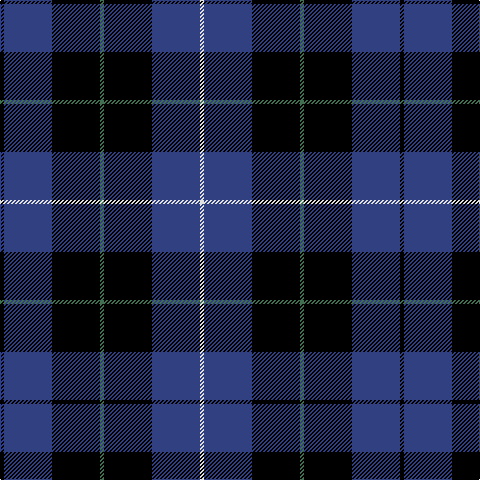

This page is one **sett** — a single exact thread-count. It belongs to the [tartan](/tartans/k1b12k12g1k12b12ln1/)
(the same proportion at any scale), whose colour order is pattern [KBKGKBW](/stripes/kbkgkbw/).

Sourced from weddslist.  It is a [7 stripe tartan](/stripes/stripes7/).

Original link http://www.weddslist.com/cgi-bin/tartans/pg.pl?source=sts

## Thread count
K/4 B48 K48 G4 K48 B48 LN/4

## Palette
Each colour and the base-6 reference it is a variant of.

| Colour | Shade | Base |
|---|---|---|
| B | <code style="background-color:#304080;">#304080</code> `oklch(39.4% 0.109 270.2)` <small>#304080</small> | B <code style="background-color:#2A418A;">#2A418A</code> |
| G | <code style="background-color:#407050;">#407050</code> `oklch(50.1% 0.074 153.7)` <small>#407050</small> | G <code style="background-color:#006100;">#006100</code> |
| K | <code style="background-color:#000000;">#000000</code> `oklch(0.0% 0.000 0.0)` <small>#000000</small> | K <code style="background-color:#000000;">#000000</code> |
| LN | <code style="background-color:#E0E0E0;">#E0E0E0</code> `oklch(90.7% 0.000 89.9)` <small>#E0E0E0</small> | W <code style="background-color:#F7F7F7;">#F7F7F7</code> |

# Sample pattern

## Nearest tartans

The nearest existing variants by ΔTartan distance, with this tartan at the top so the swatches line up against it.

ΔTartan

Tartan

Sett

—

<a href="/ttd/edit/#slug=k1db12k12g1k12db12w1~x4">Marchmont</a> <a class="nn-out" href="/setts/s7/k1db12k12g1k12db12w1~x4/" title="open its dictionary page">↗</a>

0.87

<a href="/ttd/edit/#slug=k6db50k29b6k29db6">Scottish Express International</a> <a class="nn-out" href="/setts/s6/k6db50k29b6k29db6/" title="open its dictionary page">↗</a>

1.00

<a href="/ttd/edit/#slug=k6lo2k16t6k3db18k2~x2">Carrick High School</a> <a class="nn-out" href="/setts/s7/k6lo2k16t6k3db18k2~x2/" title="open its dictionary page">↗</a>

1.15

<a href="/ttd/edit/#slug=k21db3k12r2db12k2db12w2~x2">Inverness Caledonian Thistle Football Club</a> <a class="nn-out" href="/setts/s8/k21db3k12r2db12k2db12w2~x2/" title="open its dictionary page">↗</a>

1.17

<a href="/ttd/edit/#slug=k15y2k10db18w3~x2">College of Radiographers</a> <a class="nn-out" href="/setts/s5/k15y2k10db18w3~x2/" title="open its dictionary page">↗</a>

1.27

<a href="/ttd/edit/#slug=k4dg3dp18k18lb2~x2">Wcwm 1106-2</a> <a class="nn-out" href="/setts/s5/k4dg3dp18k18lb2~x2/" title="open its dictionary page">↗</a>

1.31

<a href="/ttd/edit/#slug=k15lo2k10db18lb3~x2">College of Radiographers</a> <a class="nn-out" href="/setts/s5/k15lo2k10db18lb3~x2/" title="open its dictionary page">↗</a>

1.36

<a href="/ttd/edit/#slug=k15ly2k10db18w3~x2">College of Radiographers Corporate Tartan Tartan Number: 1274. Earliest known date: 1988 Marketed in Edinburgh around 1930s but no longer seen. See products available Copyright © Blair Urquhart, Comrie, 2015</a> <a class="nn-out" href="/setts/s5/k15ly2k10db18w3~x2/" title="open its dictionary page">↗</a>

1.44

<a href="/ttd/edit/#slug=dg4k4dg23k11r2k2r2k20w4~x2">New Golf Club</a> <a class="nn-out" href="/setts/s9/dg4k4dg23k11r2k2r2k20w4~x2/" title="open its dictionary page">↗</a>

1.57

<a href="/ttd/edit/#slug=k7r2k2k6lo1k1lo1k4~x4">Printing Industries of America</a> <a class="nn-out" href="/setts/s8/k7r2k2k6lo1k1lo1k4~x4/" title="open its dictionary page">↗</a>

1.57

<a href="/ttd/edit/#slug=n6db3n6db20k20db8w4~x2">Allianz Deutschland 2012</a> <a class="nn-out" href="/setts/s7/n6db3n6db20k20db8w4~x2/" title="open its dictionary page">↗</a>

## Neighbour map

Every grey dot is one of 14299 variants placed by the first two principal components of the ΔTartan feature space (44% of its variance). Red is this tartan; blue dots are its nearest — click one to open its page.

<svg viewBox="0 0 640 380" role="img" style="max-width:100%;height:auto;border:1px solid #e0e0e0;border-radius:4px;display:block" xmlns="http://www.w3.org/2000/svg"><image href="/nn/cloud.v1.png" width="640" height="380"/><a href="/setts/s6/k6db50k29b6k29db6/"><circle cx="255.9" cy="234.7" r="4" fill="#3465a4"><title>Scottish Express International</title></circle></a><a href="/setts/s7/k6lo2k16t6k3db18k2~x2/"><circle cx="249.9" cy="217.8" r="4" fill="#3465a4"><title>Carrick High School</title></circle></a><a href="/setts/s8/k21db3k12r2db12k2db12w2~x2/"><circle cx="310.8" cy="227.4" r="4" fill="#3465a4"><title>Inverness Caledonian Thistle Football Club</title></circle></a><a href="/setts/s5/k15y2k10db18w3~x2/"><circle cx="250.7" cy="240.1" r="4" fill="#3465a4"><title>College of Radiographers</title></circle></a><a href="/setts/s5/k4dg3dp18k18lb2~x2/"><circle cx="271.8" cy="231.2" r="4" fill="#3465a4"><title>Wcwm 1106-2</title></circle></a><a href="/setts/s5/k15lo2k10db18lb3~x2/"><circle cx="273.8" cy="252.7" r="4" fill="#3465a4"><title>College of Radiographers</title></circle></a><a href="/setts/s5/k15ly2k10db18w3~x2/"><circle cx="267.5" cy="244.6" r="4" fill="#3465a4"><title>College of Radiographers Corporate Tartan Tartan Number: 1274. Earliest known date: 1988 Marketed in Edinburgh around 1930s but no longer seen. See products available Copyright © Blair Urquhart, Comrie, 2015</title></circle></a><a href="/setts/s9/dg4k4dg23k11r2k2r2k20w4~x2/"><circle cx="288.1" cy="193.2" r="4" fill="#3465a4"><title>New Golf Club</title></circle></a><a href="/setts/s8/k7r2k2k6lo1k1lo1k4~x4/"><circle cx="231.3" cy="236.5" r="4" fill="#3465a4"><title>Printing Industries of America</title></circle></a><a href="/setts/s7/n6db3n6db20k20db8w4~x2/"><circle cx="199.7" cy="236.2" r="4" fill="#3465a4"><title>Allianz Deutschland 2012</title></circle></a><circle cx="284.8" cy="218.0" r="5" fill="#c00000"/></svg>

ID: /setts/s7/k1db12k12g1k12db12w1~x4/
