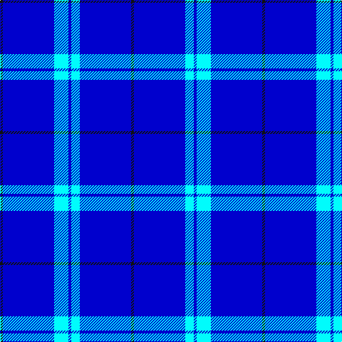

This page is one **sett** — a single exact thread-count. It belongs to the [tartan](/tartans/k1db18lt5db1lt3db18k1/)
(the same proportion at any scale), whose colour order is pattern [KBWBWBK](/stripes/kbwbwbk/).

Sourced from register-of-tartans.  It is a [7 stripe tartan](/stripes/stripes7/).

Original link https://www.tartanregister.gov.uk/tartanDetails.aspx?ref=11405

## Register references

External register numbers recorded for this tartan.

- Scottish Register of Tartans: [11405](https://www.tartanregister.gov.uk/tartanDetails.aspx?ref=11405)

## Thread count
K/4 B72 LB20 B4 LB12 B72 K/4

## Palette

Palette: <strong>Tartan Register</strong>
<table><thead><tr><th>Colour</th><th>Threads</th><th>Shade</th><th>Base</th><th>OKLCh</th></tr></thead><tbody><tr><td>K/</td><td style="text-align:right;font-variant-numeric:tabular-nums">4</td><td><code style="background-color:#101010;">#101010</code> <small style="color:#888">#101010</small></td><td>K <code style="background-color:#000000;">#000000</code></td><td><small style="color:#888">oklch(17.3% 0.000 89.9)</small></td></tr><tr><td>B</td><td style="text-align:right;font-variant-numeric:tabular-nums">72</td><td><code style="background-color:#0000CD;">#0000CD</code> <small style="color:#888">#0000CD</small></td><td>B <code style="background-color:#2A418A;">#2A418A</code></td><td><small style="color:#888">oklch(38.3% 0.266 264.1)</small></td></tr><tr><td>LB</td><td style="text-align:right;font-variant-numeric:tabular-nums">20</td><td><code style="background-color:#00FCFC;">#00FCFC</code> <small style="color:#888">#00FCFC</small></td><td>W <code style="background-color:#F7F7F7;">#F7F7F7</code></td><td><small style="color:#888">oklch(89.7% 0.153 194.8)</small></td></tr><tr><td>B</td><td style="text-align:right;font-variant-numeric:tabular-nums">4</td><td><code style="background-color:#0000CD;">#0000CD</code> <small style="color:#888">#0000CD</small></td><td>B <code style="background-color:#2A418A;">#2A418A</code></td><td><small style="color:#888">oklch(38.3% 0.266 264.1)</small></td></tr><tr><td>LB</td><td style="text-align:right;font-variant-numeric:tabular-nums">12</td><td><code style="background-color:#00FCFC;">#00FCFC</code> <small style="color:#888">#00FCFC</small></td><td>W <code style="background-color:#F7F7F7;">#F7F7F7</code></td><td><small style="color:#888">oklch(89.7% 0.153 194.8)</small></td></tr><tr><td>B</td><td style="text-align:right;font-variant-numeric:tabular-nums">72</td><td><code style="background-color:#0000CD;">#0000CD</code> <small style="color:#888">#0000CD</small></td><td>B <code style="background-color:#2A418A;">#2A418A</code></td><td><small style="color:#888">oklch(38.3% 0.266 264.1)</small></td></tr><tr><td>K/</td><td style="text-align:right;font-variant-numeric:tabular-nums">4</td><td><code style="background-color:#101010;">#101010</code> <small style="color:#888">#101010</small></td><td>K <code style="background-color:#000000;">#000000</code></td><td><small style="color:#888">oklch(17.3% 0.000 89.9)</small></td></tr></tbody></table>

# Sample pattern

## Nearest tartans

The nearest existing variants by ΔTartan distance, with this tartan at the top so the swatches line up against it.

ΔTartan

Tartan

Sett

—

<a href="/ttd/edit/#slug=k1db18lt5db1lt3db18k1~x4">Blueheart</a> <a class="nn-out" href="/setts/s7/k1db18lt5db1lt3db18k1~x4/" title="open its dictionary page">↗</a>

1.53

<a href="/ttd/edit/#slug=lt13r2db13r2db70lt3~x2">Agua</a> <a class="nn-out" href="/setts/s6/lt13r2db13r2db70lt3~x2/" title="open its dictionary page">↗</a>

2.08

<a href="/ttd/edit/#slug=db35w4db10m3r3m3~x4">Steffen, Markus (Personal)</a> <a class="nn-out" href="/setts/s6/db35w4db10m3r3m3~x4/" title="open its dictionary page">↗</a>

2.33

<a href="/ttd/edit/#slug=b61ly3db2w2b20w2b4ly4~x2">Royal Warrant Holders</a> <a class="nn-out" href="/setts/s8/b61ly3db2w2b20w2b4ly4~x2/" title="open its dictionary page">↗</a>

2.67

<a href="/ttd/edit/#slug=b10db6b3db62w4db5~x2">Auchairne</a> <a class="nn-out" href="/setts/s6/b10db6b3db62w4db5~x2/" title="open its dictionary page">↗</a>

2.69

<a href="/ttd/edit/#slug=db100y10k5y10r8">Waugh</a> <a class="nn-out" href="/setts/s5/db100y10k5y10r8/" title="open its dictionary page">↗</a>

2.77

<a href="/ttd/edit/#slug=db61r6w2r8lo2db3lo2db15~x2">Duke of York (Royal)</a> <a class="nn-out" href="/setts/s8/db61r6w2r8lo2db3lo2db15~x2/" title="open its dictionary page">↗</a>

2.84

<a href="/ttd/edit/#slug=db72t6db12t17w6~x2">Gulfmark (Corporate)</a> <a class="nn-out" href="/setts/s5/db72t6db12t17w6~x2/" title="open its dictionary page">↗</a>

2.84

<a href="/ttd/edit/#slug=db24t6db10t6db32ly3~x2">Sultan of Qaboo's Air Force</a> <a class="nn-out" href="/setts/s6/db24t6db10t6db32ly3~x2/" title="open its dictionary page">↗</a>

2.87

<a href="/ttd/edit/#slug=b5w5b5w5b15w1lo2w1b21ly2b5k2ly4~x2">Jouy (La Chapelle Saint Sulpice) (Personal)</a> <a class="nn-out" href="/setts/s13/b5w5b5w5b15w1lo2w1b21ly2b5k2ly4~x2/" title="open its dictionary page">↗</a>

2.88

<a href="/ttd/edit/#slug=db66w2db10w2db10w2db12r3t24~x2">RAAF</a> <a class="nn-out" href="/setts/s9/db66w2db10w2db10w2db12r3t24~x2/" title="open its dictionary page">↗</a>

## Neighbour map

Every grey dot is one of 14299 variants placed by the first two principal components of the ΔTartan feature space (44% of its variance). Red is this tartan; blue dots are its nearest — click one to open its page.

<svg viewBox="0 0 640 380" role="img" style="max-width:100%;height:auto;border:1px solid #e0e0e0;border-radius:4px;display:block" xmlns="http://www.w3.org/2000/svg"><image href="/nn/cloud.v1.png" width="640" height="380"/><a href="/setts/s6/lt13r2db13r2db70lt3~x2/"><circle cx="564.0" cy="165.0" r="4" fill="#3465a4"><title>Agua</title></circle></a><a href="/setts/s6/db35w4db10m3r3m3~x4/"><circle cx="466.8" cy="192.8" r="4" fill="#3465a4"><title>Steffen, Markus (Personal)</title></circle></a><a href="/setts/s8/b61ly3db2w2b20w2b4ly4~x2/"><circle cx="592.0" cy="137.4" r="4" fill="#3465a4"><title>Royal Warrant Holders</title></circle></a><a href="/setts/s6/b10db6b3db62w4db5~x2/"><circle cx="553.1" cy="185.2" r="4" fill="#3465a4"><title>Auchairne</title></circle></a><a href="/setts/s5/db100y10k5y10r8/"><circle cx="501.3" cy="184.5" r="4" fill="#3465a4"><title>Waugh</title></circle></a><a href="/setts/s8/db61r6w2r8lo2db3lo2db15~x2/"><circle cx="551.2" cy="141.5" r="4" fill="#3465a4"><title>Duke of York (Royal)</title></circle></a><a href="/setts/s5/db72t6db12t17w6~x2/"><circle cx="496.7" cy="232.9" r="4" fill="#3465a4"><title>Gulfmark (Corporate)</title></circle></a><a href="/setts/s6/db24t6db10t6db32ly3~x2/"><circle cx="511.2" cy="252.1" r="4" fill="#3465a4"><title>Sultan of Qaboo's Air Force</title></circle></a><a href="/setts/s13/b5w5b5w5b15w1lo2w1b21ly2b5k2ly4~x2/"><circle cx="340.0" cy="113.4" r="4" fill="#3465a4"><title>Jouy (La Chapelle Saint Sulpice) (Personal)</title></circle></a><a href="/setts/s9/db66w2db10w2db10w2db12r3t24~x2/"><circle cx="494.9" cy="133.7" r="4" fill="#3465a4"><title>RAAF</title></circle></a><circle cx="483.8" cy="193.8" r="5" fill="#c00000"/></svg>

ID: /setts/s7/k1db18lt5db1lt3db18k1~x4/
