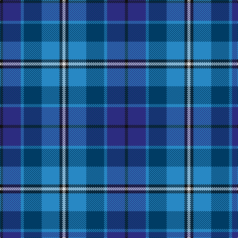

This page is one **sett** — a single exact thread-count. It belongs to the [tartan](/tartans/k1db6t1dt6t6k1w1/)
(the same proportion at any scale), whose colour order is pattern [KBBBBKW](/stripes/kbbbbkw/).

Sourced from register-of-tartans.  It is a [7 stripe tartan](/stripes/stripes7/).

Original link https://www.tartanregister.gov.uk/tartanDetails.aspx?ref=2845

2 attestations — the source records this cloth was collapsed from (oldest owns this page)

<ul>
<li>25/08/1998 — Mary Washington (register-of-tartans, <a href="https://www.tartanregister.gov.uk/tartanDetails.aspx?ref=2845">record</a>)</li>
<li>pre 1998 — Mary Washington (Corporate) (tartans-authority, <a href="http://www.tartansauthority.com/tartan-ferret/display/2432/">record</a>)</li>
</ul>

## Register references

External register numbers recorded for this tartan.

- Scottish Register of Tartans: [2845](https://www.tartanregister.gov.uk/tartanDetails.aspx?ref=2845)
- Scottish Tartans Authority (ITI): 2432
- Scottish Tartans World Register: 2432

## Thread count
K/6 DB36 B6 DBa36 B36 K6 LN/6

## Palette

Palette: <strong>Tartan Register</strong>
<table><thead><tr><th>Colour</th><th>Threads</th><th>Shade</th><th>Base</th><th>OKLCh</th></tr></thead><tbody><tr><td>K/</td><td style="text-align:right;font-variant-numeric:tabular-nums">6</td><td><code style="background-color:#101010;">#101010</code> <small style="color:#888">#101010</small></td><td>K <code style="background-color:#000000;">#000000</code></td><td><small style="color:#888">oklch(17.3% 0.000 89.9)</small></td></tr><tr><td>DB</td><td style="text-align:right;font-variant-numeric:tabular-nums">36</td><td><code style="background-color:#2C2C80;">#2C2C80</code> <small style="color:#888">#2C2C80</small></td><td>B <code style="background-color:#2A418A;">#2A418A</code></td><td><small style="color:#888">oklch(35.0% 0.138 276.6)</small></td></tr><tr><td>B</td><td style="text-align:right;font-variant-numeric:tabular-nums">6</td><td><code style="background-color:#2888C4;">#2888C4</code> <small style="color:#888">#2888C4</small></td><td>B <code style="background-color:#2A418A;">#2A418A</code></td><td><small style="color:#888">oklch(60.1% 0.125 241.5)</small></td></tr><tr><td>DBa</td><td style="text-align:right;font-variant-numeric:tabular-nums">36</td><td><code style="background-color:#003C64;">#003C64</code> <small style="color:#888">#003C64</small></td><td>B <code style="background-color:#2A418A;">#2A418A</code></td><td><small style="color:#888">oklch(34.5% 0.089 246.0)</small></td></tr><tr><td>B</td><td style="text-align:right;font-variant-numeric:tabular-nums">36</td><td><code style="background-color:#2888C4;">#2888C4</code> <small style="color:#888">#2888C4</small></td><td>B <code style="background-color:#2A418A;">#2A418A</code></td><td><small style="color:#888">oklch(60.1% 0.125 241.5)</small></td></tr><tr><td>K</td><td style="text-align:right;font-variant-numeric:tabular-nums">6</td><td><code style="background-color:#101010;">#101010</code> <small style="color:#888">#101010</small></td><td>K <code style="background-color:#000000;">#000000</code></td><td><small style="color:#888">oklch(17.3% 0.000 89.9)</small></td></tr><tr><td>LN/</td><td style="text-align:right;font-variant-numeric:tabular-nums">6</td><td><code style="background-color:#E0E0E0;">#E0E0E0</code> <small style="color:#888">#E0E0E0</small></td><td>W <code style="background-color:#F7F7F7;">#F7F7F7</code></td><td><small style="color:#888">oklch(90.7% 0.000 89.9)</small></td></tr></tbody></table>

# Sample pattern

## Nearest tartans

The nearest existing variants by ΔTartan distance, with this tartan at the top so the swatches line up against it.

ΔTartan

Tartan

Sett

—

<a href="/ttd/edit/#slug=k1db6t1dt6t6k1w1~x6">Mary Washington</a> <a class="nn-out" href="/setts/s7/k1db6t1dt6t6k1w1~x6/" title="open its dictionary page">↗</a>

1.42

<a href="/ttd/edit/#slug=k3db24t3k25t22k3t3~x2">Strathclyde blue</a> <a class="nn-out" href="/setts/s7/k3db24t3k25t22k3t3~x2/" title="open its dictionary page">↗</a>

1.44

<a href="/ttd/edit/#slug=m5g20k13db42k13g20ly5~x2">Newmill</a> <a class="nn-out" href="/setts/s7/m5g20k13db42k13g20ly5~x2/" title="open its dictionary page">↗</a>

1.49

<a href="/ttd/edit/#slug=r2db11r3db11t12db10w2~x2">Blue</a> <a class="nn-out" href="/setts/s7/r2db11r3db11t12db10w2~x2/" title="open its dictionary page">↗</a>

1.55

<a href="/ttd/edit/#slug=g12db3g3db3g3k15lg20b3~x2">Lemania</a> <a class="nn-out" href="/setts/s8/g12db3g3db3g3k15lg20b3~x2/" title="open its dictionary page">↗</a>

1.58

<a href="/ttd/edit/#slug=w3dt2db15t15r2~x4">SABA</a> <a class="nn-out" href="/setts/s5/w3dt2db15t15r2~x4/" title="open its dictionary page">↗</a>

1.61

<a href="/ttd/edit/#slug=b2dg6ly1k6db6k1db1~x2">Hogarth of Firhill #2</a> <a class="nn-out" href="/setts/s7/b2dg6ly1k6db6k1db1~x2/" title="open its dictionary page">↗</a>

1.62

<a href="/ttd/edit/#slug=ly3db20db4dt4db4dt20g4dp4ly2~x2">Blue Peter</a> <a class="nn-out" href="/setts/s9/ly3db20db4dt4db4dt20g4dp4ly2~x2/" title="open its dictionary page">↗</a>

1.63

<a href="/ttd/edit/#slug=n12k2n2k2n2k12db12b3w1~x2">de Franck, Matt (Personal)</a> <a class="nn-out" href="/setts/s9/n12k2n2k2n2k12db12b3w1~x2/" title="open its dictionary page">↗</a>

1.63

<a href="/ttd/edit/#slug=db3t24k11db20w2db5lo3~x2">Icelandair</a> <a class="nn-out" href="/setts/s7/db3t24k11db20w2db5lo3~x2/" title="open its dictionary page">↗</a>

1.69

<a href="/ttd/edit/#slug=r5o20dt13db42dt13o20lo5">Newmill Corporate Tartan Tartan Number: 2053. Earliest known date: March 1992 Designed to be used in the refurbishing of Johnstons of Elgin new mill shop and based on the colours of the mill shop house style. The lighter square is represented here as green from the 'Antique' colour range, a speciality of Johnstons of Elgin. See products available Copyright © Blair Urquhart, Comrie, 2015</a> <a class="nn-out" href="/setts/s7/r5o20dt13db42dt13o20lo5/" title="open its dictionary page">↗</a>

## Neighbour map

Every grey dot is one of 14299 variants placed by the first two principal components of the ΔTartan feature space (44% of its variance). Red is this tartan; blue dots are its nearest — click one to open its page.

<svg viewBox="0 0 640 380" role="img" style="max-width:100%;height:auto;border:1px solid #e0e0e0;border-radius:4px;display:block" xmlns="http://www.w3.org/2000/svg"><image href="/nn/cloud.v1.png" width="640" height="380"/><a href="/setts/s7/k3db24t3k25t22k3t3~x2/"><circle cx="181.9" cy="221.5" r="4" fill="#3465a4"><title>Strathclyde blue</title></circle></a><a href="/setts/s7/m5g20k13db42k13g20ly5~x2/"><circle cx="163.1" cy="220.7" r="4" fill="#3465a4"><title>Newmill</title></circle></a><a href="/setts/s7/r2db11r3db11t12db10w2~x2/"><circle cx="163.1" cy="237.8" r="4" fill="#3465a4"><title>Blue</title></circle></a><a href="/setts/s8/g12db3g3db3g3k15lg20b3~x2/"><circle cx="110.4" cy="197.3" r="4" fill="#3465a4"><title>Lemania</title></circle></a><a href="/setts/s5/w3dt2db15t15r2~x4/"><circle cx="203.2" cy="218.5" r="4" fill="#3465a4"><title>SABA</title></circle></a><a href="/setts/s7/b2dg6ly1k6db6k1db1~x2/"><circle cx="120.0" cy="229.0" r="4" fill="#3465a4"><title>Hogarth of Firhill #2</title></circle></a><a href="/setts/s9/ly3db20db4dt4db4dt20g4dp4ly2~x2/"><circle cx="233.9" cy="188.0" r="4" fill="#3465a4"><title>Blue Peter</title></circle></a><a href="/setts/s9/n12k2n2k2n2k12db12b3w1~x2/"><circle cx="179.5" cy="183.1" r="4" fill="#3465a4"><title>de Franck, Matt (Personal)</title></circle></a><a href="/setts/s7/db3t24k11db20w2db5lo3~x2/"><circle cx="206.9" cy="187.5" r="4" fill="#3465a4"><title>Icelandair</title></circle></a><a href="/setts/s7/r5o20dt13db42dt13o20lo5/"><circle cx="177.2" cy="218.3" r="4" fill="#3465a4"><title>Newmill Corporate Tartan Tartan Number: 2053. Earliest known date: March 1992 Designed to be used in the refurbishing of Johnstons of Elgin new mill shop and based on the colours of the mill shop house style. The lighter square is represented here as green from the 'Antique' colour range, a speciality of Johnstons of Elgin. See products available Copyright © Blair Urquhart, Comrie, 2015</title></circle></a><circle cx="138.5" cy="227.7" r="5" fill="#c00000"/></svg>

ID: /setts/s7/k1db6t1dt6t6k1w1~x6/
