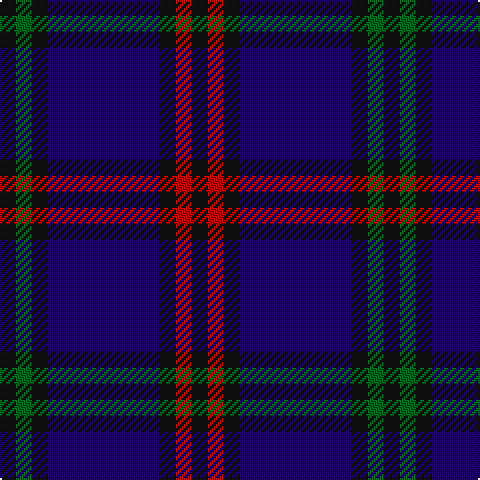

In pattern [KGKBKRK](/patterns/kgkbkrk/).

This was sourced from register-of-tartans.  It is a [7 stripes tartan](/stripes/stripes7/).

Original link https://www.tartanregister.gov.uk/tartanDetails.aspx?ref=1090

## Attestations

This cloth appears in 2 source records; the oldest owns this page.

- 01/01/1707 — Eglinton (register-of-tartans, [record](https://www.tartanregister.gov.uk/tartanDetails.aspx?ref=1090))
- 1707? — Eglinton (District?) (tartans-authority, [record](http://www.tartansauthority.com/tartan-ferret/display/2075/))

## Thread count
K/8 G8 K8 DB56 K8 R8 K/8

## Palette
Each colour and its ΔE from the base-6 reference it is a variant of.

| Colour | Shade | Base | ΔE (OKLab) |
|---|---|---|---|
| DB | <code style="background-color:#1C0070;">#1C0070</code> `#1C0070` | B <code style="background-color:#2A418A;">#2A418A</code> | 0.14 |
| G | <code style="background-color:#006818;">#006818</code> `#006818` | G <code style="background-color:#006100;">#006100</code> | 0.02 |
| K | <code style="background-color:#101010;">#101010</code> `#101010` | K <code style="background-color:#000000;">#000000</code> | 0.17 |
| R | <code style="background-color:#C80000;">#C80000</code> `#C80000` | R <code style="background-color:#CC0000;">#CC0000</code> | 0.01 |

# Sample pattern

## Nearest tartans

The nearest existing variants by ΔTartan distance.

1. [Montgomerie of Eglinton Family Tartan Tartan Number: 1082. Earliest known date: 1893 D W Stewart, author of Old and Rare Scottish Tartans (1893), was of the opinion that this sett could be traced back to 1707 when it was adopted by the Montgomeries Earls of Eglinton. See Eglinton District. See products available Copyright © Blair Urquhart, Comrie, 2015](/setts/s7/k4g5k4b28k4r5k4x2~b2c2c80-g006818-k101010-rc80000/) — ΔT 0.69
1. [Auckland (Fashion)](/setts/s8/g3k3b2k16b2k2b24w2x2~b2c2c80-g003820-k101010-wc0c0c0/) — ΔT 1.01
1. [Komissarov, Dmitry (Personal)](/setts/s7/b30ba30g4ba4g4ba5r6x2~b640044-ba000048-g808080-r880000/) — ΔT 1.14
1. [Slanj Dress (Corporate)](/setts/s8/k4b36k4b4k34ba3k3w4x2~b202060-ba3850c8-k101010-we0e0e0/) — ΔT 1.16
1. [Daks, Muted blue](/setts/s8/r5b12ba4ra4ba22b3ba4r5~b304080-ba000050-r806050-ra906030/) — ΔT 1.19
1. [Murdoch Clebration (Personal)](/setts/s8/k21b8r4b2r2b23k4w2x2~b2c2c80-k101010-rc80000-we0e0e0/) — ΔT 1.30
1. [Scottish Express International](/setts/s6/b1k4w1k4ba7k1x4~b9058d8-ba1c0070-k101010-wa8ace8/) — ΔT 1.37
1. [Hume or Home Clan Tartan Tartan Number: 125. Earliest known date: pre 2003 Alternate spelling for Home. See products available Copyright © Blair Urquhart, Comrie, 2015](/setts/s9/b3g3b20r2k2r2k20g3k3x2~b2c2c80-g006818-k101010-rc80000/) — ΔT 1.40
1. [Royal Scotsman Train (Corporate)](/setts/s6/b5k2b14k14b2y2x2~b2c2c80-k101010-yb8b4b8/) — ΔT 1.43
1. [Stone of Destiny](/setts/s9/b4y2b17k2r4k2b3k11b3x2~b304080-k000030-rc00000-yf0c000/) — ΔT 1.47

## Neighbour map

Every grey dot is one of 15726 variants placed by the first two principal components of the ΔTartan feature space (44% of its variance). Red is this tartan; blue dots are its nearest — click one to open its page.

<svg viewBox="0 0 640 380" role="img" style="max-width:100%;height:auto;border:1px solid #e0e0e0;border-radius:4px;display:block" xmlns="http://www.w3.org/2000/svg"><image href="/nn/cloud.v1.png" width="640" height="380"/><a href="/setts/s7/k4g5k4b28k4r5k4x2~b2c2c80-g006818-k101010-rc80000/"><circle cx="306.7" cy="219.6" r="4" fill="#3465a4"><title>Montgomerie of Eglinton Family Tartan Tartan Number: 1082. Earliest known date: 1893 D W Stewart, author of Old and Rare Scottish Tartans (1893), was of the opinion that this sett could be traced back to 1707 when it was adopted by the Montgomeries Earls of Eglinton. See Eglinton District. See products available Copyright © Blair Urquhart, Comrie, 2015</title></circle></a><a href="/setts/s8/g3k3b2k16b2k2b24w2x2~b2c2c80-g003820-k101010-wc0c0c0/"><circle cx="359.4" cy="199.3" r="4" fill="#3465a4"><title>Auckland (Fashion)</title></circle></a><a href="/setts/s7/b30ba30g4ba4g4ba5r6x2~b640044-ba000048-g808080-r880000/"><circle cx="290.0" cy="222.1" r="4" fill="#3465a4"><title>Komissarov, Dmitry (Personal)</title></circle></a><a href="/setts/s8/k4b36k4b4k34ba3k3w4x2~b202060-ba3850c8-k101010-we0e0e0/"><circle cx="345.5" cy="197.4" r="4" fill="#3465a4"><title>Slanj Dress (Corporate)</title></circle></a><a href="/setts/s8/r5b12ba4ra4ba22b3ba4r5~b304080-ba000050-r806050-ra906030/"><circle cx="278.0" cy="233.3" r="4" fill="#3465a4"><title>Daks, Muted blue</title></circle></a><a href="/setts/s8/k21b8r4b2r2b23k4w2x2~b2c2c80-k101010-rc80000-we0e0e0/"><circle cx="306.2" cy="196.4" r="4" fill="#3465a4"><title>Murdoch Clebration (Personal)</title></circle></a><a href="/setts/s6/b1k4w1k4ba7k1x4~b9058d8-ba1c0070-k101010-wa8ace8/"><circle cx="282.7" cy="253.8" r="4" fill="#3465a4"><title>Scottish Express International</title></circle></a><a href="/setts/s9/b3g3b20r2k2r2k20g3k3x2~b2c2c80-g006818-k101010-rc80000/"><circle cx="286.0" cy="194.5" r="4" fill="#3465a4"><title>Hume or Home Clan Tartan Tartan Number: 125. Earliest known date: pre 2003 Alternate spelling for Home. See products available Copyright © Blair Urquhart, Comrie, 2015</title></circle></a><a href="/setts/s6/b5k2b14k14b2y2x2~b2c2c80-k101010-yb8b4b8/"><circle cx="350.4" cy="267.7" r="4" fill="#3465a4"><title>Royal Scotsman Train (Corporate)</title></circle></a><a href="/setts/s9/b4y2b17k2r4k2b3k11b3x2~b304080-k000030-rc00000-yf0c000/"><circle cx="305.2" cy="205.8" r="4" fill="#3465a4"><title>Stone of Destiny</title></circle></a><circle cx="331.2" cy="222.7" r="5" fill="#c00000"/></svg>

ID: /setts/s7/k1g1k1b7k1r1k1x8~b1c0070-g006818-k101010-rc80000/
