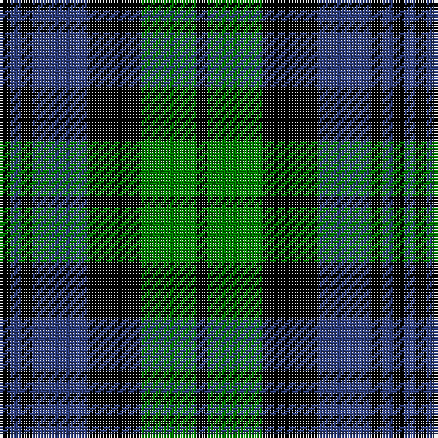

This page is one **sett** — a single exact thread-count. It belongs to the [tartan](/tartans/k1g5k5b5k1b1k1/)
(the same proportion at any scale), whose colour order is pattern [KBKBKGK](/stripes/kbkbkgk/).

Sourced from weddslist.  It is a [7 stripe tartan](/stripes/stripes7/).

Original link http://www.weddslist.com/cgi-bin/tartans/pg.pl?source=sts

2 attestations — the source records this cloth was collapsed from (oldest owns this page)

<ul>
<li>undated — Strathspey (weddslist, <a href="http://www.weddslist.com/cgi-bin/tartans/pg.pl?source=sts">record</a>)</li>
<li>undated — Strathspey District Tartan Tartan Number: 1039. Earliest known date: 1795 From the back of a waistcoat of a Strathspey Fencible 1794-5. The design, which is a variation of the Black Watch may be attributed to General James Grant of Ballindalloch who raised the fencible unit and whose clan already used the the Black Watch as a hunting sett. The Strathspey tartan is now produced as a District tartan. See products available Copyright © Blair Urquhart, Comrie, 2015 (house-of-tartan, <a href="http://www.house-of-tartan.scotland.net/house/TartanViewjs.asp?colr=Def&tnam=1039">record</a>)</li>
</ul>

## Thread count
K/4 G20 K20 B20 K4 B4 K/4

## Palette
Each colour and the base-6 reference it is a variant of.

| Colour | Shade | Base |
|---|---|---|
| B | <code style="background-color:#304080;">#304080</code> `oklch(39.4% 0.109 270.2)` <small>#304080</small> | B <code style="background-color:#2A418A;">#2A418A</code> |
| G | <code style="background-color:#008000;">#008000</code> `oklch(52.0% 0.177 142.5)` <small>#008000</small> | G <code style="background-color:#006100;">#006100</code> |
| K | <code style="background-color:#000000;">#000000</code> `oklch(0.0% 0.000 0.0)` <small>#000000</small> | K <code style="background-color:#000000;">#000000</code> |

# Sample pattern

## Nearest tartans

The nearest existing variants by ΔTartan distance, with this tartan at the top so the swatches line up against it.

ΔTartan

Tartan

Sett

—

<a href="/ttd/edit/#slug=k1g5k5db5k1db1k1~x4">Strathspey</a> <a class="nn-out" href="/setts/s7/k1g5k5db5k1db1k1~x4/" title="open its dictionary page">↗</a>

0.88

<a href="/ttd/edit/#slug=db6k6db18k18g22k5">Campbell, the 42nd</a> <a class="nn-out" href="/setts/s6/db6k6db18k18g22k5/" title="open its dictionary page">↗</a>

0.95

<a href="/ttd/edit/#slug=k3g14k14g2db14g3~x2">MacKay</a> <a class="nn-out" href="/setts/s6/k3g14k14g2db14g3~x2/" title="open its dictionary page">↗</a>

1.08

<a href="/ttd/edit/#slug=k1db5k4g3k1g3k6g1~x4">Keith McCormick (Personal)</a> <a class="nn-out" href="/setts/s8/k1db5k4g3k1g3k6g1~x4/" title="open its dictionary page">↗</a>

1.11

<a href="/ttd/edit/#slug=db1k6db6k6g6k1w1~x2">Forbes Ancient</a> <a class="nn-out" href="/setts/s7/db1k6db6k6g6k1w1~x2/" title="open its dictionary page">↗</a>

1.12

<a href="/ttd/edit/#slug=t3g12k14t11k3t3~x2">Wilson's, No 166</a> <a class="nn-out" href="/setts/s6/t3g12k14t11k3t3~x2/" title="open its dictionary page">↗</a>

1.16

<a href="/ttd/edit/#slug=db1g1db6k6g1k6g1db2g1db3g1~x2">Clergy 2</a> <a class="nn-out" href="/setts/s11/db1g1db6k6g1k6g1db2g1db3g1~x2/" title="open its dictionary page">↗</a>

1.17

<a href="/ttd/edit/#slug=db1k1db6k6g6k1w1~x2">Forbes</a> <a class="nn-out" href="/setts/s7/db1k1db6k6g6k1w1~x2/" title="open its dictionary page">↗</a>

1.17

<a href="/ttd/edit/#slug=dt4g18dt3k17dt18dp4~x2">Scottish Airports</a> <a class="nn-out" href="/setts/s6/dt4g18dt3k17dt18dp4~x2/" title="open its dictionary page">↗</a>

1.21

<a href="/ttd/edit/#slug=db1g6k2db1k3g1k2db2g1db6g1~x4">Black Water</a> <a class="nn-out" href="/setts/s11/db1g6k2db1k3g1k2db2g1db6g1~x4/" title="open its dictionary page">↗</a>

1.23

<a href="/ttd/edit/#slug=db2k2db12k8g11r2~x2">Murray</a> <a class="nn-out" href="/setts/s6/db2k2db12k8g11r2~x2/" title="open its dictionary page">↗</a>

## Neighbour map

Every grey dot is one of 14299 variants placed by the first two principal components of the ΔTartan feature space (44% of its variance). Red is this tartan; blue dots are its nearest — click one to open its page.

<svg viewBox="0 0 640 380" role="img" style="max-width:100%;height:auto;border:1px solid #e0e0e0;border-radius:4px;display:block" xmlns="http://www.w3.org/2000/svg"><image href="/nn/cloud.v1.png" width="640" height="380"/><a href="/setts/s6/db6k6db18k18g22k5/"><circle cx="154.6" cy="285.3" r="4" fill="#3465a4"><title>Campbell, the 42nd</title></circle></a><a href="/setts/s6/k3g14k14g2db14g3~x2/"><circle cx="179.6" cy="254.7" r="4" fill="#3465a4"><title>MacKay</title></circle></a><a href="/setts/s8/k1db5k4g3k1g3k6g1~x4/"><circle cx="226.3" cy="263.8" r="4" fill="#3465a4"><title>Keith McCormick (Personal)</title></circle></a><a href="/setts/s7/db1k6db6k6g6k1w1~x2/"><circle cx="184.4" cy="240.8" r="4" fill="#3465a4"><title>Forbes Ancient</title></circle></a><a href="/setts/s6/t3g12k14t11k3t3~x2/"><circle cx="145.4" cy="267.6" r="4" fill="#3465a4"><title>Wilson's, No 166</title></circle></a><a href="/setts/s11/db1g1db6k6g1k6g1db2g1db3g1~x2/"><circle cx="207.4" cy="227.6" r="4" fill="#3465a4"><title>Clergy 2</title></circle></a><a href="/setts/s7/db1k1db6k6g6k1w1~x2/"><circle cx="142.8" cy="223.0" r="4" fill="#3465a4"><title>Forbes</title></circle></a><a href="/setts/s6/dt4g18dt3k17dt18dp4~x2/"><circle cx="162.3" cy="252.7" r="4" fill="#3465a4"><title>Scottish Airports</title></circle></a><a href="/setts/s11/db1g6k2db1k3g1k2db2g1db6g1~x4/"><circle cx="176.7" cy="227.5" r="4" fill="#3465a4"><title>Black Water</title></circle></a><a href="/setts/s6/db2k2db12k8g11r2~x2/"><circle cx="152.4" cy="240.0" r="4" fill="#3465a4"><title>Murray</title></circle></a><circle cx="189.0" cy="257.4" r="5" fill="#c00000"/></svg>

ID: /setts/s7/k1g5k5db5k1db1k1~x4/
