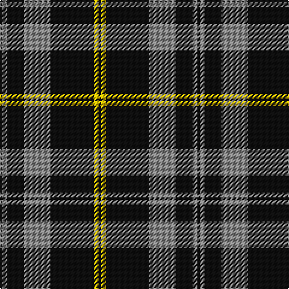

**Bands:** [KRKRKYK](/stripes/krkrkyk/) · **Stripes:** [K O K O K LY K](/stripes/stripes7/) K O K O K LY K

This was sourced from tartans-authority.  It is a [7 band tartan](/bands/bands7/).

Original link http://www.tartansauthority.com/tartan-ferret/display/7657/

## Attestations

This cloth appears in 2 source records; the oldest owns this page.

- June 2008 — DDB Canada (Fashion) (tartans-authority, [record](http://www.tartansauthority.com/tartan-ferret/display/7657/))
- undated — DDB Canada (register-of-tartans, [record](https://www.tartanregister.gov.uk/tartanDetails.aspx?ref=5665))

## Register references

External register numbers recorded for this tartan.

- Scottish Register of Tartans: [5665](https://www.tartanregister.gov.uk/tartanDetails.aspx?ref=5665)
- Scottish Tartans Authority (ITI): 7657

## Thread count
K/2 N4 K14 N22 K36 Y4 K/2

## Palette
Each colour and its ΔE from the base-6 reference it is a variant of.

| Colour | Shade | Base | ΔE (OKLab) |
|---|---|---|---|
| K | <code style="background-color:#101010;">#101010</code> `#101010` | K <code style="background-color:#000000;">#000000</code> | 0.17 |
| N | <code style="background-color:#888888;">#888888</code> `#888888` | R <code style="background-color:#CC0000;">#CC0000</code> | 0.24 |
| Y | <code style="background-color:#E8C000;">#E8C000</code> `#E8C000` | Y <code style="background-color:#F2BF00;">#F2BF00</code> | 0.02 |

# Sample pattern

## Nearest tartans

The nearest existing variants by ΔTartan distance.

1. [Moffat (1984)](/setts/s7/k39o3k3o3k14o28r3~x2/) — ΔT 0.65
1. [West Point](/setts/s8/k13o1k1o1k4o10ly1o1~x6/) — ΔT 0.98
1. [Glen Coe Trade Tartan Tartan Number: 1243. Earliest known date: Modern Many new designs have been given district names to promote their Scottish connections. However, these names should not be confused with the District tartans which have earned their title through 'use and wont' and not a little history. See products available Copyright © Blair Urquhart, Comrie, 2015](/setts/s5/k37w9k3dg9w3~x2/) — ΔT 1.06
1. [Sligo Irish County Tartan Tartan Number: 2256. Earliest known date: 1995 One of a series of Irish District tartans designed by Polly Wittering of the House of Edgar, with colours reminiscent of the Country with soft warm colours dominating. See products available Copyright © Blair Urquhart, Comrie, 2015](/setts/s6/t50k4t12k23lo4k4~x2/) — ΔT 1.09
1. [Lundy Reform](/setts/s7/k2lb5k1lb1k10r1k1~x4/) — ΔT 1.10
1. [Black Isle](/setts/s6/k53o22k10o10k2o4~x2/) — ΔT 1.15
1. [Perry Ancient (Personal)](/setts/s5/k75y26y3k4ly6~x2/) — ΔT 1.16
1. [Jensen, Sven (Personal)](/setts/s9/g12k8w6k22w3k8w3k40g6/) — ΔT 1.19
1. [Korner-Macpherson (Personal)](/setts/s7/y5r3y35k28y4k11y2~x2/) — ΔT 1.20
1. [Moffat](/setts/s7/k39y3k3y3k14y28r3~x2/) — ΔT 1.23

## Neighbour map

Every grey dot is one of 14313 variants placed by the first two principal components of the ΔTartan feature space (44% of its variance). Red is this tartan; blue dots are its nearest — click one to open its page.

<svg viewBox="0 0 640 380" role="img" style="max-width:100%;height:auto;border:1px solid #e0e0e0;border-radius:4px;display:block" xmlns="http://www.w3.org/2000/svg"><image href="/nn/cloud.v1.png" width="640" height="380"/><a href="/setts/s7/k39o3k3o3k14o28r3~x2/"><circle cx="373.0" cy="198.3" r="4" fill="#3465a4"><title>Moffat (1984)</title></circle></a><a href="/setts/s8/k13o1k1o1k4o10ly1o1~x6/"><circle cx="351.7" cy="182.7" r="4" fill="#3465a4"><title>West Point</title></circle></a><a href="/setts/s5/k37w9k3dg9w3~x2/"><circle cx="373.4" cy="207.5" r="4" fill="#3465a4"><title>Glen Coe Trade Tartan Tartan Number: 1243. Earliest known date: Modern Many new designs have been given district names to promote their Scottish connections. However, these names should not be confused with the District tartans which have earned their title through 'use and wont' and not a little history. See products available Copyright © Blair Urquhart, Comrie, 2015</title></circle></a><a href="/setts/s6/t50k4t12k23lo4k4~x2/"><circle cx="370.1" cy="197.7" r="4" fill="#3465a4"><title>Sligo Irish County Tartan Tartan Number: 2256. Earliest known date: 1995 One of a series of Irish District tartans designed by Polly Wittering of the House of Edgar, with colours reminiscent of the Country with soft warm colours dominating. See products available Copyright © Blair Urquhart, Comrie, 2015</title></circle></a><a href="/setts/s7/k2lb5k1lb1k10r1k1~x4/"><circle cx="377.2" cy="195.7" r="4" fill="#3465a4"><title>Lundy Reform</title></circle></a><a href="/setts/s6/k53o22k10o10k2o4~x2/"><circle cx="450.6" cy="198.7" r="4" fill="#3465a4"><title>Black Isle</title></circle></a><a href="/setts/s5/k75y26y3k4ly6~x2/"><circle cx="463.0" cy="182.7" r="4" fill="#3465a4"><title>Perry Ancient (Personal)</title></circle></a><a href="/setts/s9/g12k8w6k22w3k8w3k40g6/"><circle cx="416.8" cy="197.8" r="4" fill="#3465a4"><title>Jensen, Sven (Personal)</title></circle></a><a href="/setts/s7/y5r3y35k28y4k11y2~x2/"><circle cx="347.7" cy="188.1" r="4" fill="#3465a4"><title>Korner-Macpherson (Personal)</title></circle></a><a href="/setts/s7/k39y3k3y3k14y28r3~x2/"><circle cx="357.4" cy="196.2" r="4" fill="#3465a4"><title>Moffat</title></circle></a><circle cx="395.6" cy="187.8" r="5" fill="#c00000"/></svg>

ID: /setts/s7/k1ly2k18o11k7o2k1~x2/
