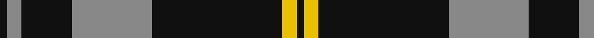

This page is one **sett** — a single exact thread-count. It belongs to the [tartan](/tartans/k1n2k7n11k18y2k1/)
(the same proportion at any scale), whose colour order is pattern [KRKRKYK](/stripes/krkrkyk/).

Sourced from tartans-authority.  It is a [7 stripe tartan](/stripes/stripes7/).

Original link http://www.tartansauthority.com/tartan-ferret/display/7657/

2 attestations — the source records this cloth was collapsed from (oldest owns this page)

<ul>
<li>June 2008 — DDB Canada (Fashion) (tartans-authority, <a href="http://www.tartansauthority.com/tartan-ferret/display/7657/">record</a>)</li>
<li>undated — DDB Canada (register-of-tartans, <a href="https://www.tartanregister.gov.uk/tartanDetails.aspx?ref=5665">record</a>)</li>
</ul>

## Register references

External register numbers recorded for this tartan.

- Scottish Register of Tartans: [5665](https://www.tartanregister.gov.uk/tartanDetails.aspx?ref=5665)
- Scottish Tartans Authority (ITI): 7657

## Thread count
K/2 N4 K14 N22 K36 Y4 K/2

## Palette
Each colour and the base-6 reference it is a variant of.

| Colour | Shade | Base |
|---|---|---|
| K | <code style="background-color:#101010;">#101010</code> `oklch(17.3% 0.000 89.9)` <small>#101010</small> | K <code style="background-color:#000000;">#000000</code> |
| N | <code style="background-color:#888888;">#888888</code> `oklch(62.7% 0.000 89.9)` <small>#888888</small> | R <code style="background-color:#CC0000;">#CC0000</code> |
| Y | <code style="background-color:#E8C000;">#E8C000</code> `oklch(81.9% 0.168 93.7)` <small>#E8C000</small> | Y <code style="background-color:#F2BF00;">#F2BF00</code> |

# Sample pattern

## Nearest tartans

The nearest existing variants by ΔTartan distance, with this tartan at the top so the swatches line up against it.

ΔTartan

Tartan

Sett

—

<a href="/ttd/edit/#slug=k1o2k7o11k18ly2k1~x2">DDB Canada (Fashion)</a> <a class="nn-out" href="/setts/s7/k1o2k7o11k18ly2k1~x2/" title="open its dictionary page">↗</a>

0.65

<a href="/ttd/edit/#slug=k39o3k3o3k14o28r3~x2">Moffat (1984)</a> <a class="nn-out" href="/setts/s7/k39o3k3o3k14o28r3~x2/" title="open its dictionary page">↗</a>

0.98

<a href="/ttd/edit/#slug=k13o1k1o1k4o10ly1o1~x6">West Point</a> <a class="nn-out" href="/setts/s8/k13o1k1o1k4o10ly1o1~x6/" title="open its dictionary page">↗</a>

1.06

<a href="/ttd/edit/#slug=k37w9k3dg9w3~x2">Glen Coe Trade Tartan Tartan Number: 1243. Earliest known date: Modern Many new designs have been given district names to promote their Scottish connections. However, these names should not be confused with the District tartans which have earned their title through 'use and wont' and not a little history. See products available Copyright © Blair Urquhart, Comrie, 2015</a> <a class="nn-out" href="/setts/s5/k37w9k3dg9w3~x2/" title="open its dictionary page">↗</a>

1.09

<a href="/ttd/edit/#slug=t50k4t12k23lo4k4~x2">Sligo Irish County Tartan Tartan Number: 2256. Earliest known date: 1995 One of a series of Irish District tartans designed by Polly Wittering of the House of Edgar, with colours reminiscent of the Country with soft warm colours dominating. See products available Copyright © Blair Urquhart, Comrie, 2015</a> <a class="nn-out" href="/setts/s6/t50k4t12k23lo4k4~x2/" title="open its dictionary page">↗</a>

1.10

<a href="/ttd/edit/#slug=k2lb5k1lb1k10r1k1~x4">Lundy Reform</a> <a class="nn-out" href="/setts/s7/k2lb5k1lb1k10r1k1~x4/" title="open its dictionary page">↗</a>

1.15

<a href="/ttd/edit/#slug=k53o22k10o10k2o4~x2">Black Isle</a> <a class="nn-out" href="/setts/s6/k53o22k10o10k2o4~x2/" title="open its dictionary page">↗</a>

1.16

<a href="/ttd/edit/#slug=k75y26y3k4ly6~x2">Perry Ancient (Personal)</a> <a class="nn-out" href="/setts/s5/k75y26y3k4ly6~x2/" title="open its dictionary page">↗</a>

1.19

<a href="/ttd/edit/#slug=g12k8w6k22w3k8w3k40g6">Jensen, Sven (Personal)</a> <a class="nn-out" href="/setts/s9/g12k8w6k22w3k8w3k40g6/" title="open its dictionary page">↗</a>

1.20

<a href="/ttd/edit/#slug=y5r3y35k28y4k11y2~x2">Korner-Macpherson (Personal)</a> <a class="nn-out" href="/setts/s7/y5r3y35k28y4k11y2~x2/" title="open its dictionary page">↗</a>

1.23

<a href="/ttd/edit/#slug=k39y3k3y3k14y28r3~x2">Moffat</a> <a class="nn-out" href="/setts/s7/k39y3k3y3k14y28r3~x2/" title="open its dictionary page">↗</a>

## Neighbour map

Every grey dot is one of 14299 variants placed by the first two principal components of the ΔTartan feature space (44% of its variance). Red is this tartan; blue dots are its nearest — click one to open its page.

<svg viewBox="0 0 640 380" role="img" style="max-width:100%;height:auto;border:1px solid #e0e0e0;border-radius:4px;display:block" xmlns="http://www.w3.org/2000/svg"><image href="/nn/cloud.v1.png" width="640" height="380"/><a href="/setts/s7/k39o3k3o3k14o28r3~x2/"><circle cx="372.9" cy="198.0" r="4" fill="#3465a4"><title>Moffat (1984)</title></circle></a><a href="/setts/s8/k13o1k1o1k4o10ly1o1~x6/"><circle cx="351.6" cy="182.5" r="4" fill="#3465a4"><title>West Point</title></circle></a><a href="/setts/s5/k37w9k3dg9w3~x2/"><circle cx="373.3" cy="207.1" r="4" fill="#3465a4"><title>Glen Coe Trade Tartan Tartan Number: 1243. Earliest known date: Modern Many new designs have been given district names to promote their Scottish connections. However, these names should not be confused with the District tartans which have earned their title through 'use and wont' and not a little history. See products available Copyright © Blair Urquhart, Comrie, 2015</title></circle></a><a href="/setts/s6/t50k4t12k23lo4k4~x2/"><circle cx="370.0" cy="197.4" r="4" fill="#3465a4"><title>Sligo Irish County Tartan Tartan Number: 2256. Earliest known date: 1995 One of a series of Irish District tartans designed by Polly Wittering of the House of Edgar, with colours reminiscent of the Country with soft warm colours dominating. See products available Copyright © Blair Urquhart, Comrie, 2015</title></circle></a><a href="/setts/s7/k2lb5k1lb1k10r1k1~x4/"><circle cx="377.0" cy="195.3" r="4" fill="#3465a4"><title>Lundy Reform</title></circle></a><a href="/setts/s6/k53o22k10o10k2o4~x2/"><circle cx="450.5" cy="198.3" r="4" fill="#3465a4"><title>Black Isle</title></circle></a><a href="/setts/s5/k75y26y3k4ly6~x2/"><circle cx="462.9" cy="182.4" r="4" fill="#3465a4"><title>Perry Ancient (Personal)</title></circle></a><a href="/setts/s9/g12k8w6k22w3k8w3k40g6/"><circle cx="416.7" cy="197.5" r="4" fill="#3465a4"><title>Jensen, Sven (Personal)</title></circle></a><a href="/setts/s7/y5r3y35k28y4k11y2~x2/"><circle cx="347.6" cy="187.8" r="4" fill="#3465a4"><title>Korner-Macpherson (Personal)</title></circle></a><a href="/setts/s7/k39y3k3y3k14y28r3~x2/"><circle cx="357.5" cy="195.9" r="4" fill="#3465a4"><title>Moffat</title></circle></a><circle cx="395.5" cy="187.5" r="5" fill="#c00000"/></svg>

ID: /setts/s7/k1o2k7o11k18ly2k1~x2/
