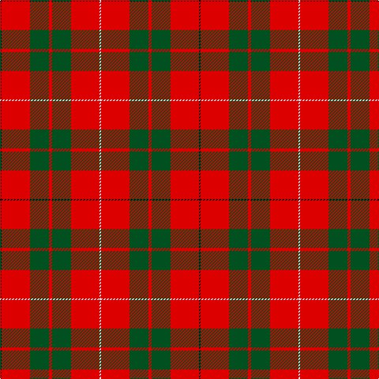

**Bands:** [KRGRGRW](/stripes/krgrgrw/) · **Stripes:** [K R DG R DG R W](/stripes/stripes7/) K R DG R DG R W

This was sourced from register-of-tartans.  It is a [7 band tartan](/bands/bands7/).

Original link https://www.tartanregister.gov.uk/tartanDetails.aspx?ref=2548

## Register references

External register numbers recorded for this tartan.

- Scottish Register of Tartans: [2548](https://www.tartanregister.gov.uk/tartanDetails.aspx?ref=2548)
- Scottish Tartans World Register: 1165

## Thread count
K/2 R36 G24 R4 G24 R36 LN/2

## Palette
Each colour and its ΔE from the base-6 reference it is a variant of.

| Colour | Shade | Base | ΔE (OKLab) |
|---|---|---|---|
| G | <code style="background-color:#005020;">#005020</code> `#005020` | G <code style="background-color:#006100;">#006100</code> | 0.07 |
| K | <code style="background-color:#101010;">#101010</code> `#101010` | K <code style="background-color:#000000;">#000000</code> | 0.17 |
| LN | <code style="background-color:#E0E0E0;">#E0E0E0</code> `#E0E0E0` | W <code style="background-color:#F7F7F7;">#F7F7F7</code> | 0.07 |
| R | <code style="background-color:#DC0000;">#DC0000</code> `#DC0000` | R <code style="background-color:#CC0000;">#CC0000</code> | 0.03 |

# Sample pattern

## Nearest tartans

The nearest existing variants by ΔTartan distance.

1. [MacKinnon 8](/setts/s7/k1r18g12r2g12r18w1~x2/) — ΔT 0.75
1. [MacGregor](/setts/s6/r35dg16r5dg5w2k3~x2/) — ΔT 0.99
1. [Claus of the North Pole (Restricted)](/setts/s7/r21g3r21g16lo3w2lo3~x2/) — ΔT 1.08
1. [Crawford](/setts/s7/r6lb2r30dg12r3dg12r3/) — ΔT 1.10
1. [Cameron](/setts/s6/r2dg6r2dg6r16ly1~x2/) — ΔT 1.11
1. [Menzies](/setts/s8/r12g9w1t3r24t3w1g9~x8/) — ΔT 1.12
1. [MacGregor](/setts/s6/r35g16r5g5w2k3~x2/) — ΔT 1.12
1. [MacAulay (Clan)](/setts/s6/k2r16g6r3g8w1~x4/) — ΔT 1.12
1. [MacAulay](/setts/s6/k2r16g6r3g8lb1~x2/) — ΔT 1.14
1. [Tipperary](/setts/s7/r33k8dr12g12r8dr2r8~x2/) — ΔT 1.15

## Neighbour map

Every grey dot is one of 14313 variants placed by the first two principal components of the ΔTartan feature space (44% of its variance). Red is this tartan; blue dots are its nearest — click one to open its page.

<svg viewBox="0 0 640 380" role="img" style="max-width:100%;height:auto;border:1px solid #e0e0e0;border-radius:4px;display:block" xmlns="http://www.w3.org/2000/svg"><image href="/nn/cloud.v1.png" width="640" height="380"/><a href="/setts/s7/k1r18g12r2g12r18w1~x2/"><circle cx="374.4" cy="184.0" r="4" fill="#3465a4"><title>MacKinnon 8</title></circle></a><a href="/setts/s6/r35dg16r5dg5w2k3~x2/"><circle cx="388.0" cy="160.7" r="4" fill="#3465a4"><title>MacGregor</title></circle></a><a href="/setts/s7/r21g3r21g16lo3w2lo3~x2/"><circle cx="356.8" cy="192.2" r="4" fill="#3465a4"><title>Claus of the North Pole (Restricted)</title></circle></a><a href="/setts/s7/r6lb2r30dg12r3dg12r3/"><circle cx="417.6" cy="193.7" r="4" fill="#3465a4"><title>Crawford</title></circle></a><a href="/setts/s6/r2dg6r2dg6r16ly1~x2/"><circle cx="415.0" cy="198.8" r="4" fill="#3465a4"><title>Cameron</title></circle></a><a href="/setts/s8/r12g9w1t3r24t3w1g9~x8/"><circle cx="374.5" cy="155.0" r="4" fill="#3465a4"><title>Menzies</title></circle></a><a href="/setts/s6/r35g16r5g5w2k3~x2/"><circle cx="380.9" cy="161.8" r="4" fill="#3465a4"><title>MacGregor</title></circle></a><a href="/setts/s6/k2r16g6r3g8w1~x4/"><circle cx="331.9" cy="187.8" r="4" fill="#3465a4"><title>MacAulay (Clan)</title></circle></a><a href="/setts/s6/k2r16g6r3g8lb1~x2/"><circle cx="336.0" cy="189.9" r="4" fill="#3465a4"><title>MacAulay</title></circle></a><a href="/setts/s7/r33k8dr12g12r8dr2r8~x2/"><circle cx="329.3" cy="178.2" r="4" fill="#3465a4"><title>Tipperary</title></circle></a><circle cx="374.4" cy="179.6" r="5" fill="#c00000"/></svg>

ID: /setts/s7/k1r18dg12r2dg12r18w1~x2/
