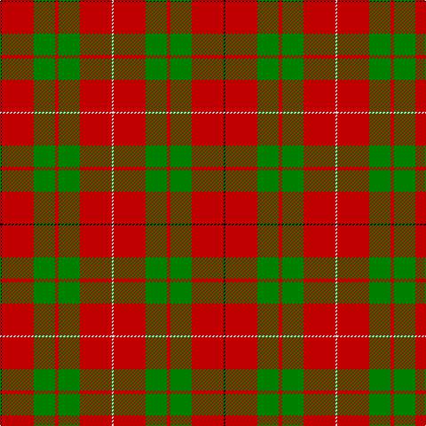

In pattern [KRGRGRW](/stripes/krgrgrw/).

This was sourced from weddslist.  It is a [7 stripe tartan](/stripes/stripes7/).

Original link http://www.weddslist.com/cgi-bin/tartans/pg.pl?source=sts

## Also known as

This cloth is also recorded under:

- MacKinnon #4

## Thread count
K/2 R36 G24 R4 G24 R36 LN/2

## Palette
Each colour and the base-6 reference it is a variant of.

| Colour | Shade | Base |
|---|---|---|
| G | <code style="background-color:#008000;">#008000</code> `oklch(52.0% 0.177 142.5)` <small>#008000</small> | G <code style="background-color:#006100;">#006100</code> |
| K | <code style="background-color:#000000;">#000000</code> `oklch(0.0% 0.000 0.0)` <small>#000000</small> | K <code style="background-color:#000000;">#000000</code> |
| LN | <code style="background-color:#E0E0E0;">#E0E0E0</code> `oklch(90.7% 0.000 89.9)` <small>#E0E0E0</small> | W <code style="background-color:#F7F7F7;">#F7F7F7</code> |
| R | <code style="background-color:#C00000;">#C00000</code> `oklch(50.7% 0.208 29.2)` <small>#C00000</small> | R <code style="background-color:#CC0000;">#CC0000</code> |

# Sample pattern

## Nearest tartans

The nearest existing variants by ΔTartan distance, with this tartan at the top so the swatches line up against it.

ΔTartan

Tartan

Sett

—

<a href="/ttd/edit/#slug=k1r18g12r2g12r18w1~x2">MacKinnon 8</a> <a class="nn-out" href="/setts/s7/k1r18g12r2g12r18w1~x2/" title="open its dictionary page">↗</a>

0.75

<a href="/ttd/edit/#slug=k1r18dg12r2dg12r18w1~x2">MacKinnon #4</a> <a class="nn-out" href="/setts/s7/k1r18dg12r2dg12r18w1~x2/" title="open its dictionary page">↗</a>

0.91

<a href="/ttd/edit/#slug=r2g6ly1g6r3g2r16db1~x4">Burnett</a> <a class="nn-out" href="/setts/s8/r2g6ly1g6r3g2r16db1~x4/" title="open its dictionary page">↗</a>

0.95

<a href="/ttd/edit/#slug=k2r16g6r3g8w1~x4">MacAulay (Clan)</a> <a class="nn-out" href="/setts/s6/k2r16g6r3g8w1~x4/" title="open its dictionary page">↗</a>

0.95

<a href="/ttd/edit/#slug=k2r16g6r3g8lb1~x2">MacAulay</a> <a class="nn-out" href="/setts/s6/k2r16g6r3g8lb1~x2/" title="open its dictionary page">↗</a>

0.97

<a href="/ttd/edit/#slug=r2g6ly1g6r3g2r16t1~x4">Burnett of Leys Family Tartan Tartan Number: 2355. Earliest known date: Unknown In Scottish Tartan Society Files but source unknown. At present woven by Lochcarron. The entry in the Lyon Court Books does not define the pattern. See products available Copyright © Blair Urquhart, Comrie, 2015</a> <a class="nn-out" href="/setts/s8/r2g6ly1g6r3g2r16t1~x4/" title="open its dictionary page">↗</a>

1.09

<a href="/ttd/edit/#slug=r32t5g17r4g5w2~x2">Wilson's, No 5</a> <a class="nn-out" href="/setts/s6/r32t5g17r4g5w2~x2/" title="open its dictionary page">↗</a>

1.10

<a href="/ttd/edit/#slug=r2g6r2g6r16ly1~x2">Cameron</a> <a class="nn-out" href="/setts/s6/r2g6r2g6r16ly1~x2/" title="open its dictionary page">↗</a>

1.10

<a href="/ttd/edit/#slug=r35g16r5g5w2k3~x2">MacGregor</a> <a class="nn-out" href="/setts/s6/r35g16r5g5w2k3~x2/" title="open its dictionary page">↗</a>

1.12

<a href="/ttd/edit/#slug=k2r16g6r3g8w1~x2">MacAulay</a> <a class="nn-out" href="/setts/s6/k2r16g6r3g8w1~x2/" title="open its dictionary page">↗</a>

1.13

<a href="/setts/s8/r24t3w1g9r12~x8/">Menzies</a>

## Neighbour map

Every grey dot is one of 14299 variants placed by the first two principal components of the ΔTartan feature space (44% of its variance). Red is this tartan; blue dots are its nearest — click one to open its page.

<svg viewBox="0 0 640 380" role="img" style="max-width:100%;height:auto;border:1px solid #e0e0e0;border-radius:4px;display:block" xmlns="http://www.w3.org/2000/svg"><image href="/nn/cloud.v1.png" width="640" height="380"/><a href="/setts/s7/k1r18dg12r2dg12r18w1~x2/"><circle cx="374.0" cy="179.4" r="4" fill="#3465a4"><title>MacKinnon #4</title></circle></a><a href="/setts/s8/r2g6ly1g6r3g2r16db1~x4/"><circle cx="371.9" cy="166.7" r="4" fill="#3465a4"><title>Burnett</title></circle></a><a href="/setts/s6/k2r16g6r3g8w1~x4/"><circle cx="331.6" cy="187.7" r="4" fill="#3465a4"><title>MacAulay (Clan)</title></circle></a><a href="/setts/s6/k2r16g6r3g8lb1~x2/"><circle cx="335.7" cy="189.8" r="4" fill="#3465a4"><title>MacAulay</title></circle></a><a href="/setts/s8/r2g6ly1g6r3g2r16t1~x4/"><circle cx="377.8" cy="168.5" r="4" fill="#3465a4"><title>Burnett of Leys Family Tartan Tartan Number: 2355. Earliest known date: Unknown In Scottish Tartan Society Files but source unknown. At present woven by Lochcarron. The entry in the Lyon Court Books does not define the pattern. See products available Copyright © Blair Urquhart, Comrie, 2015</title></circle></a><a href="/setts/s6/r32t5g17r4g5w2~x2/"><circle cx="352.5" cy="177.7" r="4" fill="#3465a4"><title>Wilson's, No 5</title></circle></a><a href="/setts/s6/r2g6r2g6r16ly1~x2/"><circle cx="416.7" cy="200.8" r="4" fill="#3465a4"><title>Cameron</title></circle></a><a href="/setts/s6/r35g16r5g5w2k3~x2/"><circle cx="380.5" cy="161.6" r="4" fill="#3465a4"><title>MacGregor</title></circle></a><a href="/setts/s6/k2r16g6r3g8w1~x2/"><circle cx="315.2" cy="181.0" r="4" fill="#3465a4"><title>MacAulay</title></circle></a><a href="/setts/s8/r24t3w1g9r12~x8/"><circle cx="374.1" cy="154.9" r="4" fill="#3465a4"><title>Menzies</title></circle></a><circle cx="374.0" cy="183.8" r="5" fill="#c00000"/></svg>

ID: /setts/s7/k1r18g12r2g12r18w1~x2/
