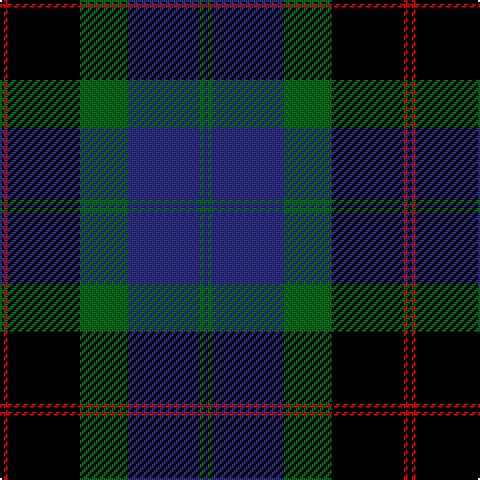

This page is one **sett** — a single exact thread-count. It belongs to the [tartan](/tartans/k1r1k18g12db18g1db1/)
(the same proportion at any scale), whose colour order is pattern [BGBGKRK](/stripes/bgbgkrk/).

Sourced from register-of-tartans.  It is a [7 stripe tartan](/stripes/stripes7/).

Original link https://www.tartanregister.gov.uk/tartanDetails.aspx?ref=2931

2 attestations — the source records this cloth was collapsed from (oldest owns this page)

<ul>
<li>26/03/2001 — Meoni (Personal) (register-of-tartans, <a href="https://www.tartanregister.gov.uk/tartanDetails.aspx?ref=2931">record</a>)</li>
<li>2001 — Meoni (Name) (tartans-authority, <a href="http://www.tartansauthority.com/tartan-ferret/display/4124/">record</a>)</li>
</ul>

## Register references

External register numbers recorded for this tartan.

- Scottish Register of Tartans: [2931](https://www.tartanregister.gov.uk/tartanDetails.aspx?ref=2931)
- Scottish Tartans Authority (ITI): 4124
- Scottish Tartans World Register: 2813

## Thread count
K/2 R2 K36 G24 DB36 G2 DB/2

## Palette

Palette: <strong>Tartan Register</strong>
<table><thead><tr><th>Colour</th><th>Threads</th><th>Shade</th><th>Base</th><th>OKLCh</th></tr></thead><tbody><tr><td>K/</td><td style="text-align:right;font-variant-numeric:tabular-nums">2</td><td><code style="background-color:#000000;">#000000</code> <small style="color:#888">#000000</small></td><td>K <code style="background-color:#000000;">#000000</code></td><td><small style="color:#888">oklch(0.0% 0.000 0.0)</small></td></tr><tr><td>R</td><td style="text-align:right;font-variant-numeric:tabular-nums">2</td><td><code style="background-color:#C80000;">#C80000</code> <small style="color:#888">#C80000</small></td><td>R <code style="background-color:#CC0000;">#CC0000</code></td><td><small style="color:#888">oklch(52.3% 0.215 29.2)</small></td></tr><tr><td>K</td><td style="text-align:right;font-variant-numeric:tabular-nums">36</td><td><code style="background-color:#000000;">#000000</code> <small style="color:#888">#000000</small></td><td>K <code style="background-color:#000000;">#000000</code></td><td><small style="color:#888">oklch(0.0% 0.000 0.0)</small></td></tr><tr><td>G</td><td style="text-align:right;font-variant-numeric:tabular-nums">24</td><td><code style="background-color:#006818;">#006818</code> <small style="color:#888">#006818</small></td><td>G <code style="background-color:#006100;">#006100</code></td><td><small style="color:#888">oklch(45.0% 0.142 145.0)</small></td></tr><tr><td>DB</td><td style="text-align:right;font-variant-numeric:tabular-nums">36</td><td><code style="background-color:#2C2C80;">#2C2C80</code> <small style="color:#888">#2C2C80</small></td><td>B <code style="background-color:#2A418A;">#2A418A</code></td><td><small style="color:#888">oklch(35.0% 0.138 276.6)</small></td></tr><tr><td>G</td><td style="text-align:right;font-variant-numeric:tabular-nums">2</td><td><code style="background-color:#006818;">#006818</code> <small style="color:#888">#006818</small></td><td>G <code style="background-color:#006100;">#006100</code></td><td><small style="color:#888">oklch(45.0% 0.142 145.0)</small></td></tr><tr><td>DB/</td><td style="text-align:right;font-variant-numeric:tabular-nums">2</td><td><code style="background-color:#2C2C80;">#2C2C80</code> <small style="color:#888">#2C2C80</small></td><td>B <code style="background-color:#2A418A;">#2A418A</code></td><td><small style="color:#888">oklch(35.0% 0.138 276.6)</small></td></tr></tbody></table>

# Sample pattern

## Nearest tartans

The nearest existing variants by ΔTartan distance, with this tartan at the top so the swatches line up against it.

ΔTartan

Tartan

Sett

—

<a href="/ttd/edit/#slug=k1r1k18g12db18g1db1~x2">Meoni (Personal)</a> <a class="nn-out" href="/setts/s7/k1r1k18g12db18g1db1~x2/" title="open its dictionary page">↗</a>

0.74

<a href="/ttd/edit/#slug=db4r1db18k20g18r1g4~x2">Blair</a> <a class="nn-out" href="/setts/s7/db4r1db18k20g18r1g4~x2/" title="open its dictionary page">↗</a>

0.97

<a href="/ttd/edit/#slug=dg1dg1r2dg21k11db21r2db1db1~x2">MacThomas</a> <a class="nn-out" href="/setts/s9/dg1dg1r2dg21k11db21r2db1db1~x2/" title="open its dictionary page">↗</a>

0.98

<a href="/ttd/edit/#slug=k2db3g16b1k13b1db18k2db2~x2">Hebridean Old</a> <a class="nn-out" href="/setts/s9/k2db3g16b1k13b1db18k2db2~x2/" title="open its dictionary page">↗</a>

1.06

<a href="/ttd/edit/#slug=r3k2dg15k10db21k1ly2">MacLeod</a> <a class="nn-out" href="/setts/s7/r3k2dg15k10db21k1ly2/" title="open its dictionary page">↗</a>

1.08

<a href="/ttd/edit/#slug=dg8lb2dg1k12db12k1~x2">Graham of Menteith</a> <a class="nn-out" href="/setts/s6/dg8lb2dg1k12db12k1~x2/" title="open its dictionary page">↗</a>

1.13

<a href="/ttd/edit/#slug=r3k2db25k28g25k2r1db2~x2">Common Kilt</a> <a class="nn-out" href="/setts/s8/r3k2db25k28g25k2r1db2~x2/" title="open its dictionary page">↗</a>

1.15

<a href="/ttd/edit/#slug=r7g3r2g33k31db31k3db3">Baird</a> <a class="nn-out" href="/setts/s8/r7g3r2g33k31db31k3db3/" title="open its dictionary page">↗</a>

1.17

<a href="/ttd/edit/#slug=k4db16k12dg24r1dg2k2~x2">Dundas</a> <a class="nn-out" href="/setts/s7/k4db16k12dg24r1dg2k2~x2/" title="open its dictionary page">↗</a>

1.17

<a href="/ttd/edit/#slug=k37w18k37r2k2r2~x2">Hakkarain (Personal)</a> <a class="nn-out" href="/setts/s6/k37w18k37r2k2r2~x2/" title="open its dictionary page">↗</a>

1.18

<a href="/ttd/edit/#slug=db4k2db16lb1k8dg24r4">Colquhoun VS</a> <a class="nn-out" href="/setts/s7/db4k2db16lb1k8dg24r4/" title="open its dictionary page">↗</a>

## Neighbour map

Every grey dot is one of 14299 variants placed by the first two principal components of the ΔTartan feature space (44% of its variance). Red is this tartan; blue dots are its nearest — click one to open its page.

<svg viewBox="0 0 640 380" role="img" style="max-width:100%;height:auto;border:1px solid #e0e0e0;border-radius:4px;display:block" xmlns="http://www.w3.org/2000/svg"><image href="/nn/cloud.v1.png" width="640" height="380"/><a href="/setts/s7/db4r1db18k20g18r1g4~x2/"><circle cx="205.4" cy="184.8" r="4" fill="#3465a4"><title>Blair</title></circle></a><a href="/setts/s9/dg1dg1r2dg21k11db21r2db1db1~x2/"><circle cx="259.3" cy="160.3" r="4" fill="#3465a4"><title>MacThomas</title></circle></a><a href="/setts/s9/k2db3g16b1k13b1db18k2db2~x2/"><circle cx="220.6" cy="160.3" r="4" fill="#3465a4"><title>Hebridean Old</title></circle></a><a href="/setts/s7/r3k2dg15k10db21k1ly2/"><circle cx="203.0" cy="161.7" r="4" fill="#3465a4"><title>MacLeod</title></circle></a><a href="/setts/s6/dg8lb2dg1k12db12k1~x2/"><circle cx="190.6" cy="216.9" r="4" fill="#3465a4"><title>Graham of Menteith</title></circle></a><a href="/setts/s8/r3k2db25k28g25k2r1db2~x2/"><circle cx="224.9" cy="145.9" r="4" fill="#3465a4"><title>Common Kilt</title></circle></a><a href="/setts/s8/r7g3r2g33k31db31k3db3/"><circle cx="179.2" cy="169.9" r="4" fill="#3465a4"><title>Baird</title></circle></a><a href="/setts/s7/k4db16k12dg24r1dg2k2~x2/"><circle cx="275.4" cy="187.7" r="4" fill="#3465a4"><title>Dundas</title></circle></a><a href="/setts/s6/k37w18k37r2k2r2~x2/"><circle cx="223.4" cy="172.1" r="4" fill="#3465a4"><title>Hakkarain (Personal)</title></circle></a><a href="/setts/s7/db4k2db16lb1k8dg24r4/"><circle cx="232.7" cy="163.1" r="4" fill="#3465a4"><title>Colquhoun VS</title></circle></a><circle cx="232.1" cy="177.8" r="5" fill="#c00000"/></svg>

ID: /setts/s7/k1r1k18g12db18g1db1~x2/
