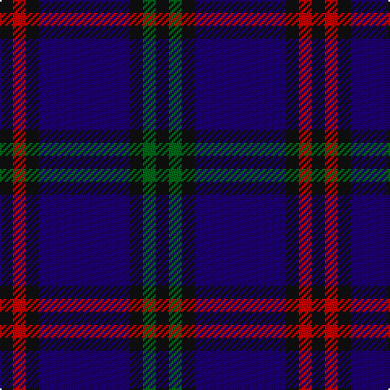

This page is one **sett** — a single exact thread-count. It belongs to the [tartan](/tartans/k1r1k1db7k1g1k1/)
(the same proportion at any scale), whose colour order is pattern [KGKBKRK](/stripes/kgkbkrk/).

Sourced from register-of-tartans.  It is a [7 stripe tartan](/stripes/stripes7/).

Original link https://www.tartanregister.gov.uk/tartanDetails.aspx?ref=1090

2 attestations — the source records this cloth was collapsed from (oldest owns this page)

<ul>
<li>01/01/1707 — Eglinton (register-of-tartans, <a href="https://www.tartanregister.gov.uk/tartanDetails.aspx?ref=1090">record</a>)</li>
<li>1707? — Eglinton (District?) (tartans-authority, <a href="http://www.tartansauthority.com/tartan-ferret/display/2075/">record</a>)</li>
</ul>

## Register references

External register numbers recorded for this tartan.

- Scottish Register of Tartans: [1090](https://www.tartanregister.gov.uk/tartanDetails.aspx?ref=1090)
- Scottish Tartans Authority (ITI): 2075
- Scottish Tartans World Register: 2075

## Thread count
K/8 R8 K8 DB56 K8 G8 K/8

## Palette
Each colour and the base-6 reference it is a variant of.

| Colour | Shade | Base |
|---|---|---|
| DB | <code style="background-color:#1C0070;">#1C0070</code> `oklch(26.3% 0.162 277.1)` <small>#1C0070</small> | B <code style="background-color:#2A418A;">#2A418A</code> |
| G | <code style="background-color:#006818;">#006818</code> `oklch(45.0% 0.142 145.0)` <small>#006818</small> | G <code style="background-color:#006100;">#006100</code> |
| K | <code style="background-color:#101010;">#101010</code> `oklch(17.3% 0.000 89.9)` <small>#101010</small> | K <code style="background-color:#000000;">#000000</code> |
| R | <code style="background-color:#C80000;">#C80000</code> `oklch(52.3% 0.215 29.2)` <small>#C80000</small> | R <code style="background-color:#CC0000;">#CC0000</code> |

# Sample pattern

## Nearest tartans

The nearest existing variants by ΔTartan distance, with this tartan at the top so the swatches line up against it.

ΔTartan

Tartan

Sett

—

<a href="/ttd/edit/#slug=k1r1k1db7k1g1k1~x8">Eglinton</a> <a class="nn-out" href="/setts/s7/k1r1k1db7k1g1k1~x8/" title="open its dictionary page">↗</a>

1.01

<a href="/ttd/edit/#slug=dg3k3db2k16db2k2db24lb2~x2">Auckland (Fashion)</a> <a class="nn-out" href="/setts/s8/dg3k3db2k16db2k2db24lb2~x2/" title="open its dictionary page">↗</a>

1.15

<a href="/ttd/edit/#slug=dp30db30y4db4y4db5r6~x2">Komissarov, Dmitry (Personal)</a> <a class="nn-out" href="/setts/s7/dp30db30y4db4y4db5r6~x2/" title="open its dictionary page">↗</a>

1.16

<a href="/ttd/edit/#slug=k4db36k4db4k34b3k3w4~x2">Slanj Dress (Corporate)</a> <a class="nn-out" href="/setts/s8/k4db36k4db4k34b3k3w4~x2/" title="open its dictionary page">↗</a>

1.20

<a href="/ttd/edit/#slug=o5db12db4o4db22db3db4o5">Daks, Muted blue</a> <a class="nn-out" href="/setts/s8/o5db12db4o4db22db3db4o5/" title="open its dictionary page">↗</a>

1.30

<a href="/ttd/edit/#slug=k21db8r4db2r2db23k4w2~x2">Murdoch Clebration (Personal)</a> <a class="nn-out" href="/setts/s8/k21db8r4db2r2db23k4w2~x2/" title="open its dictionary page">↗</a>

1.37

<a href="/ttd/edit/#slug=k1db7k4lb1k4p1~x4">Scottish Express International</a> <a class="nn-out" href="/setts/s6/k1db7k4lb1k4p1~x4/" title="open its dictionary page">↗</a>

1.43

<a href="/ttd/edit/#slug=db5k2db14k14db2lr2~x2">Royal Scotsman Train (Corporate)</a> <a class="nn-out" href="/setts/s6/db5k2db14k14db2lr2~x2/" title="open its dictionary page">↗</a>

1.47

<a href="/ttd/edit/#slug=db4ly2db17k2r4k2db3k11db3~x2">Stone of Destiny</a> <a class="nn-out" href="/setts/s9/db4ly2db17k2r4k2db3k11db3~x2/" title="open its dictionary page">↗</a>

1.48

<a href="/ttd/edit/#slug=t5db30k25t5db30dp3t5~x2">Van Loo Tartan Tartan Number: 6717. Earliest known date: pre 2005 Nothing See products available Copyright © Blair Urquhart, Comrie, 2015</a> <a class="nn-out" href="/setts/s7/t5db30k25t5db30dp3t5~x2/" title="open its dictionary page">↗</a>

1.49

<a href="/ttd/edit/#slug=k3dg3k20r2k2r2db20dg3db3~x2">Hume or Home</a> <a class="nn-out" href="/setts/s9/k3dg3k20r2k2r2db20dg3db3~x2/" title="open its dictionary page">↗</a>

## Neighbour map

Every grey dot is one of 14299 variants placed by the first two principal components of the ΔTartan feature space (44% of its variance). Red is this tartan; blue dots are its nearest — click one to open its page.

<svg viewBox="0 0 640 380" role="img" style="max-width:100%;height:auto;border:1px solid #e0e0e0;border-radius:4px;display:block" xmlns="http://www.w3.org/2000/svg"><image href="/nn/cloud.v1.png" width="640" height="380"/><a href="/setts/s8/dg3k3db2k16db2k2db24lb2~x2/"><circle cx="362.1" cy="205.0" r="4" fill="#3465a4"><title>Auckland (Fashion)</title></circle></a><a href="/setts/s7/dp30db30y4db4y4db5r6~x2/"><circle cx="292.3" cy="225.9" r="4" fill="#3465a4"><title>Komissarov, Dmitry (Personal)</title></circle></a><a href="/setts/s8/k4db36k4db4k34b3k3w4~x2/"><circle cx="348.3" cy="202.5" r="4" fill="#3465a4"><title>Slanj Dress (Corporate)</title></circle></a><a href="/setts/s8/o5db12db4o4db22db3db4o5/"><circle cx="281.0" cy="238.9" r="4" fill="#3465a4"><title>Daks, Muted blue</title></circle></a><a href="/setts/s8/k21db8r4db2r2db23k4w2~x2/"><circle cx="308.9" cy="198.5" r="4" fill="#3465a4"><title>Murdoch Clebration (Personal)</title></circle></a><a href="/setts/s6/k1db7k4lb1k4p1~x4/"><circle cx="285.7" cy="256.9" r="4" fill="#3465a4"><title>Scottish Express International</title></circle></a><a href="/setts/s6/db5k2db14k14db2lr2~x2/"><circle cx="353.1" cy="270.6" r="4" fill="#3465a4"><title>Royal Scotsman Train (Corporate)</title></circle></a><a href="/setts/s9/db4ly2db17k2r4k2db3k11db3~x2/"><circle cx="308.1" cy="207.0" r="4" fill="#3465a4"><title>Stone of Destiny</title></circle></a><a href="/setts/s7/t5db30k25t5db30dp3t5~x2/"><circle cx="349.2" cy="240.3" r="4" fill="#3465a4"><title>Van Loo Tartan Tartan Number: 6717. Earliest known date: pre 2005 Nothing See products available Copyright © Blair Urquhart, Comrie, 2015</title></circle></a><a href="/setts/s9/k3dg3k20r2k2r2db20dg3db3~x2/"><circle cx="288.7" cy="199.9" r="4" fill="#3465a4"><title>Hume or Home</title></circle></a><circle cx="334.0" cy="227.4" r="5" fill="#c00000"/></svg>

ID: /setts/s7/k1r1k1db7k1g1k1~x8/
