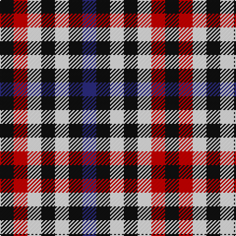

This page is one **sett** — a single exact thread-count. It belongs to the [tartan](/tartans/k1r1w1k1w1k1db1/)
(the same proportion at any scale), whose colour order is pattern [BKWKWRK](/stripes/bkwkwrk/).

Sourced from tartans-authority.  It is a [7 stripe tartan](/stripes/stripes7/).

Original link http://www.tartansauthority.com/tartan-ferret/display/370/

## Also known as

This cloth is also recorded under:

- Bell Southern
- Bell, Border
- Bell, South.

## Register references

External register numbers recorded for this tartan.

- Scottish Tartans Authority (ITI): 370

## Thread count
K/14 R14 W14 K14 W14 K14 DB/14

## Palette

Palette: <strong>Tartan Register</strong>
<table><thead><tr><th>Colour</th><th>Threads</th><th>Shade</th><th>Base</th><th>OKLCh</th></tr></thead><tbody><tr><td>K/</td><td style="text-align:right;font-variant-numeric:tabular-nums">14</td><td><code style="background-color:#101010;">#101010</code> <small style="color:#888">#101010</small></td><td>K <code style="background-color:#000000;">#000000</code></td><td><small style="color:#888">oklch(17.3% 0.000 89.9)</small></td></tr><tr><td>R</td><td style="text-align:right;font-variant-numeric:tabular-nums">14</td><td><code style="background-color:#C80000;">#C80000</code> <small style="color:#888">#C80000</small></td><td>R <code style="background-color:#CC0000;">#CC0000</code></td><td><small style="color:#888">oklch(52.3% 0.215 29.2)</small></td></tr><tr><td>W</td><td style="text-align:right;font-variant-numeric:tabular-nums">14</td><td><code style="background-color:#FCFCFC;">#FCFCFC</code> <small style="color:#888">#FCFCFC</small></td><td>W <code style="background-color:#F7F7F7;">#F7F7F7</code></td><td><small style="color:#888">oklch(99.1% 0.000 89.9)</small></td></tr><tr><td>K</td><td style="text-align:right;font-variant-numeric:tabular-nums">14</td><td><code style="background-color:#101010;">#101010</code> <small style="color:#888">#101010</small></td><td>K <code style="background-color:#000000;">#000000</code></td><td><small style="color:#888">oklch(17.3% 0.000 89.9)</small></td></tr><tr><td>W</td><td style="text-align:right;font-variant-numeric:tabular-nums">14</td><td><code style="background-color:#FCFCFC;">#FCFCFC</code> <small style="color:#888">#FCFCFC</small></td><td>W <code style="background-color:#F7F7F7;">#F7F7F7</code></td><td><small style="color:#888">oklch(99.1% 0.000 89.9)</small></td></tr><tr><td>K</td><td style="text-align:right;font-variant-numeric:tabular-nums">14</td><td><code style="background-color:#101010;">#101010</code> <small style="color:#888">#101010</small></td><td>K <code style="background-color:#000000;">#000000</code></td><td><small style="color:#888">oklch(17.3% 0.000 89.9)</small></td></tr><tr><td>DB/</td><td style="text-align:right;font-variant-numeric:tabular-nums">14</td><td><code style="background-color:#2C2C80;">#2C2C80</code> <small style="color:#888">#2C2C80</small></td><td>B <code style="background-color:#2A418A;">#2A418A</code></td><td><small style="color:#888">oklch(35.0% 0.138 276.6)</small></td></tr></tbody></table>

# Sample pattern

## Nearest tartans

The nearest existing variants by ΔTartan distance, with this tartan at the top so the swatches line up against it.

ΔTartan

Tartan

Sett

—

<a href="/ttd/edit/#slug=k1r1w1k1w1k1db1~x14">Bell, Border (Name)</a> <a class="nn-out" href="/setts/s7/k1r1w1k1w1k1db1~x14/" title="open its dictionary page">↗</a>

0.00

<a href="/ttd/edit/#slug=k1r1w1k1w1k1db1~x16">Border Bell</a> <a class="nn-out" href="/setts/s7/k1r1w1k1w1k1db1~x16/" title="open its dictionary page">↗</a>

0.75

<a href="/ttd/edit/#slug=do1lb1k1lb1do1lb1k1lb1r1~x6">Dupplin Check</a> <a class="nn-out" href="/setts/s9/do1lb1k1lb1do1lb1k1lb1r1~x6/" title="open its dictionary page">↗</a>

0.81

<a href="/ttd/edit/#slug=k1r1w1k1w1k1db1~x8">Bell, South.</a> <a class="nn-out" href="/setts/s7/k1r1w1k1w1k1db1~x8/" title="open its dictionary page">↗</a>

1.00

<a href="/ttd/edit/#slug=do1w1k1w1do1w1k1w1dt1~x6">Strathspey (Estate Check)</a> <a class="nn-out" href="/setts/s9/do1w1k1w1do1w1k1w1dt1~x6/" title="open its dictionary page">↗</a>

1.57

<a href="/setts/s8/k1w1k1w1db1~x12/">Buccleuch, Check</a>

1.76

<a href="/ttd/edit/#slug=k1lt1r1db1g1db1~x25">Antonelli (Oklahoma), John (Personal)</a> <a class="nn-out" href="/setts/s6/k1lt1r1db1g1db1~x25/" title="open its dictionary page">↗</a>

1.86

<a href="/setts/s4/k1w1do1~x8/">Hogg</a>

1.97

<a href="/ttd/edit/#slug=r1o1k1o1y1o1k1o1y1~x12">Seaforth (Estate Check)</a> <a class="nn-out" href="/setts/s9/r1o1k1o1y1o1k1o1y1~x12/" title="open its dictionary page">↗</a>

1.97

<a href="/ttd/edit/#slug=r1o1k1o1y1o1k1o1y1~x6">Seaforth Estate Check Estate Check Weavers Tartan Tartan Number: 5344. Earliest known date: pre 1990 No details. See products available Copyright © Blair Urquhart, Comrie, 2015</a> <a class="nn-out" href="/setts/s9/r1o1k1o1y1o1k1o1y1~x6/" title="open its dictionary page">↗</a>

2.00

<a href="/ttd/edit/#slug=b5w4k4w4k4w4k4w4k4w4k4~x2">Buccleuch Check (9 squares)</a> <a class="nn-out" href="/setts/s11/b5w4k4w4k4w4k4w4k4w4k4~x2/" title="open its dictionary page">↗</a>

## Neighbour map

Every grey dot is one of 14359 variants placed by the first two principal components of the ΔTartan feature space (44% of its variance). Red is this tartan; blue dots are its nearest — click one to open its page.

<svg viewBox="0 0 640 380" role="img" style="max-width:100%;height:auto;border:1px solid #e0e0e0;border-radius:4px;display:block" xmlns="http://www.w3.org/2000/svg"><image href="/nn/cloud.v1.png" width="640" height="380"/><a href="/setts/s7/k1r1w1k1w1k1db1~x16/"><circle cx="14.0" cy="366.0" r="4" fill="#3465a4"><title>Border Bell</title></circle></a><a href="/setts/s9/do1lb1k1lb1do1lb1k1lb1r1~x6/"><circle cx="14.0" cy="366.0" r="4" fill="#3465a4"><title>Dupplin Check</title></circle></a><a href="/setts/s7/k1r1w1k1w1k1db1~x8/"><circle cx="14.0" cy="366.0" r="4" fill="#3465a4"><title>Bell, South.</title></circle></a><a href="/setts/s9/do1w1k1w1do1w1k1w1dt1~x6/"><circle cx="14.0" cy="366.0" r="4" fill="#3465a4"><title>Strathspey (Estate Check)</title></circle></a><a href="/setts/s8/k1w1k1w1db1~x12/"><circle cx="27.1" cy="366.0" r="4" fill="#3465a4"><title>Buccleuch, Check</title></circle></a><a href="/setts/s6/k1lt1r1db1g1db1~x25/"><circle cx="14.0" cy="366.0" r="4" fill="#3465a4"><title>Antonelli (Oklahoma), John (Personal)</title></circle></a><a href="/setts/s4/k1w1do1~x8/"><circle cx="35.0" cy="366.0" r="4" fill="#3465a4"><title>Hogg</title></circle></a><a href="/setts/s9/r1o1k1o1y1o1k1o1y1~x12/"><circle cx="14.0" cy="366.0" r="4" fill="#3465a4"><title>Seaforth (Estate Check)</title></circle></a><a href="/setts/s9/r1o1k1o1y1o1k1o1y1~x6/"><circle cx="14.0" cy="366.0" r="4" fill="#3465a4"><title>Seaforth Estate Check Estate Check Weavers Tartan Tartan Number: 5344. Earliest known date: pre 1990 No details. See products available Copyright © Blair Urquhart, Comrie, 2015</title></circle></a><a href="/setts/s11/b5w4k4w4k4w4k4w4k4w4k4~x2/"><circle cx="33.1" cy="360.9" r="4" fill="#3465a4"><title>Buccleuch Check (9 squares)</title></circle></a><circle cx="14.0" cy="366.0" r="5" fill="#c00000"/></svg>

ID: /setts/s7/k1r1w1k1w1k1db1~x14/
