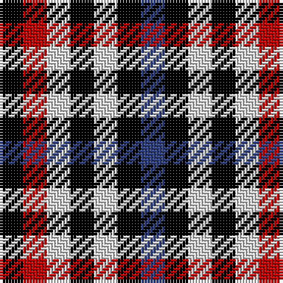

In pattern [BKWKWRK](/stripes/bkwkwrk/).

This was sourced from weddslist.  It is a [7 stripe tartan](/stripes/stripes7/).

Original link http://www.weddslist.com/cgi-bin/tartans/pg.pl?source=sts

## Also known as

This cloth is also recorded under:

- Bell, South.

## Attestations

This cloth appears in 2 source records; the oldest owns this page.

- undated — Bell, South. (weddslist, [record](http://www.weddslist.com/cgi-bin/tartans/pg.pl?source=sts))
- undated — Bell Southern Family Tartan Tartan Number: 370. Earliest known date: 1986 Originally anotated with 'Authorized by The Clan Bell of Lochmaben' but not now recognised by Chief Apparent, Benjamin. This tartan was known, possibly in error, as Bell of Blackethouse or Bell Blackethouse, and is now called 'Southern Bell'. See products available Copyright © Blair Urquhart, Comrie, 2015 (house-of-tartan, [record](http://www.house-of-tartan.scotland.net/house/TartanViewjs.asp?colr=Def&tnam=370))

## Thread count
K/8 R8 LN8 K8 LN8 K8 B/8

## Palette
Each colour and the base-6 reference it is a variant of.

| Colour | Shade | Base |
|---|---|---|
| B | <code style="background-color:#304080;">#304080</code> `oklch(39.4% 0.109 270.2)` <small>#304080</small> | B <code style="background-color:#2A418A;">#2A418A</code> |
| K | <code style="background-color:#000000;">#000000</code> `oklch(0.0% 0.000 0.0)` <small>#000000</small> | K <code style="background-color:#000000;">#000000</code> |
| LN | <code style="background-color:#E0E0E0;">#E0E0E0</code> `oklch(90.7% 0.000 89.9)` <small>#E0E0E0</small> | W <code style="background-color:#F7F7F7;">#F7F7F7</code> |
| R | <code style="background-color:#C00000;">#C00000</code> `oklch(50.7% 0.208 29.2)` <small>#C00000</small> | R <code style="background-color:#CC0000;">#CC0000</code> |

# Sample pattern

## Nearest tartans

The nearest existing variants by ΔTartan distance.

1. [Border Bell](/setts/s7/k1r1w1k1w1k1db1~x16/) — ΔT 0.81
1. [Bell, Border (Name)](/setts/s7/k1r1w1k1w1k1db1~x14/) — ΔT 0.81
1. [Dupplin Check](/setts/s9/do1lb1k1lb1do1lb1k1lb1r1~x6/) — ΔT 1.13
1. [Strathspey (Estate Check)](/setts/s9/do1w1k1w1do1w1k1w1dt1~x6/) — ΔT 1.54
1. [Buccleuch, Check](/setts/s8/k1w1k1w1db1~x12/) — ΔT 1.82
1. [Antonelli (Oklahoma), John (Personal)](/setts/s6/k1lt1r1db1g1db1~x25/) — ΔT 1.85
1. [Seaforth (Estate Check)](/setts/s9/r1o1k1o1y1o1k1o1y1~x12/) — ΔT 1.94
1. [Seaforth Estate Check Estate Check Weavers Tartan Tartan Number: 5344. Earliest known date: pre 1990 No details. See products available Copyright © Blair Urquhart, Comrie, 2015](/setts/s9/r1o1k1o1y1o1k1o1y1~x6/) — ΔT 1.94
1. [Dupplin (Estate Check)](/setts/s9/k1k1r1k1k1k1r1k1r1~x6/) — ΔT 2.22
1. [Coigach Tweed](/setts/s3/k1lb1o1~x6/) — ΔT 2.24

## Neighbour map

Every grey dot is one of 14299 variants placed by the first two principal components of the ΔTartan feature space (44% of its variance). Red is this tartan; blue dots are its nearest — click one to open its page.

<svg viewBox="0 0 640 380" role="img" style="max-width:100%;height:auto;border:1px solid #e0e0e0;border-radius:4px;display:block" xmlns="http://www.w3.org/2000/svg"><image href="/nn/cloud.v1.png" width="640" height="380"/><a href="/setts/s7/k1r1w1k1w1k1db1~x16/"><circle cx="14.0" cy="366.0" r="4" fill="#3465a4"><title>Border Bell</title></circle></a><a href="/setts/s7/k1r1w1k1w1k1db1~x14/"><circle cx="14.0" cy="366.0" r="4" fill="#3465a4"><title>Bell, Border (Name)</title></circle></a><a href="/setts/s9/do1lb1k1lb1do1lb1k1lb1r1~x6/"><circle cx="14.0" cy="366.0" r="4" fill="#3465a4"><title>Dupplin Check</title></circle></a><a href="/setts/s9/do1w1k1w1do1w1k1w1dt1~x6/"><circle cx="14.0" cy="366.0" r="4" fill="#3465a4"><title>Strathspey (Estate Check)</title></circle></a><a href="/setts/s8/k1w1k1w1db1~x12/"><circle cx="27.4" cy="366.0" r="4" fill="#3465a4"><title>Buccleuch, Check</title></circle></a><a href="/setts/s6/k1lt1r1db1g1db1~x25/"><circle cx="14.0" cy="366.0" r="4" fill="#3465a4"><title>Antonelli (Oklahoma), John (Personal)</title></circle></a><a href="/setts/s9/r1o1k1o1y1o1k1o1y1~x12/"><circle cx="14.0" cy="366.0" r="4" fill="#3465a4"><title>Seaforth (Estate Check)</title></circle></a><a href="/setts/s9/r1o1k1o1y1o1k1o1y1~x6/"><circle cx="14.0" cy="366.0" r="4" fill="#3465a4"><title>Seaforth Estate Check Estate Check Weavers Tartan Tartan Number: 5344. Earliest known date: pre 1990 No details. See products available Copyright © Blair Urquhart, Comrie, 2015</title></circle></a><a href="/setts/s9/k1k1r1k1k1k1r1k1r1~x6/"><circle cx="14.0" cy="366.0" r="4" fill="#3465a4"><title>Dupplin (Estate Check)</title></circle></a><a href="/setts/s3/k1lb1o1~x6/"><circle cx="14.0" cy="366.0" r="4" fill="#3465a4"><title>Coigach Tweed</title></circle></a><circle cx="14.0" cy="366.0" r="5" fill="#c00000"/></svg>

ID: /setts/s7/k1r1w1k1w1k1db1~x8/
