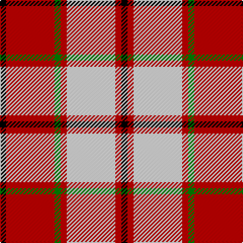

In pattern [KRGRWRK](/patterns/krgrwrk/).

This was sourced from weddslist.  It is a [7 stripes tartan](/stripes/stripes7/).

Original link http://www.weddslist.com/cgi-bin/tartans/pg.pl?source=sts

## Thread count
K/6 R48 G6 R6 LN48 R6 K/6

## Palette
Each colour and its ΔE from the base-6 reference it is a variant of.

| Colour | Shade | Base | ΔE (OKLab) |
|---|---|---|---|
| G | <code style="background-color:#008000;">#008000</code> `#008000` | G <code style="background-color:#006100;">#006100</code> | 0.10 |
| K | <code style="background-color:#000000;">#000000</code> `#000000` | K <code style="background-color:#000000;">#000000</code> | 0.00 |
| LN | <code style="background-color:#E0E0E0;">#E0E0E0</code> `#E0E0E0` | W <code style="background-color:#F7F7F7;">#F7F7F7</code> | 0.07 |
| R | <code style="background-color:#C00000;">#C00000</code> `#C00000` | R <code style="background-color:#CC0000;">#CC0000</code> | 0.03 |

# Sample pattern

## Nearest tartans

The nearest existing variants by ΔTartan distance.

1. [Cameron Hose](/setts/s7/k1r8g1r1w8r1k1x6~g005020-k101010-rdc0000-we0e0e0/) — ΔT 0.48
1. [Lennox Dress #2](/setts/s7/r2ra1r10ra2w10b1w2x4~b2c2c80-rc80000-ra880000-we0e0e0/) — ΔT 0.99
1. [MacPherson Dress Burgundy (Dance)](/setts/s7/w4k2w25r21w3r8y3x2~k101010-r880000-we0e0e0-ye8c000/) — ΔT 1.06
1. [Cameron, Hose for E](/setts/s8/r3k2r23ra3r3w23r3ra3x2~k000000-rc00000-rad00000-we0e0e0/) — ΔT 1.12
1. [Orange Fanaticos](/setts/s7/w12y75k22wa12k22wa16w8~k101010-wadbee9-waffffff-yfc8100/) — ΔT 1.13
1. [Unidentified 34](/setts/s9/w6r1ra4w1b4r1ra8w1ra2x2~b000050-r906030-rac00000-we0e0e0/) — ΔT 1.19
1. [Nesbit, Rose](/setts/s6/r6w3r37k16w16g4x2~g006818-k101010-rd05054-we8ccb8/) — ΔT 1.20
1. [MacPherson, Burgundy dress](/setts/s7/w4k2w25r21w3r8y3x2~k000000-rc00000-we0e0e0-yf0c000/) — ΔT 1.20
1. [Unidentified #41](/setts/s9/w6r1ra4w1b4r1ra8w1ra2x2~b080848-rbe7832-radc0000-we0e0e0/) — ΔT 1.23
1. [Torridon, Burgundy (Dance)](/setts/s7/w3y2w30r30b2r2y3x2~b843470-r800028-wf0e0c8-y58bc60/) — ΔT 1.23

## Neighbour map

Every grey dot is one of 15726 variants placed by the first two principal components of the ΔTartan feature space (44% of its variance). Red is this tartan; blue dots are its nearest — click one to open its page.

<svg viewBox="0 0 640 380" role="img" style="max-width:100%;height:auto;border:1px solid #e0e0e0;border-radius:4px;display:block" xmlns="http://www.w3.org/2000/svg"><image href="/nn/cloud.v1.png" width="640" height="380"/><a href="/setts/s7/k1r8g1r1w8r1k1x6~g005020-k101010-rdc0000-we0e0e0/"><circle cx="244.3" cy="163.3" r="4" fill="#3465a4"><title>Cameron Hose</title></circle></a><a href="/setts/s7/r2ra1r10ra2w10b1w2x4~b2c2c80-rc80000-ra880000-we0e0e0/"><circle cx="237.0" cy="163.9" r="4" fill="#3465a4"><title>Lennox Dress #2</title></circle></a><a href="/setts/s7/w4k2w25r21w3r8y3x2~k101010-r880000-we0e0e0-ye8c000/"><circle cx="264.2" cy="159.7" r="4" fill="#3465a4"><title>MacPherson Dress Burgundy (Dance)</title></circle></a><a href="/setts/s8/r3k2r23ra3r3w23r3ra3x2~k000000-rc00000-rad00000-we0e0e0/"><circle cx="285.7" cy="143.5" r="4" fill="#3465a4"><title>Cameron, Hose for E</title></circle></a><a href="/setts/s7/w12y75k22wa12k22wa16w8~k101010-wadbee9-waffffff-yfc8100/"><circle cx="187.7" cy="166.8" r="4" fill="#3465a4"><title>Orange Fanaticos</title></circle></a><a href="/setts/s9/w6r1ra4w1b4r1ra8w1ra2x2~b000050-r906030-rac00000-we0e0e0/"><circle cx="218.1" cy="177.2" r="4" fill="#3465a4"><title>Unidentified 34</title></circle></a><a href="/setts/s6/r6w3r37k16w16g4x2~g006818-k101010-rd05054-we8ccb8/"><circle cx="266.3" cy="177.7" r="4" fill="#3465a4"><title>Nesbit, Rose</title></circle></a><a href="/setts/s7/w4k2w25r21w3r8y3x2~k000000-rc00000-we0e0e0-yf0c000/"><circle cx="272.1" cy="157.5" r="4" fill="#3465a4"><title>MacPherson, Burgundy dress</title></circle></a><a href="/setts/s9/w6r1ra4w1b4r1ra8w1ra2x2~b080848-rbe7832-radc0000-we0e0e0/"><circle cx="220.9" cy="174.2" r="4" fill="#3465a4"><title>Unidentified #41</title></circle></a><a href="/setts/s7/w3y2w30r30b2r2y3x2~b843470-r800028-wf0e0c8-y58bc60/"><circle cx="275.4" cy="135.0" r="4" fill="#3465a4"><title>Torridon, Burgundy (Dance)</title></circle></a><circle cx="235.8" cy="163.7" r="5" fill="#c00000"/></svg>

ID: /setts/s7/k1r8g1r1w8r1k1x6~g008000-k000000-rc00000-we0e0e0/
