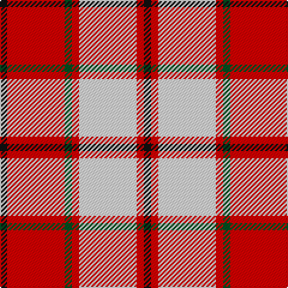

In pattern [KRGRWRK](/patterns/krgrwrk/).

This was sourced from register-of-tartans.  It is a [7 stripes tartan](/stripes/stripes7/).

Original link https://www.tartanregister.gov.uk/tartanDetails.aspx?ref=492

## Thread count
K/6 R48 G6 R6 LN48 R6 K/6

## Palette
Each colour and its ΔE from the base-6 reference it is a variant of.

| Colour | Shade | Base | ΔE (OKLab) |
|---|---|---|---|
| G | <code style="background-color:#005020;">#005020</code> `#005020` | G <code style="background-color:#006100;">#006100</code> | 0.07 |
| K | <code style="background-color:#101010;">#101010</code> `#101010` | K <code style="background-color:#000000;">#000000</code> | 0.17 |
| LN | <code style="background-color:#E0E0E0;">#E0E0E0</code> `#E0E0E0` | W <code style="background-color:#F7F7F7;">#F7F7F7</code> | 0.07 |
| R | <code style="background-color:#DC0000;">#DC0000</code> `#DC0000` | R <code style="background-color:#CC0000;">#CC0000</code> | 0.03 |

# Sample pattern

## Nearest tartans

The nearest existing variants by ΔTartan distance.

1. [Cameron, Hose](/setts/s7/k1r8g1r1w8r1k1~g008000-k000000-rc00000-we0e0e0~x6/) — ΔT 0.48
1. [Lennox Dress #2](/setts/s7/r2ra1r10ra2w10b1w2~b2c2c80-rc80000-ra880000-we0e0e0~x4/) — ΔT 0.69
1. [Cameron, Hose for E](/setts/s8/r3k2r23ra3r3w23r3ra3~k000000-rc00000-rad00000-we0e0e0~x2/) — ΔT 0.85
1. [MacPherson, Red](/setts/s7/w5b3w26r20w3r8y3~b800080-rc00000-we0e0e0-yf0c000~x2/) — ΔT 0.99
1. [MacPherson, Burgundy dress](/setts/s7/w4k2w25r21w3r8y3~k000000-rc00000-we0e0e0-yf0c000~x2/) — ΔT 1.02
1. [MacPherson Dress Red (Dance)](/setts/s7/w5b3w26r20w3r8y3~b780078-rc80000-we0e0e0-ye8c000~x2/) — ΔT 1.02
1. [Lennox Dress District Tartan Tartan Number: 1649. Earliest known date: 1986 Families with the surname 'Lennox' are usually considered related to Clans Stewart or MacFarlane. Some of this surname also choose to wear the distinctive and ancient 'Lennox' tartan. D W Stewart reproduced the sett from a 'lost' portrait of the Countess of Lennox dating from the 16th century. See products available Copyright © Blair Urquhart, Comrie, 2015](/setts/s7/r8ra2r24ra5w25g2w8~g604000-rc80000-raa00048-we0e0e0~x2/) — ΔT 1.08
1. [MacPherson Dress Burgandy Clan Tartan Tartan Number: 1832. Earliest known date: pre 2003 Examined by D.C.S. 1947 See products available Copyright © Blair Urquhart, Comrie, 2015](/setts/s7/w4k2w25r21w3r8y3~k101010-rc80000-we0e0e0-ye8c000~x2/) — ΔT 1.09
1. [Torridon, Cherry (Dance)](/setts/s7/r3ra2b2ra30w30b2w3~b1c1c50-r880000-rab80000-wf0e0c8~x2/) — ΔT 1.09
1. [Lennox, dress](/setts/s7/r8b2r24b5w25ra2w8~b800080-rc00000-ra806050-we0e0e0~x2/) — ΔT 1.10

## Neighbour map

Every grey dot is one of 15726 variants placed by the first two principal components of the ΔTartan feature space (44% of its variance). Red is this tartan; blue dots are its nearest — click one to open its page.

<svg viewBox="0 0 640 380" role="img" style="max-width:100%;height:auto;border:1px solid #e0e0e0;border-radius:4px;display:block" xmlns="http://www.w3.org/2000/svg"><image href="/nn/cloud.v1.png" width="640" height="380"/><a href="/setts/s7/k1r8g1r1w8r1k1~g008000-k000000-rc00000-we0e0e0~x6/"><circle cx="235.8" cy="163.7" r="4" fill="#3465a4"><title>Cameron, Hose</title></circle></a><a href="/setts/s7/r2ra1r10ra2w10b1w2~b2c2c80-rc80000-ra880000-we0e0e0~x4/"><circle cx="237.0" cy="163.9" r="4" fill="#3465a4"><title>Lennox Dress #2</title></circle></a><a href="/setts/s8/r3k2r23ra3r3w23r3ra3~k000000-rc00000-rad00000-we0e0e0~x2/"><circle cx="285.7" cy="143.5" r="4" fill="#3465a4"><title>Cameron, Hose for E</title></circle></a><a href="/setts/s7/w5b3w26r20w3r8y3~b800080-rc00000-we0e0e0-yf0c000~x2/"><circle cx="265.2" cy="175.0" r="4" fill="#3465a4"><title>MacPherson, Red</title></circle></a><a href="/setts/s7/w4k2w25r21w3r8y3~k000000-rc00000-we0e0e0-yf0c000~x2/"><circle cx="272.1" cy="157.5" r="4" fill="#3465a4"><title>MacPherson, Burgundy dress</title></circle></a><a href="/setts/s7/w5b3w26r20w3r8y3~b780078-rc80000-we0e0e0-ye8c000~x2/"><circle cx="266.7" cy="175.1" r="4" fill="#3465a4"><title>MacPherson Dress Red (Dance)</title></circle></a><a href="/setts/s7/r8ra2r24ra5w25g2w8~g604000-rc80000-raa00048-we0e0e0~x2/"><circle cx="253.8" cy="164.6" r="4" fill="#3465a4"><title>Lennox Dress District Tartan Tartan Number: 1649. Earliest known date: 1986 Families with the surname 'Lennox' are usually considered related to Clans Stewart or MacFarlane. Some of this surname also choose to wear the distinctive and ancient 'Lennox' tartan. D W Stewart reproduced the sett from a 'lost' portrait of the Countess of Lennox dating from the 16th century. See products available Copyright © Blair Urquhart, Comrie, 2015</title></circle></a><a href="/setts/s7/w4k2w25r21w3r8y3~k101010-rc80000-we0e0e0-ye8c000~x2/"><circle cx="277.8" cy="158.7" r="4" fill="#3465a4"><title>MacPherson Dress Burgandy Clan Tartan Tartan Number: 1832. Earliest known date: pre 2003 Examined by D.C.S. 1947 See products available Copyright © Blair Urquhart, Comrie, 2015</title></circle></a><a href="/setts/s7/r3ra2b2ra30w30b2w3~b1c1c50-r880000-rab80000-wf0e0c8~x2/"><circle cx="284.5" cy="133.1" r="4" fill="#3465a4"><title>Torridon, Cherry (Dance)</title></circle></a><a href="/setts/s7/r8b2r24b5w25ra2w8~b800080-rc00000-ra806050-we0e0e0~x2/"><circle cx="249.6" cy="164.3" r="4" fill="#3465a4"><title>Lennox, dress</title></circle></a><circle cx="244.3" cy="163.3" r="5" fill="#c00000"/></svg>

ID: /setts/s7/k1r8g1r1w8r1k1~g005020-k101010-rdc0000-we0e0e0~x6/
