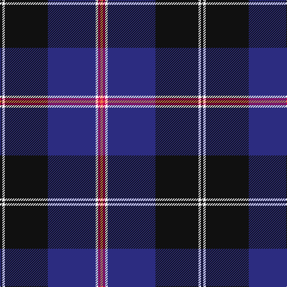

In pattern [KWKBWRY](/patterns/kwkbwry/).

This was sourced from register-of-tartans.  It is a [7 stripes tartan](/stripes/stripes7/).

Original link https://www.tartanregister.gov.uk/tartanDetails.aspx?ref=1289

## Attestations

This cloth appears in 2 source records; the oldest owns this page.

- 01/09/2005 — Fuller of Hopewell (Personal) (register-of-tartans, [record](https://www.tartanregister.gov.uk/tartanDetails.aspx?ref=1289))
- 2005 September — Fuller of Hopewell (Personal) (tartans-authority, [record](http://www.tartansauthority.com/tartan-ferret/display/6781/))

## Register references

External register numbers recorded for this tartan.

- Scottish Register of Tartans: [1289](https://www.tartanregister.gov.uk/tartanDetails.aspx?ref=1289)
- Scottish Tartans Authority (ITI): 6781

## Thread count
K/4 W4 K72 DB80 W4 R4 O/4

## Palette
Each colour and its ΔE from the base-6 reference it is a variant of.

| Colour | Shade | Base | ΔE (OKLab) |
|---|---|---|---|
| DB | <code style="background-color:#2C2C80;">#2C2C80</code> `#2C2C80` | B <code style="background-color:#2A418A;">#2A418A</code> | 0.06 |
| K | <code style="background-color:#101010;">#101010</code> `#101010` | K <code style="background-color:#000000;">#000000</code> | 0.17 |
| O | <code style="background-color:#EC8048;">#EC8048</code> `#EC8048` | Y <code style="background-color:#F2BF00;">#F2BF00</code> | 0.17 |
| R | <code style="background-color:#C80050;">#C80050</code> `#C80050` | R <code style="background-color:#CC0000;">#CC0000</code> | 0.07 |
| W | <code style="background-color:#F8F8F8;">#F8F8F8</code> `#F8F8F8` | W <code style="background-color:#F7F7F7;">#F7F7F7</code> | 0.00 |

# Sample pattern

## Nearest tartans

The nearest existing variants by ΔTartan distance.

1. [Hill (Name)](/setts/s9/w3b2y1b2y1b31k28r2k2~b2c2c80-k101010-rc80000-we0e0e0-ye8c000~x2/) — ΔT 0.89
1. [Binder Wedding (Personal)](/setts/s8/g1b1k1b30k30w2b5y1~b2c4084-g649848-k101010-wffffff-yffe600~x2/) — ΔT 0.95
1. [MacBeth (Fashion)](/setts/s8/b42k6y2k3y2g10r7k2~b1c0070-g006818-k101010-r880000-yd09800~x2/) — ΔT 1.04
1. [Dunlop](/setts/s8/k3r1k30w1b28r1b1w3~b2c2c80-k101010-rc80000-we0e0e0~x2/) — ΔT 1.11
1. [Hope-Weir / Weir](/setts/s8/k8y1k1b28k12g2k1ba2~b304080-ba5480b0-g008000-k000000-yf0c000~x2/) — ΔT 1.16
1. [Italian National](/setts/s6/r3w2g5k35b40y3~b2c2c80-g289c18-k101010-rc80000-wfcfcfc-ye8c000~x2/) — ΔT 1.19
1. [Locky](/setts/s10/r3w2r2b2r2b24k28r2k3y1~b2c2c80-k101010-rc80000-wfcfcfc-ye8c000~x2/) — ΔT 1.20
1. [Chestico](/setts/s7/b20g1b1g1ga8k1w3~b202060-g603800-ga003820-k101010-wfcfcfc~x2/) — ΔT 1.21
1. [City of Rome Pipe Band (Corporate)](/setts/s7/r12y6k88b45k6b6ya6~b2c2c80-k101010-r901c38-yd87c00-yae8c000/) — ΔT 1.22
1. [Royal Marines Condor](/setts/s7/k8r4k36b48r6g3y2~b1c0070-g006818-k101010-rc80000-yd09800~x2/) — ΔT 1.22

## Neighbour map

Every grey dot is one of 15726 variants placed by the first two principal components of the ΔTartan feature space (44% of its variance). Red is this tartan; blue dots are its nearest — click one to open its page.

<svg viewBox="0 0 640 380" role="img" style="max-width:100%;height:auto;border:1px solid #e0e0e0;border-radius:4px;display:block" xmlns="http://www.w3.org/2000/svg"><image href="/nn/cloud.v1.png" width="640" height="380"/><a href="/setts/s9/w3b2y1b2y1b31k28r2k2~b2c2c80-k101010-rc80000-we0e0e0-ye8c000~x2/"><circle cx="334.7" cy="111.6" r="4" fill="#3465a4"><title>Hill (Name)</title></circle></a><a href="/setts/s8/g1b1k1b30k30w2b5y1~b2c4084-g649848-k101010-wffffff-yffe600~x2/"><circle cx="355.3" cy="125.2" r="4" fill="#3465a4"><title>Binder Wedding (Personal)</title></circle></a><a href="/setts/s8/b42k6y2k3y2g10r7k2~b1c0070-g006818-k101010-r880000-yd09800~x2/"><circle cx="340.3" cy="136.8" r="4" fill="#3465a4"><title>MacBeth (Fashion)</title></circle></a><a href="/setts/s8/k3r1k30w1b28r1b1w3~b2c2c80-k101010-rc80000-we0e0e0~x2/"><circle cx="356.5" cy="137.8" r="4" fill="#3465a4"><title>Dunlop</title></circle></a><a href="/setts/s8/k8y1k1b28k12g2k1ba2~b304080-ba5480b0-g008000-k000000-yf0c000~x2/"><circle cx="317.0" cy="125.8" r="4" fill="#3465a4"><title>Hope-Weir / Weir</title></circle></a><a href="/setts/s6/r3w2g5k35b40y3~b2c2c80-g289c18-k101010-rc80000-wfcfcfc-ye8c000~x2/"><circle cx="257.5" cy="141.5" r="4" fill="#3465a4"><title>Italian National</title></circle></a><a href="/setts/s10/r3w2r2b2r2b24k28r2k3y1~b2c2c80-k101010-rc80000-wfcfcfc-ye8c000~x2/"><circle cx="293.3" cy="105.8" r="4" fill="#3465a4"><title>Locky</title></circle></a><a href="/setts/s7/b20g1b1g1ga8k1w3~b202060-g603800-ga003820-k101010-wfcfcfc~x2/"><circle cx="350.2" cy="143.8" r="4" fill="#3465a4"><title>Chestico</title></circle></a><a href="/setts/s7/r12y6k88b45k6b6ya6~b2c2c80-k101010-r901c38-yd87c00-yae8c000/"><circle cx="334.2" cy="165.3" r="4" fill="#3465a4"><title>City of Rome Pipe Band (Corporate)</title></circle></a><a href="/setts/s7/k8r4k36b48r6g3y2~b1c0070-g006818-k101010-rc80000-yd09800~x2/"><circle cx="318.0" cy="158.4" r="4" fill="#3465a4"><title>Royal Marines Condor</title></circle></a><circle cx="310.3" cy="142.6" r="5" fill="#c00000"/></svg>

ID: /setts/s7/k1w1k18b20w1r1y1~b2c2c80-k101010-rc80050-wf8f8f8-yec8048~x4/
