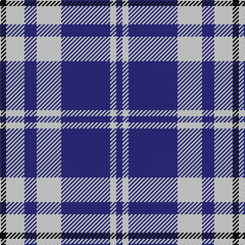

This page is one **sett** — a single exact thread-count. It belongs to the [tartan](/tartans/k1ln3db2ln4db8ln1db1/)
(the same proportion at any scale), whose colour order is pattern [BWBWBWK](/stripes/bwbwbwk/).

Sourced from tartans-authority.  It is a [7 stripe tartan](/stripes/stripes7/).

Original link http://www.tartansauthority.com/tartan-ferret/display/7772/

## Thread count
K/6 LN18 DB12 LN24 DB48 LN6 DB/6

## Palette
Each colour and the base-6 reference it is a variant of.

| Colour | Shade | Base |
|---|---|---|
| DB | <code style="background-color:#2C2C80;">#2C2C80</code> `oklch(35.0% 0.138 276.6)` <small>#2C2C80</small> | B <code style="background-color:#2A418A;">#2A418A</code> |
| K | <code style="background-color:#101010;">#101010</code> `oklch(17.3% 0.000 89.9)` <small>#101010</small> | K <code style="background-color:#000000;">#000000</code> |
| LN | <code style="background-color:#E0E0E0;">#E0E0E0</code> `oklch(90.7% 0.000 89.9)` <small>#E0E0E0</small> | W <code style="background-color:#F7F7F7;">#F7F7F7</code> |

# Sample pattern

## Nearest tartans

The nearest existing variants by ΔTartan distance, with this tartan at the top so the swatches line up against it.

ΔTartan

Tartan

Sett

—

<a href="/ttd/edit/#slug=k1w3db2w4db8w1db1~x6">Queen Margaret University (Corporate</a> <a class="nn-out" href="/setts/s7/k1w3db2w4db8w1db1~x6/" title="open its dictionary page">↗</a>

0.92

<a href="/ttd/edit/#slug=db8w3db28w32k3w4~x2">Ailsa, Navy (Dance)</a> <a class="nn-out" href="/setts/s6/db8w3db28w32k3w4~x2/" title="open its dictionary page">↗</a>

1.11

<a href="/ttd/edit/#slug=w5db16w5db16w33r3~x2">Buchanan Dress Blue (Dance)</a> <a class="nn-out" href="/setts/s6/w5db16w5db16w33r3~x2/" title="open its dictionary page">↗</a>

1.25

<a href="/ttd/edit/#slug=k3lr16k4lr3k12w2~x3">MacMugen</a> <a class="nn-out" href="/setts/s6/k3lr16k4lr3k12w2~x3/" title="open its dictionary page">↗</a>

1.32

<a href="/setts/s6/b30ly5b4r12~x4/">UEFA (Glasgow)</a>

1.34

<a href="/ttd/edit/#slug=w5k3w26db21w3db8ly3~x2">MacPherson Dress Blue (Dance)</a> <a class="nn-out" href="/setts/s7/w5k3w26db21w3db8ly3~x2/" title="open its dictionary page">↗</a>

1.34

<a href="/ttd/edit/#slug=db19ly2db3w7db3w7db9w3db2w19~x2">Yorkshire, The Spirit of</a> <a class="nn-out" href="/setts/s10/db19ly2db3w7db3w7db9w3db2w19~x2/" title="open its dictionary page">↗</a>

1.36

<a href="/ttd/edit/#slug=db8w2db11w13db30w13r11db2~x2">Jubilation (Commemorative)</a> <a class="nn-out" href="/setts/s8/db8w2db11w13db30w13r11db2~x2/" title="open its dictionary page">↗</a>

1.45

<a href="/ttd/edit/#slug=w16db3w2db3w2db3r5db6w2~x4">Jeux Canada Games '87 (Corporate)</a> <a class="nn-out" href="/setts/s9/w16db3w2db3w2db3r5db6w2~x4/" title="open its dictionary page">↗</a>

1.47

<a href="/ttd/edit/#slug=db8t3db28w32dt3w4~x2">Ailsa, Royal Blue (Dance)</a> <a class="nn-out" href="/setts/s6/db8t3db28w32dt3w4~x2/" title="open its dictionary page">↗</a>

1.48

<a href="/ttd/edit/#slug=db10g4w27db40r4~x2">Turnbull Dress, Bruce (Personal)</a> <a class="nn-out" href="/setts/s5/db10g4w27db40r4~x2/" title="open its dictionary page">↗</a>

## Neighbour map

Every grey dot is one of 14299 variants placed by the first two principal components of the ΔTartan feature space (44% of its variance). Red is this tartan; blue dots are its nearest — click one to open its page.

<svg viewBox="0 0 640 380" role="img" style="max-width:100%;height:auto;border:1px solid #e0e0e0;border-radius:4px;display:block" xmlns="http://www.w3.org/2000/svg"><image href="/nn/cloud.v1.png" width="640" height="380"/><a href="/setts/s6/db8w3db28w32k3w4~x2/"><circle cx="279.3" cy="189.9" r="4" fill="#3465a4"><title>Ailsa, Navy (Dance)</title></circle></a><a href="/setts/s6/w5db16w5db16w33r3~x2/"><circle cx="283.7" cy="194.6" r="4" fill="#3465a4"><title>Buchanan Dress Blue (Dance)</title></circle></a><a href="/setts/s6/k3lr16k4lr3k12w2~x3/"><circle cx="251.6" cy="220.9" r="4" fill="#3465a4"><title>MacMugen</title></circle></a><a href="/setts/s6/b30ly5b4r12~x4/"><circle cx="346.9" cy="217.8" r="4" fill="#3465a4"><title>UEFA (Glasgow)</title></circle></a><a href="/setts/s7/w5k3w26db21w3db8ly3~x2/"><circle cx="234.9" cy="177.1" r="4" fill="#3465a4"><title>MacPherson Dress Blue (Dance)</title></circle></a><a href="/setts/s10/db19ly2db3w7db3w7db9w3db2w19~x2/"><circle cx="265.2" cy="183.9" r="4" fill="#3465a4"><title>Yorkshire, The Spirit of</title></circle></a><a href="/setts/s8/db8w2db11w13db30w13r11db2~x2/"><circle cx="288.4" cy="188.1" r="4" fill="#3465a4"><title>Jubilation (Commemorative)</title></circle></a><a href="/setts/s9/w16db3w2db3w2db3r5db6w2~x4/"><circle cx="256.4" cy="180.8" r="4" fill="#3465a4"><title>Jeux Canada Games '87 (Corporate)</title></circle></a><a href="/setts/s6/db8t3db28w32dt3w4~x2/"><circle cx="243.3" cy="175.5" r="4" fill="#3465a4"><title>Ailsa, Royal Blue (Dance)</title></circle></a><a href="/setts/s5/db10g4w27db40r4~x2/"><circle cx="288.4" cy="200.2" r="4" fill="#3465a4"><title>Turnbull Dress, Bruce (Personal)</title></circle></a><circle cx="280.5" cy="208.6" r="5" fill="#c00000"/></svg>

ID: /setts/s7/k1w3db2w4db8w1db1~x6/
