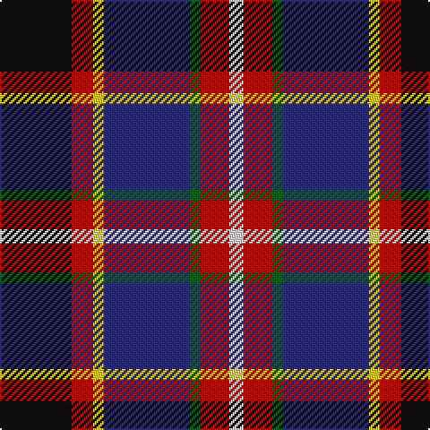

In pattern [KRYBGRW](/stripes/krybgrw/).

This was sourced from tartans-authority.  It is a [7 stripe tartan](/stripes/stripes7/).

Original link http://www.tartansauthority.com/tartan-ferret/display/10584/

## Thread count
K/40 R12 Y6 DB48 G6 R16 LN/8

## Palette
Each colour and the base-6 reference it is a variant of.

| Colour | Shade | Base |
|---|---|---|
| DB | <code style="background-color:#2C2C80;">#2C2C80</code> `oklch(35.0% 0.138 276.6)` <small>#2C2C80</small> | B <code style="background-color:#2A418A;">#2A418A</code> |
| G | <code style="background-color:#006818;">#006818</code> `oklch(45.0% 0.142 145.0)` <small>#006818</small> | G <code style="background-color:#006100;">#006100</code> |
| K | <code style="background-color:#101010;">#101010</code> `oklch(17.3% 0.000 89.9)` <small>#101010</small> | K <code style="background-color:#000000;">#000000</code> |
| LN | <code style="background-color:#E0E0E0;">#E0E0E0</code> `oklch(90.7% 0.000 89.9)` <small>#E0E0E0</small> | W <code style="background-color:#F7F7F7;">#F7F7F7</code> |
| R | <code style="background-color:#C80000;">#C80000</code> `oklch(52.3% 0.215 29.2)` <small>#C80000</small> | R <code style="background-color:#CC0000;">#CC0000</code> |
| Y | <code style="background-color:#FCCC00;">#FCCC00</code> `oklch(86.2% 0.176 91.5)` <small>#FCCC00</small> | Y <code style="background-color:#F2BF00;">#F2BF00</code> |

# Sample pattern

## Nearest tartans

The nearest existing variants by ΔTartan distance.

1. [Dean/Dundas (Melbourne, Australia) (Personal)](/setts/s9/r17k5n4k6ly5db31k5g6n3~x2/) — ΔT 0.82
1. [Culloden, Grey](/setts/s8/r6db3p24w2k23y23k2y6~x2/) — ΔT 0.89
1. [Dean/Dundas (Personal)](/setts/s9/r17k5w4k6ly5db31k5g6w3~x2/) — ΔT 0.97
1. [Culloden Grey](/setts/s8/r6db3dp24w2k23y23k2y6~x2/) — ΔT 0.99
1. [Tantallon](/setts/s10/w3db21k2r7k2g10k2r7k21ly3~x2/) — ΔT 1.00
1. [Unidentified (ex Tony Murray)](/setts/s7/r2ly2db9dy1dg9r1w1~x2/) — ΔT 1.00
1. [Loch Etive](/setts/s8/ly3db3k2db18k26r21g2lb3~x2/) — ΔT 1.03
1. [Galway County Crest (Fashion)](/setts/s9/o10t5db15k3db15k5r25k3w4~x2/) — ΔT 1.06
1. [Loch Etive](/setts/s8/w3g2r21k26db18k2db3ly3~x2/) — ΔT 1.06
1. [Morris of Balgonie (Personal)](/setts/s6/w2dp20r3k10g20lo2~x2/) — ΔT 1.08

## Neighbour map

Every grey dot is one of 14299 variants placed by the first two principal components of the ΔTartan feature space (44% of its variance). Red is this tartan; blue dots are its nearest — click one to open its page.

<svg viewBox="0 0 640 380" role="img" style="max-width:100%;height:auto;border:1px solid #e0e0e0;border-radius:4px;display:block" xmlns="http://www.w3.org/2000/svg"><image href="/nn/cloud.v1.png" width="640" height="380"/><a href="/setts/s9/r17k5n4k6ly5db31k5g6n3~x2/"><circle cx="132.4" cy="137.4" r="4" fill="#3465a4"><title>Dean/Dundas (Melbourne, Australia) (Personal)</title></circle></a><a href="/setts/s8/r6db3p24w2k23y23k2y6~x2/"><circle cx="119.9" cy="141.0" r="4" fill="#3465a4"><title>Culloden, Grey</title></circle></a><a href="/setts/s9/r17k5w4k6ly5db31k5g6w3~x2/"><circle cx="122.5" cy="132.0" r="4" fill="#3465a4"><title>Dean/Dundas (Personal)</title></circle></a><a href="/setts/s8/r6db3dp24w2k23y23k2y6~x2/"><circle cx="138.4" cy="151.9" r="4" fill="#3465a4"><title>Culloden Grey</title></circle></a><a href="/setts/s10/w3db21k2r7k2g10k2r7k21ly3~x2/"><circle cx="118.5" cy="141.2" r="4" fill="#3465a4"><title>Tantallon</title></circle></a><a href="/setts/s7/r2ly2db9dy1dg9r1w1~x2/"><circle cx="148.6" cy="162.0" r="4" fill="#3465a4"><title>Unidentified (ex Tony Murray)</title></circle></a><a href="/setts/s8/ly3db3k2db18k26r21g2lb3~x2/"><circle cx="158.4" cy="136.0" r="4" fill="#3465a4"><title>Loch Etive</title></circle></a><a href="/setts/s9/o10t5db15k3db15k5r25k3w4~x2/"><circle cx="124.5" cy="172.9" r="4" fill="#3465a4"><title>Galway County Crest (Fashion)</title></circle></a><a href="/setts/s8/w3g2r21k26db18k2db3ly3~x2/"><circle cx="153.5" cy="132.2" r="4" fill="#3465a4"><title>Loch Etive</title></circle></a><a href="/setts/s6/w2dp20r3k10g20lo2~x2/"><circle cx="151.6" cy="178.9" r="4" fill="#3465a4"><title>Morris of Balgonie (Personal)</title></circle></a><circle cx="117.8" cy="168.6" r="5" fill="#c00000"/></svg>

ID: /setts/s7/k20r6ly3db24g3r8w4~x2/
