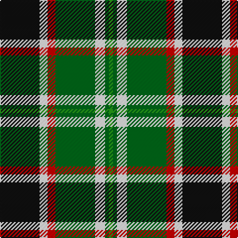

In pattern [GGWGRWK](/stripes/ggwgrwk/).

This was sourced from tartans-authority.  It is a [7 stripe tartan](/stripes/stripes7/).

Original link http://www.tartansauthority.com/tartan-ferret/display/10530/

## Thread count
K/40 W8 R8 Ga40 W10 Ga4 G/4

## Palette
Each colour and its ΔE from the base-6 reference it is a variant of.

| Colour | Shade | Base | ΔE (OKLab) |
|---|---|---|---|
| G | <code style="background-color:#289C18;">#289C18</code> `#289C18` | G <code style="background-color:#006100;">#006100</code> | 0.19 |
| Ga | <code style="background-color:#006818;">#006818</code> `#006818` | G <code style="background-color:#006100;">#006100</code> | 0.02 |
| K | <code style="background-color:#101010;">#101010</code> `#101010` | K <code style="background-color:#000000;">#000000</code> | 0.17 |
| R | <code style="background-color:#C80000;">#C80000</code> `#C80000` | R <code style="background-color:#CC0000;">#CC0000</code> | 0.01 |
| W | <code style="background-color:#FCFCFC;">#FCFCFC</code> `#FCFCFC` | W <code style="background-color:#F7F7F7;">#F7F7F7</code> | 0.01 |

# Sample pattern

## Nearest tartans

The nearest existing variants by ΔTartan distance.

1. [Mellor (Name)](/setts/s6/w8k16g32dt3lo5w5~x2/) — ΔT 0.90
1. [Lindley-Highfield Name Tartan Tartan Number: 10002. Earliest known date: 13 February 2009 'Lindley-Highfield of Ballumbie Castle' is a tartan of the family of the Lindley-Highfields of Ballumbie Castle, sometime Barons of Cartsburn. The colours of this particular tartan are taken from the armorial bearings of the Head of the Family of Lindley-Highfield of Ballumbie Castle. See products available Copyright © Blair Urquhart, Comrie, 2015](/setts/s7/g7p3w1lg2g1k2p1~x8/) — ΔT 0.94
1. [Bannockbane, Green](/setts/s7/dg8g6dg48w31o42g6o8/) — ΔT 0.96
1. [Skene](/setts/s7/db24k4r3k4g24k4lo4~x2/) — ΔT 0.98
1. [Unidentified #46](/setts/s9/w16dg2k5r2k10dg11ly2dg11k2~x2/) — ΔT 0.98
1. [Unnamed 9](/setts/s9/w16g2k5r2k10g11ly2g11k2~x2/) — ΔT 1.07
1. [MacLamroc](/setts/s6/ly4k1dg16k16r1w3~x2/) — ΔT 1.09
1. [Cape Breton](/setts/s7/ly5k5g17k6y24k6ly3~x2/) — ΔT 1.09
1. [Corstorphine Trial A](/setts/s10/k6ly2g18w3g13k3ly4k3db18w3~x2/) — ΔT 1.14
1. [Cornish National #2](/setts/s6/w2k11ly11db3k1r1~x2/) — ΔT 1.15

## Neighbour map

Every grey dot is one of 14299 variants placed by the first two principal components of the ΔTartan feature space (44% of its variance). Red is this tartan; blue dots are its nearest — click one to open its page.

<svg viewBox="0 0 640 380" role="img" style="max-width:100%;height:auto;border:1px solid #e0e0e0;border-radius:4px;display:block" xmlns="http://www.w3.org/2000/svg"><image href="/nn/cloud.v1.png" width="640" height="380"/><a href="/setts/s6/w8k16g32dt3lo5w5~x2/"><circle cx="187.3" cy="178.6" r="4" fill="#3465a4"><title>Mellor (Name)</title></circle></a><a href="/setts/s7/g7p3w1lg2g1k2p1~x8/"><circle cx="163.1" cy="189.2" r="4" fill="#3465a4"><title>Lindley-Highfield Name Tartan Tartan Number: 10002. Earliest known date: 13 February 2009 'Lindley-Highfield of Ballumbie Castle' is a tartan of the family of the Lindley-Highfields of Ballumbie Castle, sometime Barons of Cartsburn. The colours of this particular tartan are taken from the armorial bearings of the Head of the Family of Lindley-Highfield of Ballumbie Castle. See products available Copyright © Blair Urquhart, Comrie, 2015</title></circle></a><a href="/setts/s7/dg8g6dg48w31o42g6o8/"><circle cx="143.0" cy="184.1" r="4" fill="#3465a4"><title>Bannockbane, Green</title></circle></a><a href="/setts/s7/db24k4r3k4g24k4lo4~x2/"><circle cx="149.5" cy="182.5" r="4" fill="#3465a4"><title>Skene</title></circle></a><a href="/setts/s9/w16dg2k5r2k10dg11ly2dg11k2~x2/"><circle cx="124.7" cy="176.2" r="4" fill="#3465a4"><title>Unidentified #46</title></circle></a><a href="/setts/s9/w16g2k5r2k10g11ly2g11k2~x2/"><circle cx="112.9" cy="172.8" r="4" fill="#3465a4"><title>Unnamed 9</title></circle></a><a href="/setts/s6/ly4k1dg16k16r1w3~x2/"><circle cx="212.8" cy="162.7" r="4" fill="#3465a4"><title>MacLamroc</title></circle></a><a href="/setts/s7/ly5k5g17k6y24k6ly3~x2/"><circle cx="132.8" cy="200.0" r="4" fill="#3465a4"><title>Cape Breton</title></circle></a><a href="/setts/s10/k6ly2g18w3g13k3ly4k3db18w3~x2/"><circle cx="147.9" cy="168.4" r="4" fill="#3465a4"><title>Corstorphine Trial A</title></circle></a><a href="/setts/s6/w2k11ly11db3k1r1~x2/"><circle cx="174.5" cy="158.9" r="4" fill="#3465a4"><title>Cornish National #2</title></circle></a><circle cx="153.4" cy="166.0" r="5" fill="#c00000"/></svg>

ID: /setts/s7/k20w4r4g20w5g2g2~x2/
