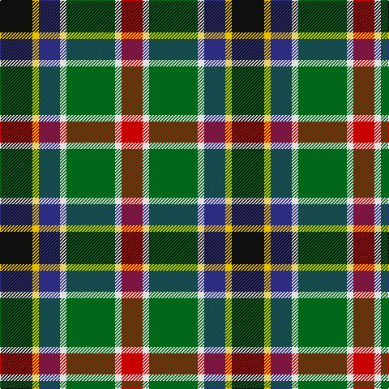

In pattern [KYBWGWR](/patterns/kybwgwr/).

This was sourced from tartans-authority.  It is a [7 stripes tartan](/stripes/stripes7/).

Original link http://www.tartansauthority.com/tartan-ferret/display/8477/

## Thread count
K/40 Y8 DB26 LN8 G60 LN8 R/26

## Palette
Each colour and its ΔE from the base-6 reference it is a variant of.

| Colour | Shade | Base | ΔE (OKLab) |
|---|---|---|---|
| DB | <code style="background-color:#2C2C80;">#2C2C80</code> `#2C2C80` | B <code style="background-color:#2A418A;">#2A418A</code> | 0.06 |
| G | <code style="background-color:#006818;">#006818</code> `#006818` | G <code style="background-color:#006100;">#006100</code> | 0.02 |
| K | <code style="background-color:#101010;">#101010</code> `#101010` | K <code style="background-color:#000000;">#000000</code> | 0.17 |
| LN | <code style="background-color:#E0E0E0;">#E0E0E0</code> `#E0E0E0` | W <code style="background-color:#F7F7F7;">#F7F7F7</code> | 0.07 |
| R | <code style="background-color:#C80000;">#C80000</code> `#C80000` | R <code style="background-color:#CC0000;">#CC0000</code> | 0.01 |
| Y | <code style="background-color:#E8C000;">#E8C000</code> `#E8C000` | Y <code style="background-color:#F2BF00;">#F2BF00</code> | 0.02 |

# Sample pattern

## Nearest tartans

The nearest existing variants by ΔTartan distance.

1. [Council of Scottish Clans & Ass. (Co](/setts/s7/w2r2b16k14g15r2y2~b2c2c80-g289c18-k101010-rc80000-wfcfcfc-yfccc00~x2/) — ΔT 0.86
1. [Comyn/Cumming](/setts/s9/b4k2b4k10y1g10r4w1r4~b3c82af-g005020-k101010-rdc0000-we0e0e0-ye8c000~x4/) — ΔT 0.90
1. [Gallowater](/setts/s6/r10k18b10ba18g40y5~b5480b0-ba304080-g008000-k000000-rc00000-yf0c000/) — ΔT 0.91
1. [Caledonian Labrador Retrievers](/setts/s8/r21y4b5y4r5k21g21ya5~b441800-g00643c-k101010-r9c68a4-y86c67c-yae0a126~x2/) — ΔT 0.92
1. [Labrador Club of Scotland (Corporate](/setts/s8/r21y4g5y4r5k21ga21ya5~g604000-ga006818-k101010-ra478a0-y98a46c-yabc8c00~x2/) — ΔT 0.94
1. [Burnfoot Check](/setts/s8/r3g2b2g3k6ba2ra10ba2~b646464-ba00008c-g004c00-k000000-r8c0000-raa0783c~x2/) — ΔT 0.95
1. [Caledonian Labrador Retrievers](/setts/s8/r21b4ba5b4r5k21g21y5~b000048-ba501400-g006818-k101010-r9c68a4-yfccc00~x2/) — ΔT 0.97
1. [National Trade Tartan Tartan Number: 1775. Earliest known date: 1934 This sett was designed by the National Association of Scottish Woollen Manufacturers in 1934. (STS archives) Some 60 years later (1994) a new 'National' tartan has been developed. See 'Scottish National' and 'Scottish National Dress'. See products available Copyright © Blair Urquhart, Comrie, 2015](/setts/s9/w2b3r6k8g12y1b4k2w2~b2c2c80-g006818-k101010-rc80000-we0e0e0-ye8c000~x2/) — ΔT 0.98
1. [Comyn, Cumming](/setts/s9/b4k2b4k10y1g10r4w1r4~b5480b0-g008000-k000000-rc00000-we0e0e0-yf0c000~x4/) — ΔT 1.01
1. [Jamestown Parish Church (Corporate)](/setts/s6/r3y2g12k12b14w3~b2c2c80-g006818-k101010-rc80000-we0e0e0-ye8c000~x2/) — ΔT 1.02

## Neighbour map

Every grey dot is one of 15726 variants placed by the first two principal components of the ΔTartan feature space (44% of its variance). Red is this tartan; blue dots are its nearest — click one to open its page.

<svg viewBox="0 0 640 380" role="img" style="max-width:100%;height:auto;border:1px solid #e0e0e0;border-radius:4px;display:block" xmlns="http://www.w3.org/2000/svg"><image href="/nn/cloud.v1.png" width="640" height="380"/><a href="/setts/s7/w2r2b16k14g15r2y2~b2c2c80-g289c18-k101010-rc80000-wfcfcfc-yfccc00~x2/"><circle cx="81.0" cy="166.2" r="4" fill="#3465a4"><title>Council of Scottish Clans &amp; Ass. (Co</title></circle></a><a href="/setts/s9/b4k2b4k10y1g10r4w1r4~b3c82af-g005020-k101010-rdc0000-we0e0e0-ye8c000~x4/"><circle cx="83.3" cy="160.3" r="4" fill="#3465a4"><title>Comyn/Cumming</title></circle></a><a href="/setts/s6/r10k18b10ba18g40y5~b5480b0-ba304080-g008000-k000000-rc00000-yf0c000/"><circle cx="96.0" cy="191.2" r="4" fill="#3465a4"><title>Gallowater</title></circle></a><a href="/setts/s8/r21y4b5y4r5k21g21ya5~b441800-g00643c-k101010-r9c68a4-y86c67c-yae0a126~x2/"><circle cx="61.5" cy="186.1" r="4" fill="#3465a4"><title>Caledonian Labrador Retrievers</title></circle></a><a href="/setts/s8/r21y4g5y4r5k21ga21ya5~g604000-ga006818-k101010-ra478a0-y98a46c-yabc8c00~x2/"><circle cx="67.7" cy="188.8" r="4" fill="#3465a4"><title>Labrador Club of Scotland (Corporate</title></circle></a><a href="/setts/s8/r3g2b2g3k6ba2ra10ba2~b646464-ba00008c-g004c00-k000000-r8c0000-raa0783c~x2/"><circle cx="57.7" cy="190.5" r="4" fill="#3465a4"><title>Burnfoot Check</title></circle></a><a href="/setts/s8/r21b4ba5b4r5k21g21y5~b000048-ba501400-g006818-k101010-r9c68a4-yfccc00~x2/"><circle cx="59.5" cy="187.2" r="4" fill="#3465a4"><title>Caledonian Labrador Retrievers</title></circle></a><a href="/setts/s9/w2b3r6k8g12y1b4k2w2~b2c2c80-g006818-k101010-rc80000-we0e0e0-ye8c000~x2/"><circle cx="78.3" cy="146.8" r="4" fill="#3465a4"><title>National Trade Tartan Tartan Number: 1775. Earliest known date: 1934 This sett was designed by the National Association of Scottish Woollen Manufacturers in 1934. (STS archives) Some 60 years later (1994) a new 'National' tartan has been developed. See 'Scottish National' and 'Scottish National Dress'. See products available Copyright © Blair Urquhart, Comrie, 2015</title></circle></a><a href="/setts/s9/b4k2b4k10y1g10r4w1r4~b5480b0-g008000-k000000-rc00000-we0e0e0-yf0c000~x4/"><circle cx="61.6" cy="154.3" r="4" fill="#3465a4"><title>Comyn, Cumming</title></circle></a><a href="/setts/s6/r3y2g12k12b14w3~b2c2c80-g006818-k101010-rc80000-we0e0e0-ye8c000~x2/"><circle cx="71.5" cy="200.3" r="4" fill="#3465a4"><title>Jamestown Parish Church (Corporate)</title></circle></a><circle cx="76.7" cy="178.0" r="5" fill="#c00000"/></svg>

ID: /setts/s7/k20y4b13w4g30w4r13~b2c2c80-g006818-k101010-rc80000-we0e0e0-ye8c000~x2/
