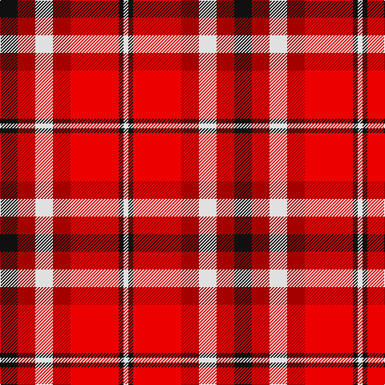

In pattern [KRWRRKW](/patterns/krwrrkw/).

This was sourced from tartans-authority.  It is a [7 stripes tartan](/stripes/stripes7/).

Original link http://www.tartansauthority.com/tartan-ferret/display/10173/

## Thread count
K/22 DR22 LN22 DR22 R60 K6 LN/6

## Palette
Each colour and its ΔE from the base-6 reference it is a variant of.

| Colour | Shade | Base | ΔE (OKLab) |
|---|---|---|---|
| DR | <code style="background-color:#A40000;">#A40000</code> `#A40000` | R <code style="background-color:#C80000;">#C80000</code> | 0.08 |
| K | <code style="background-color:#101010;">#101010</code> `#101010` | K <code style="background-color:#000000;">#000000</code> | 0.17 |
| LN | <code style="background-color:#E0E0E0;">#E0E0E0</code> `#E0E0E0` | W <code style="background-color:#F4F4F0;">#F4F4F0</code> | 0.06 |
| R | <code style="background-color:#EC0000;">#EC0000</code> `#EC0000` | R <code style="background-color:#C80000;">#C80000</code> | 0.07 |

# Sample pattern

## Nearest tartans

The nearest existing variants by ΔTartan distance.

1. [Swallow (Personal)](/setts/s7/k22r22w22r22ra60k6w6-k101010-r8b0000-racd0000-wffffff/) — ΔT 0.44
1. [Gigha, Cherry (Dance)](/setts/s8/r8w4r2w36r36ra36rb6ra8-r880000-raa40000-rbc80000-wf0e0c8/) — ΔT 1.24
1. [St. Andrews (Queens University) (Cor](/setts/s8/g22b2g22w20b2r22b2r22-b2c2c80-g604000-rc80000-we0e0e0/) — ΔT 1.26
1. [Thermos Un-named (aretefact)](/setts/s6/k12r40w4ra18w6wa4-k101010-rc80000-ra880000-we0e0e0-wac0c0c0/) — ΔT 1.43
1. [Afternoon Tea / Apple Tea](/setts/s6/w15b8r25b72ra98y15-b4c3428-rec34c4-rac82828-we0e0e0-yf8e38c/) — ΔT 1.46
1. [Ballater](/setts/s9/r24w4ra6w4r6k10r4ra36w4-k000000-rc00000-ra906030-we0e0e0/) — ΔT 1.56
1. [MacTavish](/setts/s6/w4r24b4w12k12w2-b00004c-k000000-rc80000-wd0d0d0/) — ΔT 1.61
1. [MacNaughton (Logan) #2](/setts/s9/k4b4r52g50k26b26r52b4k4-b2c2c80-g285800-k101010-rfc3800/) — ΔT 1.64
1. [Ferguson's Promise (Commemorative)](/setts/s7/r76k24ra30rb8ra30k4w8-k101010-r880000-rae87878-rbc8002c-we0e0e0/) — ΔT 1.65
1. [Unidentified #41](/setts/s9/w12r2ra8w2b8r2ra16w2ra4-b080848-rbe7832-radc0000-we0e0e0/) — ΔT 1.67

## Neighbour map

Every grey dot is one of 15726 variants placed by the first two principal components of the ΔTartan feature space (44% of its variance). Red is this tartan; blue dots are its nearest — click one to open its page.

<svg viewBox="0 0 640 380" role="img" style="max-width:100%;height:auto;border:1px solid #e0e0e0;border-radius:4px;display:block" xmlns="http://www.w3.org/2000/svg"><image href="/nn/cloud.v1.png" width="640" height="380"/><a href="/setts/s7/k22r22w22r22ra60k6w6-k101010-r8b0000-racd0000-wffffff/"><circle cx="163.3" cy="180.1" r="4" fill="#3465a4"><title>Swallow (Personal)</title></circle></a><a href="/setts/s8/r8w4r2w36r36ra36rb6ra8-r880000-raa40000-rbc80000-wf0e0c8/"><circle cx="206.4" cy="146.2" r="4" fill="#3465a4"><title>Gigha, Cherry (Dance)</title></circle></a><a href="/setts/s8/g22b2g22w20b2r22b2r22-b2c2c80-g604000-rc80000-we0e0e0/"><circle cx="200.4" cy="191.5" r="4" fill="#3465a4"><title>St. Andrews (Queens University) (Cor</title></circle></a><a href="/setts/s6/k12r40w4ra18w6wa4-k101010-rc80000-ra880000-we0e0e0-wac0c0c0/"><circle cx="226.7" cy="164.5" r="4" fill="#3465a4"><title>Thermos Un-named (aretefact)</title></circle></a><a href="/setts/s6/w15b8r25b72ra98y15-b4c3428-rec34c4-rac82828-we0e0e0-yf8e38c/"><circle cx="220.5" cy="163.6" r="4" fill="#3465a4"><title>Afternoon Tea / Apple Tea</title></circle></a><a href="/setts/s9/r24w4ra6w4r6k10r4ra36w4-k000000-rc00000-ra906030-we0e0e0/"><circle cx="222.3" cy="164.0" r="4" fill="#3465a4"><title>Ballater</title></circle></a><a href="/setts/s6/w4r24b4w12k12w2-b00004c-k000000-rc80000-wd0d0d0/"><circle cx="185.3" cy="176.8" r="4" fill="#3465a4"><title>MacTavish</title></circle></a><a href="/setts/s9/k4b4r52g50k26b26r52b4k4-b2c2c80-g285800-k101010-rfc3800/"><circle cx="229.3" cy="163.0" r="4" fill="#3465a4"><title>MacNaughton (Logan) #2</title></circle></a><a href="/setts/s7/r76k24ra30rb8ra30k4w8-k101010-r880000-rae87878-rbc8002c-we0e0e0/"><circle cx="234.2" cy="140.3" r="4" fill="#3465a4"><title>Ferguson's Promise (Commemorative)</title></circle></a><a href="/setts/s9/w12r2ra8w2b8r2ra16w2ra4-b080848-rbe7832-radc0000-we0e0e0/"><circle cx="221.8" cy="171.9" r="4" fill="#3465a4"><title>Unidentified #41</title></circle></a><circle cx="172.2" cy="180.5" r="5" fill="#c00000"/></svg>

ID: /setts/s7/k22r22w22r22ra60k6w6-k101010-ra40000-raec0000-we0e0e0/
