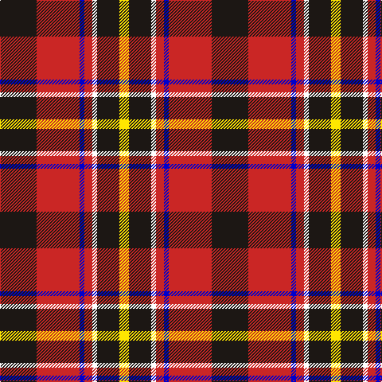

This page is one **sett** — a single exact thread-count. It belongs to the [tartan](/tartans/k23r27db3r5w3k14ly6/)
(the same proportion at any scale), whose colour order is pattern [KRBRWKY](/stripes/krbrwky/).

Sourced from register-of-tartans.  It is a [7 stripe tartan](/stripes/stripes7/).

Original link https://www.tartanregister.gov.uk/tartanDetails.aspx?ref=10478

## Register references

External register numbers recorded for this tartan.

- Scottish Register of Tartans: [10478](https://www.tartanregister.gov.uk/tartanDetails.aspx?ref=10478)

## Thread count
K/46 R54 B6 R10 W6 K28 Y/12

## Palette

Palette: <strong>Tartan Register</strong> <small style="color:#888">(3 of 5 colours)</small>
<table><thead><tr><th>Colour</th><th>Threads</th><th>Shade</th><th>Base</th><th>OKLCh</th></tr></thead><tbody><tr><td>K/</td><td style="text-align:right;font-variant-numeric:tabular-nums">46</td><td><code style="background-color:#1C1714;">#1C1714</code> <small style="color:#888">#1C1714</small></td><td>K <code style="background-color:#000000;">#000000</code></td><td><small style="color:#888">oklch(20.9% 0.010 52.9)</small></td></tr><tr><td>R</td><td style="text-align:right;font-variant-numeric:tabular-nums">54</td><td><code style="background-color:#CA2625;">#CA2625</code> <small style="color:#888">#CA2625</small></td><td>R <code style="background-color:#CC0000;">#CC0000</code></td><td><small style="color:#888">oklch(54.4% 0.199 27.2)</small></td></tr><tr><td>B</td><td style="text-align:right;font-variant-numeric:tabular-nums">6</td><td><code style="background-color:#0000CD;">#0000CD</code> <small style="color:#888">#0000CD</small></td><td>B <code style="background-color:#2A418A;">#2A418A</code></td><td><small style="color:#888">oklch(38.3% 0.266 264.1)</small></td></tr><tr><td>R</td><td style="text-align:right;font-variant-numeric:tabular-nums">10</td><td><code style="background-color:#CA2625;">#CA2625</code> <small style="color:#888">#CA2625</small></td><td>R <code style="background-color:#CC0000;">#CC0000</code></td><td><small style="color:#888">oklch(54.4% 0.199 27.2)</small></td></tr><tr><td>W</td><td style="text-align:right;font-variant-numeric:tabular-nums">6</td><td><code style="background-color:#FFFFFF;">#FFFFFF</code> <small style="color:#888">#FFFFFF</small></td><td>W <code style="background-color:#F7F7F7;">#F7F7F7</code></td><td><small style="color:#888">oklch(100.0% 0.000 89.9)</small></td></tr><tr><td>K</td><td style="text-align:right;font-variant-numeric:tabular-nums">28</td><td><code style="background-color:#1C1714;">#1C1714</code> <small style="color:#888">#1C1714</small></td><td>K <code style="background-color:#000000;">#000000</code></td><td><small style="color:#888">oklch(20.9% 0.010 52.9)</small></td></tr><tr><td>Y/</td><td style="text-align:right;font-variant-numeric:tabular-nums">12</td><td><code style="background-color:#FFE700;">#FFE700</code> <small style="color:#888">#FFE700</small></td><td>Y <code style="background-color:#F2BF00;">#F2BF00</code></td><td><small style="color:#888">oklch(91.9% 0.192 101.8)</small></td></tr></tbody></table>

# Sample pattern

## Nearest tartans

The nearest existing variants by ΔTartan distance, with this tartan at the top so the swatches line up against it.

ΔTartan

Tartan

Sett

—

<a href="/ttd/edit/#slug=k23r27db3r5w3k14ly6~x2">Hoffman Texas German</a> <a class="nn-out" href="/setts/s7/k23r27db3r5w3k14ly6~x2/" title="open its dictionary page">↗</a>

1.01

<a href="/ttd/edit/#slug=r7db2k2ly1k2r2k1w1~x2">Royal Stuart/Stewart</a> <a class="nn-out" href="/setts/s8/r7db2k2ly1k2r2k1w1~x2/" title="open its dictionary page">↗</a>

1.02

<a href="/ttd/edit/#slug=k51r21ly4r12g8db4r5~x2">Totté (from Hofstade de Baerebeeck) (Personal)</a> <a class="nn-out" href="/setts/s7/k51r21ly4r12g8db4r5~x2/" title="open its dictionary page">↗</a>

1.07

<a href="/ttd/edit/#slug=lb5r34k22r4o24r4~x2">Wcwm 759-2</a> <a class="nn-out" href="/setts/s6/lb5r34k22r4o24r4~x2/" title="open its dictionary page">↗</a>

1.15

<a href="/ttd/edit/#slug=w15g8k12g14r64k12r16k10ly8k14">Carlow County Crest (Fashion)</a> <a class="nn-out" href="/setts/s10/w15g8k12g14r64k12r16k10ly8k14/" title="open its dictionary page">↗</a>

1.16

<a href="/ttd/edit/#slug=w3r24db12dg8lo3~x2">McGill University (Corporate)</a> <a class="nn-out" href="/setts/s5/w3r24db12dg8lo3~x2/" title="open its dictionary page">↗</a>

1.19

<a href="/ttd/edit/#slug=k1r7k2r1k2do1g3ly1~x4">Craigmoor (Fashion)</a> <a class="nn-out" href="/setts/s8/k1r7k2r1k2do1g3ly1~x4/" title="open its dictionary page">↗</a>

1.21

<a href="/ttd/edit/#slug=r6k3r29k23w4k7ly3~x2">MacPherson Red Cluny</a> <a class="nn-out" href="/setts/s7/r6k3r29k23w4k7ly3~x2/" title="open its dictionary page">↗</a>

1.25

<a href="/ttd/edit/#slug=w4dg20dg10r25b2r2dg2~x2">Caledonian Brewery (Corporate)</a> <a class="nn-out" href="/setts/s7/w4dg20dg10r25b2r2dg2~x2/" title="open its dictionary page">↗</a>

1.25

<a href="/ttd/edit/#slug=r32db6k6g6w18k3">Rose, White dress</a> <a class="nn-out" href="/setts/s6/r32db6k6g6w18k3/" title="open its dictionary page">↗</a>

1.27

<a href="/ttd/edit/#slug=lo7k3db4k3r21k2r4k2w4~x2">Castle Stewart (District)</a> <a class="nn-out" href="/setts/s9/lo7k3db4k3r21k2r4k2w4~x2/" title="open its dictionary page">↗</a>

## Neighbour map

Every grey dot is one of 14299 variants placed by the first two principal components of the ΔTartan feature space (44% of its variance). Red is this tartan; blue dots are its nearest — click one to open its page.

<svg viewBox="0 0 640 380" role="img" style="max-width:100%;height:auto;border:1px solid #e0e0e0;border-radius:4px;display:block" xmlns="http://www.w3.org/2000/svg"><image href="/nn/cloud.v1.png" width="640" height="380"/><a href="/setts/s8/r7db2k2ly1k2r2k1w1~x2/"><circle cx="208.3" cy="168.5" r="4" fill="#3465a4"><title>Royal Stuart/Stewart</title></circle></a><a href="/setts/s7/k51r21ly4r12g8db4r5~x2/"><circle cx="246.5" cy="141.4" r="4" fill="#3465a4"><title>Totté (from Hofstade de Baerebeeck) (Personal)</title></circle></a><a href="/setts/s6/lb5r34k22r4o24r4~x2/"><circle cx="206.4" cy="202.6" r="4" fill="#3465a4"><title>Wcwm 759-2</title></circle></a><a href="/setts/s10/w15g8k12g14r64k12r16k10ly8k14/"><circle cx="189.9" cy="150.0" r="4" fill="#3465a4"><title>Carlow County Crest (Fashion)</title></circle></a><a href="/setts/s5/w3r24db12dg8lo3~x2/"><circle cx="210.0" cy="194.9" r="4" fill="#3465a4"><title>McGill University (Corporate)</title></circle></a><a href="/setts/s8/k1r7k2r1k2do1g3ly1~x4/"><circle cx="191.4" cy="178.8" r="4" fill="#3465a4"><title>Craigmoor (Fashion)</title></circle></a><a href="/setts/s7/r6k3r29k23w4k7ly3~x2/"><circle cx="261.4" cy="174.4" r="4" fill="#3465a4"><title>MacPherson Red Cluny</title></circle></a><a href="/setts/s7/w4dg20dg10r25b2r2dg2~x2/"><circle cx="203.0" cy="153.8" r="4" fill="#3465a4"><title>Caledonian Brewery (Corporate)</title></circle></a><a href="/setts/s6/r32db6k6g6w18k3/"><circle cx="180.3" cy="154.9" r="4" fill="#3465a4"><title>Rose, White dress</title></circle></a><a href="/setts/s9/lo7k3db4k3r21k2r4k2w4~x2/"><circle cx="238.4" cy="145.9" r="4" fill="#3465a4"><title>Castle Stewart (District)</title></circle></a><circle cx="207.4" cy="173.1" r="5" fill="#c00000"/></svg>

ID: /setts/s7/k23r27db3r5w3k14ly6~x2/
