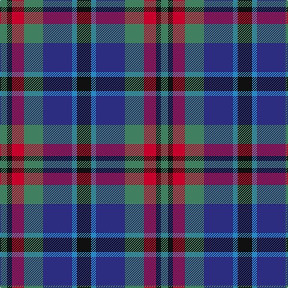

In pattern [GKRGBBK](/patterns/gkrgbbk/).

This was sourced from house-of-tartan.  It is a [7 stripes tartan](/stripes/stripes7/).

Original link http://www.house-of-tartan.scotland.net/house/TartanViewjs.asp?colr=Def&tnam=2131

## Thread count
G/12 K8 R20 G32 DB48 B8 K/24

## Palette
Each colour and its ΔE from the base-6 reference it is a variant of.

| Colour | Shade | Base | ΔE (OKLab) |
|---|---|---|---|
| B | <code style="background-color:#2888C4;">#2888C4</code> `#2888C4` | B <code style="background-color:#2A418A;">#2A418A</code> | 0.21 |
| DB | <code style="background-color:#2C2C80;">#2C2C80</code> `#2C2C80` | B <code style="background-color:#2A418A;">#2A418A</code> | 0.06 |
| G | <code style="background-color:#408060;">#408060</code> `#408060` | G <code style="background-color:#006100;">#006100</code> | 0.14 |
| K | <code style="background-color:#101010;">#101010</code> `#101010` | K <code style="background-color:#000000;">#000000</code> | 0.17 |
| R | <code style="background-color:#C8002C;">#C8002C</code> `#C8002C` | R <code style="background-color:#CC0000;">#CC0000</code> | 0.03 |

# Sample pattern

## Nearest tartans

The nearest existing variants by ΔTartan distance.

1. [Cooke (Personal)](/setts/s7/k24b8ba48g32r20k8g12-b2888c4-ba2c2c80-g006818-k101010-rc8002c/) — ΔT 0.47
1. [MacCaughan or MacEachain Clan Tartan Tartan Number: 169. Earliest known date: 1972 Nothing See products available Copyright © Blair Urquhart, Comrie, 2015](/setts/s6/r8g24k8b24k4ra8-b2c2c80-g006818-k101010-rb468ac-rac80000/) — ΔT 0.49
1. [MacEachain (Clan)](/setts/s6/r8k4b24k8g24ra8-b1c0070-g006818-k101010-r880000-ra9c68a4/) — ΔT 0.61
1. [Swankie (Personal)](/setts/s7/k8b42g20ga8k40r12b6-b1474b4-g604000-ga8c7038-k101010-rc80000/) — ΔT 0.79
1. [Fox-Eves Wedding](/setts/s6/r18b12ba26b42g36w8-b003c64-ba141e46-g808080-r800028-wf8f4d0/) — ΔT 0.87
1. [Wellington](/setts/s6/b2r2b12k12g12w2-b2c4084-g005020-k101010-rdc0000-we0e0e0/) — ΔT 0.91
1. [Lopez-Gasparotto](/setts/s7/r8ra40k40b8k8b48y8-b2c2c80-k101010-rc80000-ra888888-ye8c000/) — ΔT 0.93
1. [Hogarth of Firhill #2](/setts/s7/b4g12y2k12ba12k2ba2-b0596fa-ba2c4084-g005020-k101010-ye8c000/) — ΔT 0.96
1. [Hogarth of Firhill](/setts/s7/b4g12y2k12ba12k2ba2-b5c8ca8-ba2c2c80-g006818-k101010-ye8c000/) — ΔT 0.97
1. [Newmill](/setts/s7/r10g40k26b84k26g40y10-b304080-g407050-k000030-r802040-yf0c000/) — ΔT 1.00

## Neighbour map

Every grey dot is one of 15726 variants placed by the first two principal components of the ΔTartan feature space (44% of its variance). Red is this tartan; blue dots are its nearest — click one to open its page.

<svg viewBox="0 0 640 380" role="img" style="max-width:100%;height:auto;border:1px solid #e0e0e0;border-radius:4px;display:block" xmlns="http://www.w3.org/2000/svg"><image href="/nn/cloud.v1.png" width="640" height="380"/><a href="/setts/s7/k24b8ba48g32r20k8g12-b2888c4-ba2c2c80-g006818-k101010-rc8002c/"><circle cx="110.4" cy="231.8" r="4" fill="#3465a4"><title>Cooke (Personal)</title></circle></a><a href="/setts/s6/r8g24k8b24k4ra8-b2c2c80-g006818-k101010-rb468ac-rac80000/"><circle cx="113.3" cy="233.1" r="4" fill="#3465a4"><title>MacCaughan or MacEachain Clan Tartan Tartan Number: 169. Earliest known date: 1972 Nothing See products available Copyright © Blair Urquhart, Comrie, 2015</title></circle></a><a href="/setts/s6/r8k4b24k8g24ra8-b1c0070-g006818-k101010-r880000-ra9c68a4/"><circle cx="114.7" cy="237.1" r="4" fill="#3465a4"><title>MacEachain (Clan)</title></circle></a><a href="/setts/s7/k8b42g20ga8k40r12b6-b1474b4-g604000-ga8c7038-k101010-rc80000/"><circle cx="143.7" cy="210.9" r="4" fill="#3465a4"><title>Swankie (Personal)</title></circle></a><a href="/setts/s6/r18b12ba26b42g36w8-b003c64-ba141e46-g808080-r800028-wf8f4d0/"><circle cx="120.3" cy="251.6" r="4" fill="#3465a4"><title>Fox-Eves Wedding</title></circle></a><a href="/setts/s6/b2r2b12k12g12w2-b2c4084-g005020-k101010-rdc0000-we0e0e0/"><circle cx="138.3" cy="232.7" r="4" fill="#3465a4"><title>Wellington</title></circle></a><a href="/setts/s7/r8ra40k40b8k8b48y8-b2c2c80-k101010-rc80000-ra888888-ye8c000/"><circle cx="128.5" cy="208.0" r="4" fill="#3465a4"><title>Lopez-Gasparotto</title></circle></a><a href="/setts/s7/b4g12y2k12ba12k2ba2-b0596fa-ba2c4084-g005020-k101010-ye8c000/"><circle cx="115.3" cy="225.1" r="4" fill="#3465a4"><title>Hogarth of Firhill #2</title></circle></a><a href="/setts/s7/b4g12y2k12ba12k2ba2-b5c8ca8-ba2c2c80-g006818-k101010-ye8c000/"><circle cx="111.6" cy="222.3" r="4" fill="#3465a4"><title>Hogarth of Firhill</title></circle></a><a href="/setts/s7/r10g40k26b84k26g40y10-b304080-g407050-k000030-r802040-yf0c000/"><circle cx="158.8" cy="216.6" r="4" fill="#3465a4"><title>Newmill</title></circle></a><circle cx="107.7" cy="228.3" r="5" fill="#c00000"/></svg>

ID: /setts/s7/k24b8ba48g32r20k8g12-b2888c4-ba2c2c80-g408060-k101010-rc8002c/
