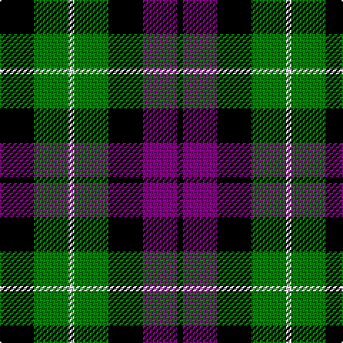

In pattern [KBKGWGK](/patterns/kbkgwgk/).

This was sourced from weddslist.  It is a [7 stripes tartan](/stripes/stripes7/).

Original link http://www.weddslist.com/cgi-bin/tartans/pg.pl?source=sts

## Thread count
K/24 G24 LN4 G24 K24 P24 K/4

## Palette
Each colour and its ΔE from the base-6 reference it is a variant of.

| Colour | Shade | Base | ΔE (OKLab) |
|---|---|---|---|
| G | <code style="background-color:#008000;">#008000</code> `#008000` | G <code style="background-color:#006100;">#006100</code> | 0.10 |
| K | <code style="background-color:#000000;">#000000</code> `#000000` | K <code style="background-color:#000000;">#000000</code> | 0.00 |
| LN | <code style="background-color:#E0E0E0;">#E0E0E0</code> `#E0E0E0` | W <code style="background-color:#F7F7F7;">#F7F7F7</code> | 0.07 |
| P | <code style="background-color:#800080;">#800080</code> `#800080` | B <code style="background-color:#2A418A;">#2A418A</code> | 0.17 |

# Sample pattern

## Nearest tartans

The nearest existing variants by ΔTartan distance.

1. [Abercrombie, (Wilson's No 64)](/setts/s7/k24g24y4g24k24b24k4-b800080-g008000-k000000-yf0c000/) — ΔT 0.11
1. [Wilson's, No 97](/setts/s7/k22g24k4g24k24b24w6-b800080-g008000-k000000-we0e0e0/) — ΔT 0.26
1. [MacCallum](/setts/s7/k12g12r2g12k12b12k2-b304080-g008000-k000000-rc00000/) — ΔT 0.61
1. [MacLaggan](/setts/s7/k28g24w4g24k28b28k4-b304080-g008000-k000000-we0e0e0/) — ΔT 0.69
1. [Wilson's, No 108](/setts/s8/k28g28k4g28k28b4ba28k4-b5480b0-ba800080-g008000-k000000/) — ΔT 0.70
1. [MacIntyre](/setts/s7/k24g24k4g24k24b24ba6-b304080-ba5480b0-g008000-k000000/) — ΔT 0.76
1. [Unnamed, No 31](/setts/s7/k16g16k2g16k16b16w4-b8080d0-g008000-k000000-we0e0e0/) — ΔT 0.85
1. [Campbell of Breadalbane](/setts/s7/k18g18y4g18k18b18k6-b304080-g008000-k000000-yf0c000/) — ΔT 0.90
1. [Wilson's, No 233](/setts/s7/k24g24w4g24k24b24ga4-b800080-g008000-ga30a010-k000000-we0e0e0/) — ΔT 0.92
1. [Campbell of Breadalbane (Clan)](/setts/s7/k18g18y4g18k18b18k6-b2c2c80-g006818-k000000-ydcbc00/) — ΔT 0.93

## Neighbour map

Every grey dot is one of 15726 variants placed by the first two principal components of the ΔTartan feature space (44% of its variance). Red is this tartan; blue dots are its nearest — click one to open its page.

<svg viewBox="0 0 640 380" role="img" style="max-width:100%;height:auto;border:1px solid #e0e0e0;border-radius:4px;display:block" xmlns="http://www.w3.org/2000/svg"><image href="/nn/cloud.v1.png" width="640" height="380"/><a href="/setts/s7/k24g24y4g24k24b24k4-b800080-g008000-k000000-yf0c000/"><circle cx="135.7" cy="250.9" r="4" fill="#3465a4"><title>Abercrombie, (Wilson's No 64)</title></circle></a><a href="/setts/s7/k22g24k4g24k24b24w6-b800080-g008000-k000000-we0e0e0/"><circle cx="119.6" cy="253.0" r="4" fill="#3465a4"><title>Wilson's, No 97</title></circle></a><a href="/setts/s7/k12g12r2g12k12b12k2-b304080-g008000-k000000-rc00000/"><circle cx="138.9" cy="257.3" r="4" fill="#3465a4"><title>MacCallum</title></circle></a><a href="/setts/s7/k28g24w4g24k28b28k4-b304080-g008000-k000000-we0e0e0/"><circle cx="149.9" cy="248.5" r="4" fill="#3465a4"><title>MacLaggan</title></circle></a><a href="/setts/s8/k28g28k4g28k28b4ba28k4-b5480b0-ba800080-g008000-k000000/"><circle cx="161.2" cy="228.4" r="4" fill="#3465a4"><title>Wilson's, No 108</title></circle></a><a href="/setts/s7/k24g24k4g24k24b24ba6-b304080-ba5480b0-g008000-k000000/"><circle cx="128.1" cy="261.4" r="4" fill="#3465a4"><title>MacIntyre</title></circle></a><a href="/setts/s7/k16g16k2g16k16b16w4-b8080d0-g008000-k000000-we0e0e0/"><circle cx="126.1" cy="240.2" r="4" fill="#3465a4"><title>Unnamed, No 31</title></circle></a><a href="/setts/s7/k18g18y4g18k18b18k6-b304080-g008000-k000000-yf0c000/"><circle cx="117.0" cy="276.5" r="4" fill="#3465a4"><title>Campbell of Breadalbane</title></circle></a><a href="/setts/s7/k24g24w4g24k24b24ga4-b800080-g008000-ga30a010-k000000-we0e0e0/"><circle cx="97.0" cy="233.7" r="4" fill="#3465a4"><title>Wilson's, No 233</title></circle></a><a href="/setts/s7/k18g18y4g18k18b18k6-b2c2c80-g006818-k000000-ydcbc00/"><circle cx="127.0" cy="280.9" r="4" fill="#3465a4"><title>Campbell of Breadalbane (Clan)</title></circle></a><circle cx="134.7" cy="250.6" r="5" fill="#c00000"/></svg>

ID: /setts/s7/k24g24w4g24k24b24k4-b800080-g008000-k000000-we0e0e0/
