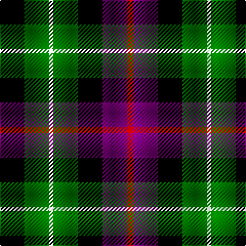

In pattern [KGWGKBR](/patterns/kgwgkbr/).

This was sourced from weddslist.  It is a [7 stripes tartan](/stripes/stripes7/).

Original link http://www.weddslist.com/cgi-bin/tartans/pg.pl?source=sts

## Thread count
K/24 G24 LN4 G24 K24 P24 R/6

## Palette
Each colour and its ΔE from the base-6 reference it is a variant of.

| Colour | Shade | Base | ΔE (OKLab) |
|---|---|---|---|
| G | <code style="background-color:#008000;">#008000</code> `#008000` | G <code style="background-color:#006100;">#006100</code> | 0.10 |
| K | <code style="background-color:#000000;">#000000</code> `#000000` | K <code style="background-color:#000000;">#000000</code> | 0.00 |
| LN | <code style="background-color:#E0E0E0;">#E0E0E0</code> `#E0E0E0` | W <code style="background-color:#F7F7F7;">#F7F7F7</code> | 0.07 |
| P | <code style="background-color:#800080;">#800080</code> `#800080` | B <code style="background-color:#2A418A;">#2A418A</code> | 0.17 |
| R | <code style="background-color:#C00000;">#C00000</code> `#C00000` | R <code style="background-color:#CC0000;">#CC0000</code> | 0.03 |

# Sample pattern

## Nearest tartans

The nearest existing variants by ΔTartan distance.

1. [Wilson's, No 233](/setts/s7/k24g24w4g24k24b24ga4-b800080-g008000-ga30a010-k000000-we0e0e0/) — ΔT 0.34
1. [Wilson's, No 194](/setts/s6/b6w2k6g10r2k6-b800080-g008000-k000000-rc00000-we0e0e0/) — ΔT 0.63
1. [Wilson's, No 97](/setts/s7/k22g24k4g24k24b24w6-b800080-g008000-k000000-we0e0e0/) — ΔT 0.90
1. [Abercrombie, (Wilson's No 64)](/setts/s7/k24g24y4g24k24b24k4-b800080-g008000-k000000-yf0c000/) — ΔT 0.99
1. [Wilson's, No 64 or Abercrombie](/setts/s7/k24g24w4g24k24b24k4-b800080-g008000-k000000-we0e0e0/) — ΔT 0.99
1. [Brodie hunting](/setts/s7/r4b16g16k16y2k16r4-b304080-g008000-k000000-rc00000-yf0c000/) — ΔT 1.05
1. [Davidson, Double..](/setts/s8/b6r4b16k16g16k6w4k6-b304080-g008000-k000000-rc00000-we0e0e0/) — ΔT 1.10
1. [Birse](/setts/s6/k8g32k28y6b32r8-b304080-g008000-k000000-rc00000-yf0c000/) — ΔT 1.10
1. [Vosko](/setts/s9/b50k24y8k18r12k18y8k24g50-b304080-g008000-k000000-rc00000-yf0c000/) — ΔT 1.11
1. [Dyce](/setts/s6/k8y4g24k24b24w4-b304080-g008000-k000000-we0e0e0-yf0c000/) — ΔT 1.15

## Neighbour map

Every grey dot is one of 15726 variants placed by the first two principal components of the ΔTartan feature space (44% of its variance). Red is this tartan; blue dots are its nearest — click one to open its page.

<svg viewBox="0 0 640 380" role="img" style="max-width:100%;height:auto;border:1px solid #e0e0e0;border-radius:4px;display:block" xmlns="http://www.w3.org/2000/svg"><image href="/nn/cloud.v1.png" width="640" height="380"/><a href="/setts/s7/k24g24w4g24k24b24ga4-b800080-g008000-ga30a010-k000000-we0e0e0/"><circle cx="97.0" cy="233.7" r="4" fill="#3465a4"><title>Wilson's, No 233</title></circle></a><a href="/setts/s6/b6w2k6g10r2k6-b800080-g008000-k000000-rc00000-we0e0e0/"><circle cx="82.8" cy="238.4" r="4" fill="#3465a4"><title>Wilson's, No 194</title></circle></a><a href="/setts/s7/k22g24k4g24k24b24w6-b800080-g008000-k000000-we0e0e0/"><circle cx="119.6" cy="253.0" r="4" fill="#3465a4"><title>Wilson's, No 97</title></circle></a><a href="/setts/s7/k24g24y4g24k24b24k4-b800080-g008000-k000000-yf0c000/"><circle cx="135.7" cy="250.9" r="4" fill="#3465a4"><title>Abercrombie, (Wilson's No 64)</title></circle></a><a href="/setts/s7/k24g24w4g24k24b24k4-b800080-g008000-k000000-we0e0e0/"><circle cx="134.7" cy="250.6" r="4" fill="#3465a4"><title>Wilson's, No 64 or Abercrombie</title></circle></a><a href="/setts/s7/r4b16g16k16y2k16r4-b304080-g008000-k000000-rc00000-yf0c000/"><circle cx="135.4" cy="213.4" r="4" fill="#3465a4"><title>Brodie hunting</title></circle></a><a href="/setts/s8/b6r4b16k16g16k6w4k6-b304080-g008000-k000000-rc00000-we0e0e0/"><circle cx="79.1" cy="233.7" r="4" fill="#3465a4"><title>Davidson, Double..</title></circle></a><a href="/setts/s6/k8g32k28y6b32r8-b304080-g008000-k000000-rc00000-yf0c000/"><circle cx="74.2" cy="229.1" r="4" fill="#3465a4"><title>Birse</title></circle></a><a href="/setts/s9/b50k24y8k18r12k18y8k24g50-b304080-g008000-k000000-rc00000-yf0c000/"><circle cx="102.0" cy="203.5" r="4" fill="#3465a4"><title>Vosko</title></circle></a><a href="/setts/s6/k8y4g24k24b24w4-b304080-g008000-k000000-we0e0e0-yf0c000/"><circle cx="97.3" cy="223.0" r="4" fill="#3465a4"><title>Dyce</title></circle></a><circle cx="90.5" cy="236.1" r="5" fill="#c00000"/></svg>

ID: /setts/s7/k24g24w4g24k24b24r6-b800080-g008000-k000000-rc00000-we0e0e0/
