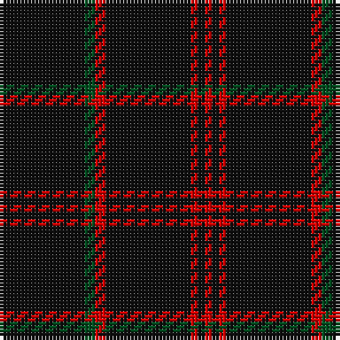

In pattern [KGRKRKR](/patterns/kgrkrkr/).

This was sourced from register-of-tartans.  It is a [7 stripes tartan](/stripes/stripes7/).

Original link https://www.tartanregister.gov.uk/tartanDetails.aspx?ref=4246

## Thread count
K/24 G3 R3 K24 R2 K2 R/2

## Palette
Each colour and its ΔE from the base-6 reference it is a variant of.

| Colour | Shade | Base | ΔE (OKLab) |
|---|---|---|---|
| G | <code style="background-color:#005020;">#005020</code> `#005020` | G <code style="background-color:#006100;">#006100</code> | 0.07 |
| K | <code style="background-color:#101010;">#101010</code> `#101010` | K <code style="background-color:#000000;">#000000</code> | 0.17 |
| R | <code style="background-color:#DC0000;">#DC0000</code> `#DC0000` | R <code style="background-color:#CC0000;">#CC0000</code> | 0.03 |

# Sample pattern

## Nearest tartans

The nearest existing variants by ΔTartan distance.

1. [Renwick](/setts/s10/k6g4k40r4k24g4k8g4k12g4-g006818-k101010-rc80000/) — ΔT 1.26
1. [Maier (Personal)](/setts/s10/r14k6r6k44r6k6r6k74y4k8-k101010-rc80000-ye8c000/) — ΔT 1.44
1. [Laird Abdullah (Personal)](/setts/s8/k20b4k4b16k80r8k10ra4-b5c5c5c-k101010-rc80000-rae87878/) — ΔT 1.53
1. [Rikaco Vintage](/setts/s8/b148r18b8ra10b8r18b74ba18-b1c1c1c-ba000048-r9c68a4-raff0000/) — ΔT 1.55
1. [Freedom of Scotland](/setts/s6/k30b14k12b22k100b8-b5c5c5c-k101010/) — ΔT 1.66
1. [Chafyn House (School)](/setts/s7/k72r3k11b9k11r3k37-b2888c4-k101010-rc80000/) — ΔT 1.67
1. [Unidentified 11](/setts/s7/k24g3r3k24r2k2r2-g008000-k000000-rc00000/) — ΔT 1.71
1. [Auld Bernensis](/setts/s8/k124r6k6y6k6r6k18ra10-k101010-rc80000-ra888888-yd09800/) — ΔT 1.71
1. [Wallington (Corporate?)](/setts/s4/k60b3k9g7-b2888c4-g289c18-k101010/) — ΔT 1.73
1. [Gwynn](/setts/s8/k90y8k8y18k8y8k90r8-k101010-rc80000-ye8c000/) — ΔT 1.77

## Neighbour map

Every grey dot is one of 15726 variants placed by the first two principal components of the ΔTartan feature space (44% of its variance). Red is this tartan; blue dots are its nearest — click one to open its page.

<svg viewBox="0 0 640 380" role="img" style="max-width:100%;height:auto;border:1px solid #e0e0e0;border-radius:4px;display:block" xmlns="http://www.w3.org/2000/svg"><image href="/nn/cloud.v1.png" width="640" height="380"/><a href="/setts/s10/k6g4k40r4k24g4k8g4k12g4-g006818-k101010-rc80000/"><circle cx="562.0" cy="232.3" r="4" fill="#3465a4"><title>Renwick</title></circle></a><a href="/setts/s10/r14k6r6k44r6k6r6k74y4k8-k101010-rc80000-ye8c000/"><circle cx="542.3" cy="171.3" r="4" fill="#3465a4"><title>Maier (Personal)</title></circle></a><a href="/setts/s8/k20b4k4b16k80r8k10ra4-b5c5c5c-k101010-rc80000-rae87878/"><circle cx="537.0" cy="170.6" r="4" fill="#3465a4"><title>Laird Abdullah (Personal)</title></circle></a><a href="/setts/s8/b148r18b8ra10b8r18b74ba18-b1c1c1c-ba000048-r9c68a4-raff0000/"><circle cx="538.2" cy="179.0" r="4" fill="#3465a4"><title>Rikaco Vintage</title></circle></a><a href="/setts/s6/k30b14k12b22k100b8-b5c5c5c-k101010/"><circle cx="565.1" cy="260.9" r="4" fill="#3465a4"><title>Freedom of Scotland</title></circle></a><a href="/setts/s7/k72r3k11b9k11r3k37-b2888c4-k101010-rc80000/"><circle cx="626.0" cy="210.3" r="4" fill="#3465a4"><title>Chafyn House (School)</title></circle></a><a href="/setts/s7/k24g3r3k24r2k2r2-g008000-k000000-rc00000/"><circle cx="548.8" cy="217.5" r="4" fill="#3465a4"><title>Unidentified 11</title></circle></a><a href="/setts/s8/k124r6k6y6k6r6k18ra10-k101010-rc80000-ra888888-yd09800/"><circle cx="597.9" cy="150.3" r="4" fill="#3465a4"><title>Auld Bernensis</title></circle></a><a href="/setts/s4/k60b3k9g7-b2888c4-g289c18-k101010/"><circle cx="626.0" cy="229.1" r="4" fill="#3465a4"><title>Wallington (Corporate?)</title></circle></a><a href="/setts/s8/k90y8k8y18k8y8k90r8-k101010-rc80000-ye8c000/"><circle cx="517.1" cy="196.4" r="4" fill="#3465a4"><title>Gwynn</title></circle></a><circle cx="578.7" cy="222.7" r="5" fill="#c00000"/></svg>

ID: /setts/s7/k24g3r3k24r2k2r2-g005020-k101010-rdc0000/
