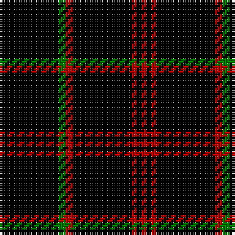

In pattern [KGRKRKR](/patterns/kgrkrkr/).

This was sourced from weddslist.  It is a [7 stripes tartan](/stripes/stripes7/).

Original link http://www.weddslist.com/cgi-bin/tartans/pg.pl?source=sts

## Thread count
K/24 G3 R3 K24 R2 K2 R/2

## Palette
Each colour and its ΔE from the base-6 reference it is a variant of.

| Colour | Shade | Base | ΔE (OKLab) |
|---|---|---|---|
| G | <code style="background-color:#008000;">#008000</code> `#008000` | G <code style="background-color:#006100;">#006100</code> | 0.10 |
| K | <code style="background-color:#000000;">#000000</code> `#000000` | K <code style="background-color:#000000;">#000000</code> | 0.00 |
| R | <code style="background-color:#C00000;">#C00000</code> `#C00000` | R <code style="background-color:#CC0000;">#CC0000</code> | 0.03 |

# Sample pattern

## Nearest tartans

The nearest existing variants by ΔTartan distance.

1. [Renwick](/setts/s10/k3g2k20r2k12g2k4g2k6g2~g008000-k000000-rc00000~x2/) — ΔT 1.05
1. [Justus](/setts/s6/k8y1k1r1k4b1~b304080-k000000-rc00000-yf0c000~x12/) — ΔT 1.37
1. [Unidentified #45](/setts/s7/k24g3r3k24r2k2r2~g005020-k101010-rdc0000/) — ΔT 1.72
1. [Gwynn](/setts/s8/k45y4k4y9k4y4k45r4~k101010-rc80000-ye8c000~x2/) — ΔT 1.74
1. [Lanoir](/setts/s6/k4r4k20r1k20w4~k101010-rc80000-we0e0e0~x6/) — ΔT 1.85
1. [Maier (Personal)](/setts/s10/r7k3r3k22r3k3r3k37y2k4~k101010-rc80000-ye8c000~x2/) — ΔT 1.93
1. [St. Mirren Football Club (Sports)](/setts/s9/k7w2k21r2k34w5k3w2k7~k101010-rc80000-wfcfcfc~x2/) — ΔT 1.96
1. [Stewart Mourning](/setts/s11/k68g11k16g4k4g4k4g19k14w4k14~g808080-k000000-we0e0e0/) — ΔT 1.99
1. [Harvie](/setts/s5/k4r11k32y1k4~k000000-rc00000-yf0c000~x2/) — ΔT 2.01
1. [Aberdeen-Angus Cattle Society (Corp)](/setts/s8/g8y3k60g3k3g3k3g4~g247800-k000000-ybc8c00~x2/) — ΔT 2.01

## Neighbour map

Every grey dot is one of 15726 variants placed by the first two principal components of the ΔTartan feature space (44% of its variance). Red is this tartan; blue dots are its nearest — click one to open its page.

<svg viewBox="0 0 640 380" role="img" style="max-width:100%;height:auto;border:1px solid #e0e0e0;border-radius:4px;display:block" xmlns="http://www.w3.org/2000/svg"><image href="/nn/cloud.v1.png" width="640" height="380"/><a href="/setts/s10/k3g2k20r2k12g2k4g2k6g2~g008000-k000000-rc00000~x2/"><circle cx="506.9" cy="223.0" r="4" fill="#3465a4"><title>Renwick</title></circle></a><a href="/setts/s6/k8y1k1r1k4b1~b304080-k000000-rc00000-yf0c000~x12/"><circle cx="470.2" cy="232.0" r="4" fill="#3465a4"><title>Justus</title></circle></a><a href="/setts/s7/k24g3r3k24r2k2r2~g005020-k101010-rdc0000/"><circle cx="577.2" cy="228.8" r="4" fill="#3465a4"><title>Unidentified #45</title></circle></a><a href="/setts/s8/k45y4k4y9k4y4k45r4~k101010-rc80000-ye8c000~x2/"><circle cx="515.2" cy="203.4" r="4" fill="#3465a4"><title>Gwynn</title></circle></a><a href="/setts/s6/k4r4k20r1k20w4~k101010-rc80000-we0e0e0~x6/"><circle cx="537.0" cy="217.1" r="4" fill="#3465a4"><title>Lanoir</title></circle></a><a href="/setts/s10/r7k3r3k22r3k3r3k37y2k4~k101010-rc80000-ye8c000~x2/"><circle cx="541.6" cy="177.4" r="4" fill="#3465a4"><title>Maier (Personal)</title></circle></a><a href="/setts/s9/k7w2k21r2k34w5k3w2k7~k101010-rc80000-wfcfcfc~x2/"><circle cx="558.3" cy="189.3" r="4" fill="#3465a4"><title>St. Mirren Football Club (Sports)</title></circle></a><a href="/setts/s11/k68g11k16g4k4g4k4g19k14w4k14~g808080-k000000-we0e0e0/"><circle cx="455.7" cy="173.3" r="4" fill="#3465a4"><title>Stewart Mourning</title></circle></a><a href="/setts/s5/k4r11k32y1k4~k000000-rc00000-yf0c000~x2/"><circle cx="526.6" cy="194.8" r="4" fill="#3465a4"><title>Harvie</title></circle></a><a href="/setts/s8/g8y3k60g3k3g3k3g4~g247800-k000000-ybc8c00~x2/"><circle cx="513.1" cy="165.9" r="4" fill="#3465a4"><title>Aberdeen-Angus Cattle Society (Corp)</title></circle></a><circle cx="547.0" cy="224.8" r="5" fill="#c00000"/></svg>

ID: /setts/s7/k24g3r3k24r2k2r2~g008000-k000000-rc00000/
