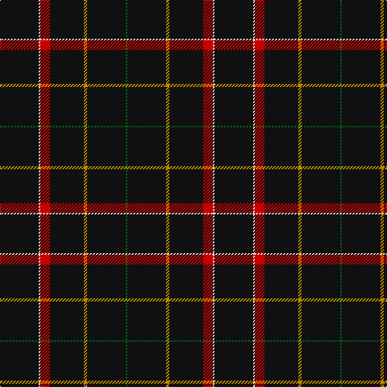

In pattern [GKYKRWK](/stripes/gkykrwk/).

This was sourced from tartans-authority.  It is a [7 stripe tartan](/stripes/stripes7/).

Original link http://www.tartansauthority.com/tartan-ferret/display/10266/

## Thread count
K/48 LN2 R12 K42 DY4 K48 G/2

## Palette
Each colour and its ΔE from the base-6 reference it is a variant of.

| Colour | Shade | Base | ΔE (OKLab) |
|---|---|---|---|
| DY | <code style="background-color:#BC8C00;">#BC8C00</code> `#BC8C00` | Y <code style="background-color:#F2BF00;">#F2BF00</code> | 0.16 |
| G | <code style="background-color:#006818;">#006818</code> `#006818` | G <code style="background-color:#006100;">#006100</code> | 0.02 |
| K | <code style="background-color:#101010;">#101010</code> `#101010` | K <code style="background-color:#000000;">#000000</code> | 0.17 |
| LN | <code style="background-color:#E0E0E0;">#E0E0E0</code> `#E0E0E0` | W <code style="background-color:#F7F7F7;">#F7F7F7</code> | 0.07 |
| R | <code style="background-color:#C80000;">#C80000</code> `#C80000` | R <code style="background-color:#CC0000;">#CC0000</code> | 0.01 |

# Sample pattern

## Nearest tartans

The nearest existing variants by ΔTartan distance.

1. [Gourlay, George (Personal)](/setts/s7/k24w1r6k21lo2k24dg1~x2/) — ΔT 0.39
1. [Savannah Harley Davidson (Corporate)](/setts/s9/k25w1n3w1k31n3k31w2o9~x2/) — ΔT 1.72
1. [NewGeneration Alchemy (NGA) Inc](/setts/s6/k31r2k10db1k1w1~x4/) — ΔT 1.78
1. [Chafyn House (School)](/setts/s7/k72r3k11t9k11r3k37/) — ΔT 2.01
1. [Auld Bernensis](/setts/s8/k62r3k3lo3k3r3k9o5~x2/) — ΔT 2.04
1. [Langhein, Alex (Personal)](/setts/s7/k40dg15k10r2k10lo2k10~x2/) — ΔT 2.05
1. [McHattie (Personal)](/setts/s5/k45db2r4ly1w1~x2/) — ΔT 2.07
1. [Laird Abdullah (Personal)](/setts/s8/k10n2k2n8k40r4k5r2~x2/) — ΔT 2.08
1. [Rikaco Vintage](/setts/s8/dt74m9dt4r5dt4m9dt37db9~x2/) — ΔT 2.09
1. [East of Scotland Tartan Army](/setts/s6/dt40ly10dt8r20dt100w5/) — ΔT 2.11

## Neighbour map

Every grey dot is one of 14299 variants placed by the first two principal components of the ΔTartan feature space (44% of its variance). Red is this tartan; blue dots are its nearest — click one to open its page.

<svg viewBox="0 0 640 380" role="img" style="max-width:100%;height:auto;border:1px solid #e0e0e0;border-radius:4px;display:block" xmlns="http://www.w3.org/2000/svg"><image href="/nn/cloud.v1.png" width="640" height="380"/><a href="/setts/s7/k24w1r6k21lo2k24dg1~x2/"><circle cx="588.9" cy="186.5" r="4" fill="#3465a4"><title>Gourlay, George (Personal)</title></circle></a><a href="/setts/s9/k25w1n3w1k31n3k31w2o9~x2/"><circle cx="539.7" cy="155.7" r="4" fill="#3465a4"><title>Savannah Harley Davidson (Corporate)</title></circle></a><a href="/setts/s6/k31r2k10db1k1w1~x4/"><circle cx="626.0" cy="172.4" r="4" fill="#3465a4"><title>NewGeneration Alchemy (NGA) Inc</title></circle></a><a href="/setts/s7/k72r3k11t9k11r3k37/"><circle cx="626.0" cy="213.8" r="4" fill="#3465a4"><title>Chafyn House (School)</title></circle></a><a href="/setts/s8/k62r3k3lo3k3r3k9o5~x2/"><circle cx="599.2" cy="152.4" r="4" fill="#3465a4"><title>Auld Bernensis</title></circle></a><a href="/setts/s7/k40dg15k10r2k10lo2k10~x2/"><circle cx="548.2" cy="220.3" r="4" fill="#3465a4"><title>Langhein, Alex (Personal)</title></circle></a><a href="/setts/s5/k45db2r4ly1w1~x2/"><circle cx="620.9" cy="133.3" r="4" fill="#3465a4"><title>McHattie (Personal)</title></circle></a><a href="/setts/s8/k10n2k2n8k40r4k5r2~x2/"><circle cx="538.5" cy="174.0" r="4" fill="#3465a4"><title>Laird Abdullah (Personal)</title></circle></a><a href="/setts/s8/dt74m9dt4r5dt4m9dt37db9~x2/"><circle cx="539.5" cy="182.6" r="4" fill="#3465a4"><title>Rikaco Vintage</title></circle></a><a href="/setts/s6/dt40ly10dt8r20dt100w5/"><circle cx="518.4" cy="180.8" r="4" fill="#3465a4"><title>East of Scotland Tartan Army</title></circle></a><circle cx="582.5" cy="185.8" r="5" fill="#c00000"/></svg>

ID: /setts/s7/k24w1r6k21lo2k24g1~x2/
