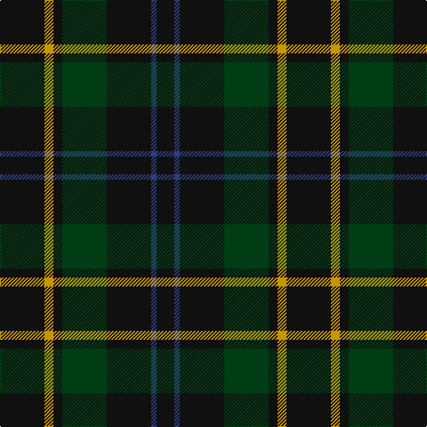

**Bands:** [KYKGKBK](/stripes/kykgkbk/) · **Stripes:** [K LO K DG K DB K](/stripes/stripes7/) K LO K DG K DB K

This was sourced from register-of-tartans.  It is a [7 band tartan](/bands/bands7/).

Original link https://www.tartanregister.gov.uk/tartanDetails.aspx?ref=5869

## Register references

External register numbers recorded for this tartan.

- Scottish Register of Tartans: [5869](https://www.tartanregister.gov.uk/tartanDetails.aspx?ref=5869)
- Scottish Tartans World Register: 3208

## Thread count
K/50 DY10 K10 DG50 K50 B6 K/20

## Palette
Each colour and its ΔE from the base-6 reference it is a variant of.

| Colour | Shade | Base | ΔE (OKLab) |
|---|---|---|---|
| B | <code style="background-color:#2C4084;">#2C4084</code> `#2C4084` | B <code style="background-color:#2A418A;">#2A418A</code> | 0.01 |
| DG | <code style="background-color:#003C14;">#003C14</code> `#003C14` | G <code style="background-color:#006100;">#006100</code> | 0.13 |
| DY | <code style="background-color:#C89600;">#C89600</code> `#C89600` | Y <code style="background-color:#F2BF00;">#F2BF00</code> | 0.13 |
| K | <code style="background-color:#101010;">#101010</code> `#101010` | K <code style="background-color:#000000;">#000000</code> | 0.17 |

# Sample pattern

## Nearest tartans

The nearest existing variants by ΔTartan distance.

1. [Klappert, Denmark (Personal)](/setts/s9/dt16k13dt7dy3r2dy3dt7k13dt16~x2/) — ΔT 1.35
1. [Gunn (Logan)](/setts/s6/dg2k12dg1k12dg12r2~x2/) — ΔT 1.37
1. [Holman](/setts/s10/dg18k10dg13k9r3k9dg25k16dg9db3~x2/) — ΔT 1.54
1. [Murray](/setts/s6/t3k16dg16k16db3t3~x2/) — ΔT 1.69
1. [Green Highland, The (Fashion)](/setts/s6/db2dg15do3db7dg7db2~x4/) — ΔT 1.70
1. [Menez Du](/setts/s9/db5k9g7k3g7k3g7k25g3~x2/) — ΔT 1.70
1. [Bean of Freeport (Personal)](/setts/s7/dt6r15dg41r15dt20dg41db6/) — ΔT 1.70
1. [MacLoughlin of Ardmarnoch (Personal)](/setts/s11/dg5k2dg2k2dg2k12r2k12dg6k2dg2~x2/) — ΔT 1.75
1. [Klappert (Name)](/setts/s9/n16k13n7dy3r2dy3n7k13n16~x2/) — ΔT 1.75
1. [MacHardy (Clan)](/setts/s8/dt6r3g26dt26w2dt27r5g5~x2/) — ΔT 1.80

## Neighbour map

Every grey dot is one of 14299 variants placed by the first two principal components of the ΔTartan feature space (44% of its variance). Red is this tartan; blue dots are its nearest — click one to open its page.

<svg viewBox="0 0 640 380" role="img" style="max-width:100%;height:auto;border:1px solid #e0e0e0;border-radius:4px;display:block" xmlns="http://www.w3.org/2000/svg"><image href="/nn/cloud.v1.png" width="640" height="380"/><a href="/setts/s9/dt16k13dt7dy3r2dy3dt7k13dt16~x2/"><circle cx="342.4" cy="267.5" r="4" fill="#3465a4"><title>Klappert, Denmark (Personal)</title></circle></a><a href="/setts/s6/dg2k12dg1k12dg12r2~x2/"><circle cx="403.3" cy="269.0" r="4" fill="#3465a4"><title>Gunn (Logan)</title></circle></a><a href="/setts/s10/dg18k10dg13k9r3k9dg25k16dg9db3~x2/"><circle cx="354.3" cy="284.1" r="4" fill="#3465a4"><title>Holman</title></circle></a><a href="/setts/s6/t3k16dg16k16db3t3~x2/"><circle cx="300.9" cy="281.4" r="4" fill="#3465a4"><title>Murray</title></circle></a><a href="/setts/s6/db2dg15do3db7dg7db2~x4/"><circle cx="389.2" cy="290.3" r="4" fill="#3465a4"><title>Green Highland, The (Fashion)</title></circle></a><a href="/setts/s9/db5k9g7k3g7k3g7k25g3~x2/"><circle cx="365.1" cy="251.1" r="4" fill="#3465a4"><title>Menez Du</title></circle></a><a href="/setts/s7/dt6r15dg41r15dt20dg41db6/"><circle cx="311.2" cy="262.4" r="4" fill="#3465a4"><title>Bean of Freeport (Personal)</title></circle></a><a href="/setts/s11/dg5k2dg2k2dg2k12r2k12dg6k2dg2~x2/"><circle cx="381.5" cy="255.1" r="4" fill="#3465a4"><title>MacLoughlin of Ardmarnoch (Personal)</title></circle></a><a href="/setts/s9/n16k13n7dy3r2dy3n7k13n16~x2/"><circle cx="324.1" cy="252.4" r="4" fill="#3465a4"><title>Klappert (Name)</title></circle></a><a href="/setts/s8/dt6r3g26dt26w2dt27r5g5~x2/"><circle cx="365.5" cy="216.1" r="4" fill="#3465a4"><title>MacHardy (Clan)</title></circle></a><circle cx="408.5" cy="273.4" r="5" fill="#c00000"/></svg>

ID: /setts/s7/k25lo5k5dg25k25db3k10~x2/
