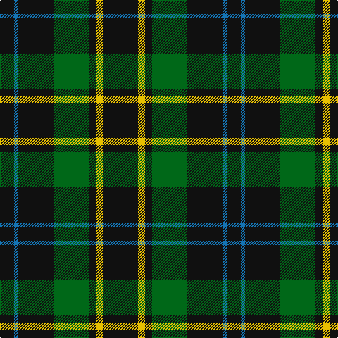

**Bands:** [KYKGKBK](/stripes/kykgkbk/) · **Stripes:** [K LY K G K B K](/stripes/stripes7/) K LY K G K B K

This was sourced from register-of-tartans.  It is a [7 band tartan](/bands/bands7/).

Original link https://www.tartanregister.gov.uk/tartanDetails.aspx?ref=5311

## Attestations

This cloth appears in 2 source records; the oldest owns this page.

- 01/06/2007 — London Community Gospel Choir (register-of-tartans, [record](https://www.tartanregister.gov.uk/tartanDetails.aspx?ref=5311))
- June 2007 — London Community Gospel Choir (Corp) (tartans-authority, [record](http://www.tartansauthority.com/tartan-ferret/display/7219/))

## Register references

External register numbers recorded for this tartan.

- Scottish Register of Tartans: [5311](https://www.tartanregister.gov.uk/tartanDetails.aspx?ref=5311)
- Scottish Tartans Authority (ITI): 7219

## Thread count
K/50 Y10 K10 G50 K50 B6 K/20

## Palette
Each colour and its ΔE from the base-6 reference it is a variant of.

| Colour | Shade | Base | ΔE (OKLab) |
|---|---|---|---|
| B | <code style="background-color:#1474B4;">#1474B4</code> `#1474B4` | B <code style="background-color:#2A418A;">#2A418A</code> | 0.15 |
| G | <code style="background-color:#006818;">#006818</code> `#006818` | G <code style="background-color:#006100;">#006100</code> | 0.02 |
| K | <code style="background-color:#101010;">#101010</code> `#101010` | K <code style="background-color:#000000;">#000000</code> | 0.17 |
| Y | <code style="background-color:#E8C000;">#E8C000</code> `#E8C000` | Y <code style="background-color:#F2BF00;">#F2BF00</code> | 0.02 |

# Sample pattern

## Nearest tartans

The nearest existing variants by ΔTartan distance.

1. [Frame (Edinburgh) (Personal)](/setts/s7/k16g15k4t12k22w2k6~x2/) — ΔT 1.08
1. [Wild Highlanders (Corporate)](/setts/s7/k36w3k10w3g28r6k18~x2/) — ΔT 1.10
1. [Pike (Personal)](/setts/s11/g10k3g3k20dp3k5g3k20g3k3g10~x2/) — ΔT 1.41
1. [MacStumer Hunting](/setts/s9/k3dg14k8dg8r3dg4lo3dg24w3~x2/) — ΔT 1.41
1. [MacAulay Hunting](/setts/s8/g6k16w1k16g8k4g12r2~x2/) — ΔT 1.44
1. [Black (symmetrical)](/setts/s6/k17r6k2lb6k17lo2~x2/) — ΔT 1.45
1. [Scottish Scouts (1957) (Corporate)](/setts/s7/r3g22db16g14r2g6lo2~x2/) — ΔT 1.48
1. [MacKintosh Hunting](/setts/s7/ly2dg12db6r3dg12r4db1~x2/) — ΔT 1.48
1. [Wilson's, No 167](/setts/s6/k20t2k6g16p4k9~x2/) — ΔT 1.49
1. [MacKintosh Hunting](/setts/s7/ly2dg12db6r3dg12r4db1/) — ΔT 1.52

## Neighbour map

Every grey dot is one of 14299 variants placed by the first two principal components of the ΔTartan feature space (44% of its variance). Red is this tartan; blue dots are its nearest — click one to open its page.

<svg viewBox="0 0 640 380" role="img" style="max-width:100%;height:auto;border:1px solid #e0e0e0;border-radius:4px;display:block" xmlns="http://www.w3.org/2000/svg"><image href="/nn/cloud.v1.png" width="640" height="380"/><a href="/setts/s7/k16g15k4t12k22w2k6~x2/"><circle cx="305.5" cy="232.6" r="4" fill="#3465a4"><title>Frame (Edinburgh) (Personal)</title></circle></a><a href="/setts/s7/k36w3k10w3g28r6k18~x2/"><circle cx="329.2" cy="209.0" r="4" fill="#3465a4"><title>Wild Highlanders (Corporate)</title></circle></a><a href="/setts/s11/g10k3g3k20dp3k5g3k20g3k3g10~x2/"><circle cx="339.1" cy="226.4" r="4" fill="#3465a4"><title>Pike (Personal)</title></circle></a><a href="/setts/s9/k3dg14k8dg8r3dg4lo3dg24w3~x2/"><circle cx="377.7" cy="207.9" r="4" fill="#3465a4"><title>MacStumer Hunting</title></circle></a><a href="/setts/s8/g6k16w1k16g8k4g12r2~x2/"><circle cx="326.7" cy="216.4" r="4" fill="#3465a4"><title>MacAulay Hunting</title></circle></a><a href="/setts/s6/k17r6k2lb6k17lo2~x2/"><circle cx="381.5" cy="227.4" r="4" fill="#3465a4"><title>Black (symmetrical)</title></circle></a><a href="/setts/s7/r3g22db16g14r2g6lo2~x2/"><circle cx="365.8" cy="226.6" r="4" fill="#3465a4"><title>Scottish Scouts (1957) (Corporate)</title></circle></a><a href="/setts/s7/ly2dg12db6r3dg12r4db1~x2/"><circle cx="334.5" cy="226.4" r="4" fill="#3465a4"><title>MacKintosh Hunting</title></circle></a><a href="/setts/s6/k20t2k6g16p4k9~x2/"><circle cx="299.2" cy="232.1" r="4" fill="#3465a4"><title>Wilson's, No 167</title></circle></a><a href="/setts/s7/ly2dg12db6r3dg12r4db1/"><circle cx="302.3" cy="209.5" r="4" fill="#3465a4"><title>MacKintosh Hunting</title></circle></a><circle cx="350.5" cy="241.7" r="5" fill="#c00000"/></svg>

ID: /setts/s7/k25ly5k5g25k25b3k10~x2/
