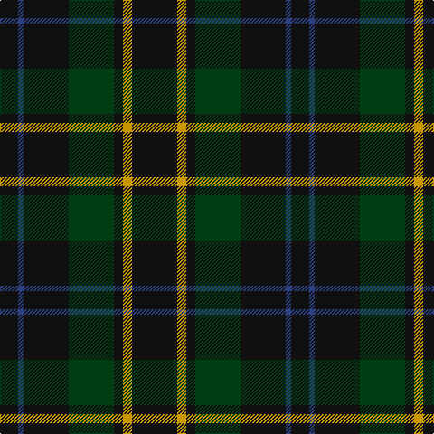

In pattern [KBKGKYK](/patterns/kbkgkyk/).

This was sourced from register-of-tartans.  It is a [7 stripes tartan](/stripes/stripes7/).

Original link https://www.tartanregister.gov.uk/tartanDetails.aspx?ref=5869

## Thread count
K/20 B6 K50 DG50 K10 DY10 K/50

## Palette
Each colour and its ΔE from the base-6 reference it is a variant of.

| Colour | Shade | Base | ΔE (OKLab) |
|---|---|---|---|
| B | <code style="background-color:#2C4084;">#2C4084</code> `#2C4084` | B <code style="background-color:#2A418A;">#2A418A</code> | 0.01 |
| DG | <code style="background-color:#003C14;">#003C14</code> `#003C14` | G <code style="background-color:#006100;">#006100</code> | 0.13 |
| DY | <code style="background-color:#C89600;">#C89600</code> `#C89600` | Y <code style="background-color:#F2BF00;">#F2BF00</code> | 0.13 |
| K | <code style="background-color:#101010;">#101010</code> `#101010` | K <code style="background-color:#000000;">#000000</code> | 0.17 |

# Sample pattern

## Nearest tartans

The nearest existing variants by ΔTartan distance.

1. [Klappert Name Tartan Tartan Number: 10468. Earliest known date: 2011 This tartan was designed to celebrate the advent of the third generation of Klapperts in Denmark. The Klappert family name is currently only shared by four people in Denmark, all closely related. The family has visited Scotland frequently and has embraced the Scottish culture. This tartan represents the family's love of Scotland. The colours reflect the family's heritage and enviroment: black symbolises the dark Nordic winter and the dark grey is the cold sea which embraces the vast Danish coastline. The dark red symbolises this family's foundation in Denmark. The brown is a reference to the longships which carried the Vikings to Scotland. See products available Copyright © Blair Urquhart, Comrie, 2015](/setts/s9/b16k13b7g3r2g3b7k13b16~b3c4440-g5c381c-k000410-rb42430~x2/) — ΔT 1.32
1. [Klappert, Denmark (Personal)](/setts/s9/b16k13b7g3r2g3b7k13b16~b3f4441-g5c391d-k010512-rb62531~x2/) — ΔT 1.35
1. [Gunn (Logan)](/setts/s6/g2k12g1k12g12r2~g005020-k101010-rdc0000~x2/) — ΔT 1.37
1. [Holman](/setts/s10/g18k10g13k9r3k9g25k16g9b3~b304080-g003000-k000030-rc00000~x2/) — ΔT 1.54
1. [Murray](/setts/s6/b3k16g16k16ba3b3~b3c82af-ba2c4084-g005020-k101010~x2/) — ΔT 1.69
1. [Green Highland, The (Fashion)](/setts/s6/b2g15ba3b7g7b2~b000088-ba381c0c-g004800~x4/) — ΔT 1.69
1. [Menez Du](/setts/s9/b5k9g7k3g7k3g7k25g3~b202060-g006818-k101010~x2/) — ΔT 1.70
1. [Bean of Freeport (Personal)](/setts/s7/b6r15g41r15b20g41ba6~b003c64-ba1c0070-g003820-rc8002c/) — ΔT 1.70
1. [MacLoughlin of Ardmarnoch (Personal)](/setts/s11/g5k2g2k2g2k12r2k12g6k2g2~g285800-k101010-rc80000~x2/) — ΔT 1.75
1. [Klappert (Name)](/setts/s9/b16k13b7g3r2g3b7k13b16~b5c5c5c-g604000-k101010-rc80000~x2/) — ΔT 1.75

## Neighbour map

Every grey dot is one of 15726 variants placed by the first two principal components of the ΔTartan feature space (44% of its variance). Red is this tartan; blue dots are its nearest — click one to open its page.

<svg viewBox="0 0 640 380" role="img" style="max-width:100%;height:auto;border:1px solid #e0e0e0;border-radius:4px;display:block" xmlns="http://www.w3.org/2000/svg"><image href="/nn/cloud.v1.png" width="640" height="380"/><a href="/setts/s9/b16k13b7g3r2g3b7k13b16~b3c4440-g5c381c-k000410-rb42430~x2/"><circle cx="336.4" cy="259.8" r="4" fill="#3465a4"><title>Klappert Name Tartan Tartan Number: 10468. Earliest known date: 2011 This tartan was designed to celebrate the advent of the third generation of Klapperts in Denmark. The Klappert family name is currently only shared by four people in Denmark, all closely related. The family has visited Scotland frequently and has embraced the Scottish culture. This tartan represents the family's love of Scotland. The colours reflect the family's heritage and enviroment: black symbolises the dark Nordic winter and the dark grey is the cold sea which embraces the vast Danish coastline. The dark red symbolises this family's foundation in Denmark. The brown is a reference to the longships which carried the Vikings to Scotland. See products available Copyright © Blair Urquhart, Comrie, 2015</title></circle></a><a href="/setts/s9/b16k13b7g3r2g3b7k13b16~b3f4441-g5c391d-k010512-rb62531~x2/"><circle cx="340.7" cy="260.9" r="4" fill="#3465a4"><title>Klappert, Denmark (Personal)</title></circle></a><a href="/setts/s6/g2k12g1k12g12r2~g005020-k101010-rdc0000~x2/"><circle cx="401.4" cy="265.0" r="4" fill="#3465a4"><title>Gunn (Logan)</title></circle></a><a href="/setts/s10/g18k10g13k9r3k9g25k16g9b3~b304080-g003000-k000030-rc00000~x2/"><circle cx="352.0" cy="274.8" r="4" fill="#3465a4"><title>Holman</title></circle></a><a href="/setts/s6/b3k16g16k16ba3b3~b3c82af-ba2c4084-g005020-k101010~x2/"><circle cx="298.3" cy="276.9" r="4" fill="#3465a4"><title>Murray</title></circle></a><a href="/setts/s6/b2g15ba3b7g7b2~b000088-ba381c0c-g004800~x4/"><circle cx="386.5" cy="284.9" r="4" fill="#3465a4"><title>Green Highland, The (Fashion)</title></circle></a><a href="/setts/s9/b5k9g7k3g7k3g7k25g3~b202060-g006818-k101010~x2/"><circle cx="362.6" cy="247.6" r="4" fill="#3465a4"><title>Menez Du</title></circle></a><a href="/setts/s7/b6r15g41r15b20g41ba6~b003c64-ba1c0070-g003820-rc8002c/"><circle cx="309.5" cy="258.0" r="4" fill="#3465a4"><title>Bean of Freeport (Personal)</title></circle></a><a href="/setts/s11/g5k2g2k2g2k12r2k12g6k2g2~g285800-k101010-rc80000~x2/"><circle cx="379.5" cy="251.9" r="4" fill="#3465a4"><title>MacLoughlin of Ardmarnoch (Personal)</title></circle></a><a href="/setts/s9/b16k13b7g3r2g3b7k13b16~b5c5c5c-g604000-k101010-rc80000~x2/"><circle cx="322.6" cy="248.5" r="4" fill="#3465a4"><title>Klappert (Name)</title></circle></a><circle cx="406.8" cy="268.0" r="5" fill="#c00000"/></svg>

ID: /setts/s7/k25y5k5g25k25b3k10~b2c4084-g003c14-k101010-yc89600~x2/
