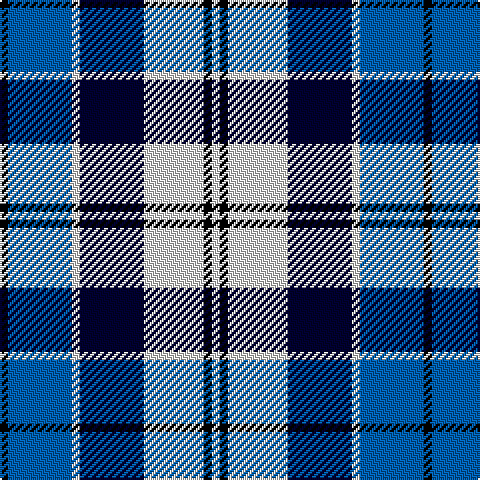

In pattern [KBWKWKW](/stripes/kbwkwkw/).

This was sourced from weddslist.  It is a [7 stripe tartan](/stripes/stripes7/).

Original link http://www.weddslist.com/cgi-bin/tartans/pg.pl?source=sts

## Thread count
K/4 B32 LN4 DB32 LN30 K4 LN/4

## Palette
Each colour and the base-6 reference it is a variant of.

| Colour | Shade | Base |
|---|---|---|
| B | <code style="background-color:#0060B0;">#0060B0</code> `oklch(48.8% 0.148 252.5)` <small>#0060B0</small> | B <code style="background-color:#2A418A;">#2A418A</code> |
| DB | <code style="background-color:#000030;">#000030</code> `oklch(14.0% 0.097 264.1)` <small>#000030</small> | K <code style="background-color:#000000;">#000000</code> |
| K | <code style="background-color:#000000;">#000000</code> `oklch(0.0% 0.000 0.0)` <small>#000000</small> | K <code style="background-color:#000000;">#000000</code> |
| LN | <code style="background-color:#E0E0E0;">#E0E0E0</code> `oklch(90.7% 0.000 89.9)` <small>#E0E0E0</small> | W <code style="background-color:#F7F7F7;">#F7F7F7</code> |

# Sample pattern

## Nearest tartans

The nearest existing variants by ΔTartan distance.

1. [Strathclyde](/setts/s7/k4db2k15w10b15db2b4~x2/) — ΔT 0.91
1. [Bannockbane Blue #1](/setts/s8/k4lo2k13lo1w8b13lo2b4~x2/) — ΔT 0.94
1. [Blue Boy, The (Fashion)](/setts/s7/db1g7db7db2w6db1w1~x4/) — ΔT 0.95
1. [St. Francis Xavier University](/setts/s7/k3lo1lb9lo1db9k3t1~x4/) — ΔT 1.02
1. [Thom(p)son, Navy](/setts/s7/r3db15w13o6db2o2r2~x2/) — ΔT 1.04
1. [Thompson (Dance)](/setts/s6/b1lb6db1b3k3b1~x8/) — ΔT 1.04
1. [Sneddon, Jonathan Taylor (Personal)](/setts/s8/b15k2w2k2w2k16lr22ly2~x4/) — ΔT 1.12
1. [Sibbald Blue (2014)](/setts/s9/dg4db22dt6w10db3w6dp4dt3w4~x2/) — ΔT 1.22
1. [(1) Abercrombie](/setts/s9/b27w2b14k14lg4k4lg4k4lg27/) — ΔT 1.27
1. [Sibbald Blue (2014)](/setts/s9/dg4db22db6w10db3w6dp4db3w4~x2/) — ΔT 1.31

## Neighbour map

Every grey dot is one of 14299 variants placed by the first two principal components of the ΔTartan feature space (44% of its variance). Red is this tartan; blue dots are its nearest — click one to open its page.

<svg viewBox="0 0 640 380" role="img" style="max-width:100%;height:auto;border:1px solid #e0e0e0;border-radius:4px;display:block" xmlns="http://www.w3.org/2000/svg"><image href="/nn/cloud.v1.png" width="640" height="380"/><a href="/setts/s7/k4db2k15w10b15db2b4~x2/"><circle cx="129.5" cy="207.5" r="4" fill="#3465a4"><title>Strathclyde</title></circle></a><a href="/setts/s8/k4lo2k13lo1w8b13lo2b4~x2/"><circle cx="149.3" cy="172.1" r="4" fill="#3465a4"><title>Bannockbane Blue #1</title></circle></a><a href="/setts/s7/db1g7db7db2w6db1w1~x4/"><circle cx="116.2" cy="202.4" r="4" fill="#3465a4"><title>Blue Boy, The (Fashion)</title></circle></a><a href="/setts/s7/k3lo1lb9lo1db9k3t1~x4/"><circle cx="110.9" cy="168.5" r="4" fill="#3465a4"><title>St. Francis Xavier University</title></circle></a><a href="/setts/s7/r3db15w13o6db2o2r2~x2/"><circle cx="151.7" cy="188.8" r="4" fill="#3465a4"><title>Thom(p)son, Navy</title></circle></a><a href="/setts/s6/b1lb6db1b3k3b1~x8/"><circle cx="134.7" cy="214.5" r="4" fill="#3465a4"><title>Thompson (Dance)</title></circle></a><a href="/setts/s8/b15k2w2k2w2k16lr22ly2~x4/"><circle cx="134.8" cy="147.2" r="4" fill="#3465a4"><title>Sneddon, Jonathan Taylor (Personal)</title></circle></a><a href="/setts/s9/dg4db22dt6w10db3w6dp4dt3w4~x2/"><circle cx="123.4" cy="164.9" r="4" fill="#3465a4"><title>Sibbald Blue (2014)</title></circle></a><a href="/setts/s9/b27w2b14k14lg4k4lg4k4lg27/"><circle cx="184.6" cy="159.4" r="4" fill="#3465a4"><title>(1) Abercrombie</title></circle></a><a href="/setts/s9/dg4db22db6w10db3w6dp4db3w4~x2/"><circle cx="125.9" cy="163.5" r="4" fill="#3465a4"><title>Sibbald Blue (2014)</title></circle></a><circle cx="129.1" cy="187.9" r="5" fill="#c00000"/></svg>

ID: /setts/s7/k2b16w2k16w15k2w2~x2/
