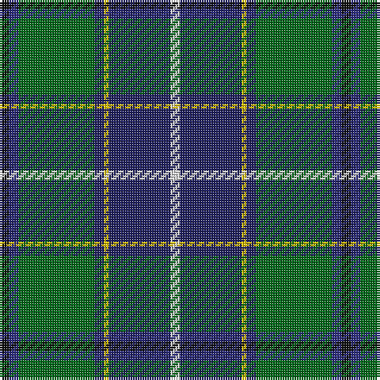

In pattern [KBGBYBW](/patterns/kbgbybw/).

This was sourced from house-of-tartan.  It is a [7 stripes tartan](/stripes/stripes7/).

Original link http://www.house-of-tartan.scotland.net/house/TartanViewjs.asp?colr=Def&tnam=2104

## Thread count
K/4 DB4 G32 DBa4 Y2 DBa26 LN/4

## Palette
Each colour and its ΔE from the base-6 reference it is a variant of.

| Colour | Shade | Base | ΔE (OKLab) |
|---|---|---|---|
| DB | <code style="background-color:#2C2C80;">#2C2C80</code> `#2C2C80` | B <code style="background-color:#2A418A;">#2A418A</code> | 0.06 |
| DBa | <code style="background-color:#202060;">#202060</code> `#202060` | B <code style="background-color:#2A418A;">#2A418A</code> | 0.11 |
| G | <code style="background-color:#006818;">#006818</code> `#006818` | G <code style="background-color:#006100;">#006100</code> | 0.02 |
| K | <code style="background-color:#101010;">#101010</code> `#101010` | K <code style="background-color:#000000;">#000000</code> | 0.17 |
| LN | <code style="background-color:#E0E0E0;">#E0E0E0</code> `#E0E0E0` | W <code style="background-color:#F7F7F7;">#F7F7F7</code> | 0.07 |
| Y | <code style="background-color:#E8C000;">#E8C000</code> `#E8C000` | Y <code style="background-color:#F2BF00;">#F2BF00</code> | 0.02 |

# Sample pattern

## Nearest tartans

The nearest existing variants by ΔTartan distance.

1. [Kleto, Susan (Personal)](/setts/s9/w1b16y1r3y1g6ga2g6w1x2~b003c64-g003c14-ga767e52-r8b0000-wffffff-ye0a126/) — ΔT 0.80
1. [Canadian Centennial District Tartan Tartan Number: 1704. Earliest known date: 1966 This tartan was approved by the Centennial Commission. The six colours represent the wealth of Canada in her people and her natural resources. See products available Copyright © Blair Urquhart, Comrie, 2015](/setts/s8/r3w6r2g32b36k2b4y2x2~b2c2c80-g006818-k101010-rc80000-we0e0e0-ye8c000/) — ΔT 0.88
1. [Vipont](/setts/s7/r4g14k3w3g12b36wa4x2~b304080-g008000-k000000-rc00000-wc0a0e0-wae0e0e0/) — ΔT 0.90
1. [Nova Scotia](/setts/s9/w2b20g2ga2g2ga4g8y2r1x2~b304080-g003000-ga30a010-rc00000-we0e0e0-yf0c000/) — ΔT 0.92
1. [Dodd of Branford](/setts/s9/g4r2g20b8k8b4w1y2k1x2~b1c0070-g006818-k101010-r880000-wc0c0c0-yd09800/) — ΔT 0.95
1. [Tooth Family Tartan Tartan Number: 922. Earliest known date: 1980 STS collection. See products available Copyright © Blair Urquhart, Comrie, 2015](/setts/s8/g5y1r2g25k14b19w4g2x2~b2c2c80-g006818-k101010-rc80000-we0e0e0-ye8c000/) — ΔT 0.96
1. [Vipont Family Tartan Tartan Number: 1479. Earliest known date: 1983 This count comes from a sample at the Scottish Tartans Society, in the MacGregor Hastie collection. He in turn procured it from J.Wright of Edinburgh. A contradictory note in the files says, "It was apparently designed and woven by them (J.Wright) for the family of Vipont c.1930. It is rarely if ever used today." The Scottish Viponts are an ancient family, who formerly possessed lands in Aberdour, Fife. See products available Copyright © Blair Urquhart, Comrie, 2015](/setts/s7/r4g14k3w3g12b36wa4x2~b2c2c80-g006818-k101010-rc80000-wc49cd8-wae0e0e0/) — ΔT 0.96
1. [Scotland’s Golf Coast](/setts/s9/y2w1b16ba2b2ba3b8g20ya2x2~b141e46-ba780078-g285800-wffffff-y48a4c0-yae0a126/) — ΔT 0.97
1. [Nova Scotia Canadian District Tartan Tartan Number: 1713. Earliest known date: 1956 Mrs Douglas Murray designed a panel for a historical display showing a shepherd tending his flock on the hills of Cape Breton. To avoid trouble amongst the clansfolk of Nova Scotia she designed a new tartan for the shepherds kilt. See products available Copyright © Blair Urquhart, Comrie, 2015](/setts/s9/w2b20g2ga2g2ga4g8y2r1x2~b2c2c80-g003820-ga289c18-rc80000-we0e0e0-ye8c000/) — ΔT 1.00
1. [Hogg Dress (Name)](/setts/s9/b34r3b8ba4b8k24g34k2w6~b4880a0-ba1c1c50-g006818-k101010-rc80000-we0e0e0/) — ΔT 1.00

## Neighbour map

Every grey dot is one of 15726 variants placed by the first two principal components of the ΔTartan feature space (44% of its variance). Red is this tartan; blue dots are its nearest — click one to open its page.

<svg viewBox="0 0 640 380" role="img" style="max-width:100%;height:auto;border:1px solid #e0e0e0;border-radius:4px;display:block" xmlns="http://www.w3.org/2000/svg"><image href="/nn/cloud.v1.png" width="640" height="380"/><a href="/setts/s9/w1b16y1r3y1g6ga2g6w1x2~b003c64-g003c14-ga767e52-r8b0000-wffffff-ye0a126/"><circle cx="215.4" cy="130.3" r="4" fill="#3465a4"><title>Kleto, Susan (Personal)</title></circle></a><a href="/setts/s8/r3w6r2g32b36k2b4y2x2~b2c2c80-g006818-k101010-rc80000-we0e0e0-ye8c000/"><circle cx="244.9" cy="120.6" r="4" fill="#3465a4"><title>Canadian Centennial District Tartan Tartan Number: 1704. Earliest known date: 1966 This tartan was approved by the Centennial Commission. The six colours represent the wealth of Canada in her people and her natural resources. See products available Copyright © Blair Urquhart, Comrie, 2015</title></circle></a><a href="/setts/s7/r4g14k3w3g12b36wa4x2~b304080-g008000-k000000-rc00000-wc0a0e0-wae0e0e0/"><circle cx="217.9" cy="152.3" r="4" fill="#3465a4"><title>Vipont</title></circle></a><a href="/setts/s9/w2b20g2ga2g2ga4g8y2r1x2~b304080-g003000-ga30a010-rc00000-we0e0e0-yf0c000/"><circle cx="228.3" cy="112.6" r="4" fill="#3465a4"><title>Nova Scotia</title></circle></a><a href="/setts/s9/g4r2g20b8k8b4w1y2k1x2~b1c0070-g006818-k101010-r880000-wc0c0c0-yd09800/"><circle cx="237.2" cy="132.2" r="4" fill="#3465a4"><title>Dodd of Branford</title></circle></a><a href="/setts/s8/g5y1r2g25k14b19w4g2x2~b2c2c80-g006818-k101010-rc80000-we0e0e0-ye8c000/"><circle cx="217.1" cy="129.3" r="4" fill="#3465a4"><title>Tooth Family Tartan Tartan Number: 922. Earliest known date: 1980 STS collection. See products available Copyright © Blair Urquhart, Comrie, 2015</title></circle></a><a href="/setts/s7/r4g14k3w3g12b36wa4x2~b2c2c80-g006818-k101010-rc80000-wc49cd8-wae0e0e0/"><circle cx="227.1" cy="155.9" r="4" fill="#3465a4"><title>Vipont Family Tartan Tartan Number: 1479. Earliest known date: 1983 This count comes from a sample at the Scottish Tartans Society, in the MacGregor Hastie collection. He in turn procured it from J.Wright of Edinburgh. A contradictory note in the files says, &quot;It was apparently designed and woven by them (J.Wright) for the family of Vipont c.1930. It is rarely if ever used today.&quot; The Scottish Viponts are an ancient family, who formerly possessed lands in Aberdour, Fife. See products available Copyright © Blair Urquhart, Comrie, 2015</title></circle></a><a href="/setts/s9/y2w1b16ba2b2ba3b8g20ya2x2~b141e46-ba780078-g285800-wffffff-y48a4c0-yae0a126/"><circle cx="255.8" cy="131.5" r="4" fill="#3465a4"><title>Scotland’s Golf Coast</title></circle></a><a href="/setts/s9/w2b20g2ga2g2ga4g8y2r1x2~b2c2c80-g003820-ga289c18-rc80000-we0e0e0-ye8c000/"><circle cx="229.2" cy="113.0" r="4" fill="#3465a4"><title>Nova Scotia Canadian District Tartan Tartan Number: 1713. Earliest known date: 1956 Mrs Douglas Murray designed a panel for a historical display showing a shepherd tending his flock on the hills of Cape Breton. To avoid trouble amongst the clansfolk of Nova Scotia she designed a new tartan for the shepherds kilt. See products available Copyright © Blair Urquhart, Comrie, 2015</title></circle></a><a href="/setts/s9/b34r3b8ba4b8k24g34k2w6~b4880a0-ba1c1c50-g006818-k101010-rc80000-we0e0e0/"><circle cx="178.1" cy="137.7" r="4" fill="#3465a4"><title>Hogg Dress (Name)</title></circle></a><circle cx="220.5" cy="146.3" r="5" fill="#c00000"/></svg>

ID: /setts/s7/k2b2g16ba2y1ba13w2x2~b2c2c80-ba202060-g006818-k101010-we0e0e0-ye8c000/
