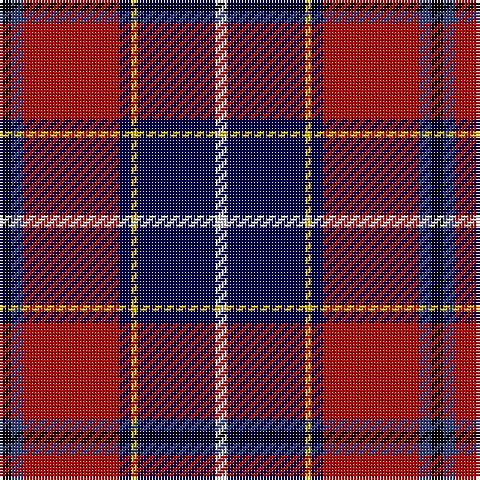

In pattern [KBRBYBW](/stripes/kbrbybw/).

This was sourced from weddslist.  It is a [7 stripe tartan](/stripes/stripes7/).

Original link http://www.weddslist.com/cgi-bin/tartans/pg.pl?source=sts

## Also known as

This cloth is also recorded under:

- Wishart, dress

## Attestations

This cloth appears in 2 source records; the oldest owns this page.

- undated — Wishart, dress (weddslist, [record](http://www.weddslist.com/cgi-bin/tartans/pg.pl?source=sts))
- undated — Wishart Dress Family Tartan Tartan Number: 2105. Earliest known date: 1990 The Wisharts of Pittarrow and Logie Wishart were a lowland family dating from around the 12th Century. The family's origins are unknown, but the name Guiscard, Wiscard, Wishart, meaning 'cunning' is Norman-French. We have also sought to associate the Wishart tartan with that of another family by virtue of the marriage of a Sir John Wishart to Jean, daughter of William Douglas, 9th Earl of Angus in the 16th Century. The Wishart tartan combines the Wallace and Douglas tartans, in an original new sett which was designed by Dr David Wishart with the assistance of the Scottish College of Textiles in Galashiels. (D. Wishart, 1990) See products available Copyright © Blair Urquhart, Comrie, 2015 (house-of-tartan, [record](http://www.house-of-tartan.scotland.net/house/TartanViewjs.asp?colr=Def&tnam=2105))

## Thread count
K/4 B4 R32 DB4 Y2 DB26 LN/4

## Palette
Each colour and the base-6 reference it is a variant of.

| Colour | Shade | Base |
|---|---|---|
| B | <code style="background-color:#304080;">#304080</code> `oklch(39.4% 0.109 270.2)` <small>#304080</small> | B <code style="background-color:#2A418A;">#2A418A</code> |
| DB | <code style="background-color:#000050;">#000050</code> `oklch(19.5% 0.135 264.1)` <small>#000050</small> | B <code style="background-color:#2A418A;">#2A418A</code> |
| K | <code style="background-color:#000000;">#000000</code> `oklch(0.0% 0.000 0.0)` <small>#000000</small> | K <code style="background-color:#000000;">#000000</code> |
| LN | <code style="background-color:#E0E0E0;">#E0E0E0</code> `oklch(90.7% 0.000 89.9)` <small>#E0E0E0</small> | W <code style="background-color:#F7F7F7;">#F7F7F7</code> |
| R | <code style="background-color:#C00000;">#C00000</code> `oklch(50.7% 0.208 29.2)` <small>#C00000</small> | R <code style="background-color:#CC0000;">#CC0000</code> |
| Y | <code style="background-color:#F0C000;">#F0C000</code> `oklch(82.7% 0.169 90.5)` <small>#F0C000</small> | Y <code style="background-color:#F2BF00;">#F2BF00</code> |

# Sample pattern

## Nearest tartans

The nearest existing variants by ΔTartan distance.

1. [Wishart Dress (Clan)](/setts/s7/k7db4r31db3ly2db27lb4~x2/) — ΔT 0.53
1. [Curnow of Kernow (Personal)](/setts/s7/r3ly2dp26k13y2k8w3~x2/) — ΔT 1.11
1. [Loch Etive](/setts/s8/ly3db3k2db18k26r21g2lb3~x2/) — ΔT 1.12
1. [Loch Etive](/setts/s8/w3g2r21k26db18k2db3ly3~x2/) — ΔT 1.13
1. [Clan MacLeod Society of Scotland, Centenary](/setts/s6/dg3g3r22k5k22ly2~x2/) — ΔT 1.19
1. [MacCreary (Personal)](/setts/s9/k4db12lb3db4g8lo2r24db4r4~x2/) — ΔT 1.23
1. [Cherry, John S (Personal)](/setts/s7/r4db36r35g2r2g8w4~x2/) — ΔT 1.24
1. [Heirloom Red Alba (Fashion)](/setts/s9/r4ly2r34db10y4db4t4db23w3~x2/) — ΔT 1.26
1. [Hyland Evening (Personal)](/setts/s8/dp3lo2r19r4dp6k36dp2lo3~x2/) — ΔT 1.28
1. [MacLeod Society of Scotland](/setts/s6/g3g3r22k5db22ly2~x2/) — ΔT 1.29

## Neighbour map

Every grey dot is one of 14299 variants placed by the first two principal components of the ΔTartan feature space (44% of its variance). Red is this tartan; blue dots are its nearest — click one to open its page.

<svg viewBox="0 0 640 380" role="img" style="max-width:100%;height:auto;border:1px solid #e0e0e0;border-radius:4px;display:block" xmlns="http://www.w3.org/2000/svg"><image href="/nn/cloud.v1.png" width="640" height="380"/><a href="/setts/s7/k7db4r31db3ly2db27lb4~x2/"><circle cx="200.2" cy="126.7" r="4" fill="#3465a4"><title>Wishart Dress (Clan)</title></circle></a><a href="/setts/s7/r3ly2dp26k13y2k8w3~x2/"><circle cx="235.4" cy="151.2" r="4" fill="#3465a4"><title>Curnow of Kernow (Personal)</title></circle></a><a href="/setts/s8/ly3db3k2db18k26r21g2lb3~x2/"><circle cx="158.4" cy="136.0" r="4" fill="#3465a4"><title>Loch Etive</title></circle></a><a href="/setts/s8/w3g2r21k26db18k2db3ly3~x2/"><circle cx="153.5" cy="132.2" r="4" fill="#3465a4"><title>Loch Etive</title></circle></a><a href="/setts/s6/dg3g3r22k5k22ly2~x2/"><circle cx="170.2" cy="154.5" r="4" fill="#3465a4"><title>Clan MacLeod Society of Scotland, Centenary</title></circle></a><a href="/setts/s9/k4db12lb3db4g8lo2r24db4r4~x2/"><circle cx="182.7" cy="134.9" r="4" fill="#3465a4"><title>MacCreary (Personal)</title></circle></a><a href="/setts/s7/r4db36r35g2r2g8w4~x2/"><circle cx="221.1" cy="120.8" r="4" fill="#3465a4"><title>Cherry, John S (Personal)</title></circle></a><a href="/setts/s9/r4ly2r34db10y4db4t4db23w3~x2/"><circle cx="252.8" cy="123.7" r="4" fill="#3465a4"><title>Heirloom Red Alba (Fashion)</title></circle></a><a href="/setts/s8/dp3lo2r19r4dp6k36dp2lo3~x2/"><circle cx="254.5" cy="113.0" r="4" fill="#3465a4"><title>Hyland Evening (Personal)</title></circle></a><a href="/setts/s6/g3g3r22k5db22ly2~x2/"><circle cx="188.3" cy="157.6" r="4" fill="#3465a4"><title>MacLeod Society of Scotland</title></circle></a><circle cx="211.2" cy="121.9" r="5" fill="#c00000"/></svg>

ID: /setts/s7/k2db2r16db2ly1db13w2~x2/
