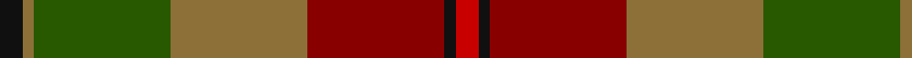
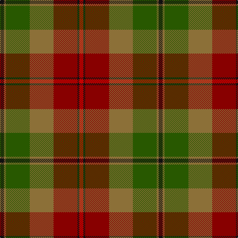

In pattern [KGGGRKR](/patterns/kgggrkr/).

This was sourced from register-of-tartans.  It is a [7 stripes tartan](/stripes/stripes7/).

Original link https://www.tartanregister.gov.uk/tartanDetails.aspx?ref=3417

## Attestations

This cloth appears in 2 source records; the oldest owns this page.

- 01/01/2006 — PSD: Operation Iraqi Freedom (register-of-tartans, [record](https://www.tartanregister.gov.uk/tartanDetails.aspx?ref=3417))
- 2006 — PSD: Operation Iraqi Freedom (Milita (tartans-authority, [record](http://www.tartansauthority.com/tartan-ferret/display/6877/))

## Thread count
K/8 LT4 G48 LT48 DR48 K4 R/8

## Palette
Each colour and its ΔE from the base-6 reference it is a variant of.

| Colour | Shade | Base | ΔE (OKLab) |
|---|---|---|---|
| DR | <code style="background-color:#880000;">#880000</code> `#880000` | R <code style="background-color:#CC0000;">#CC0000</code> | 0.15 |
| G | <code style="background-color:#285800;">#285800</code> `#285800` | G <code style="background-color:#006100;">#006100</code> | 0.03 |
| K | <code style="background-color:#101010;">#101010</code> `#101010` | K <code style="background-color:#000000;">#000000</code> | 0.17 |
| LT | <code style="background-color:#8C7038;">#8C7038</code> `#8C7038` | G <code style="background-color:#006100;">#006100</code> | 0.18 |
| R | <code style="background-color:#C80000;">#C80000</code> `#C80000` | R <code style="background-color:#CC0000;">#CC0000</code> | 0.01 |

# Sample pattern

## Nearest tartans

The nearest existing variants by ΔTartan distance.

1. [Henry, W. A.](/setts/s9/g16r16y3ga16ra2r1ra2g6r2~g484800-ga004c00-r9c0030-ra9c8000-yb0b0b0~x4/) — ΔT 0.84
1. [Wcwm 9275-1410](/setts/s7/g3ga32g4w3g18b18y3~b6c0070-g006818-ga604000-wc0c0c0-yd09800~x2/) — ΔT 1.31
1. [Cavan, County](/setts/s10/g3k2ga26k4gb9g3gb9k4r9k3~g8c7038-ga006818-gb604000-k101010-rc80000~x2/) — ΔT 1.38
1. [Brousseau (Personal)](/setts/s9/g25r2w2b2w2r13ga28b2r3~b2c2c80-g5c6428-ga643424-ra00000-we8ccb8~x2/) — ΔT 1.40
1. [Scott Htg (Clan)](/setts/s8/r3g16ga10r3ga3w2ga3r3~g604000-ga006818-rc80000-wc0c0c0~x2/) — ΔT 1.41
1. [MacAart (Personal)](/setts/s10/g9k2g2r2ga6k1y1k1ga6r3~g604000-ga006818-k101010-r880000-yd09800~x4/) — ΔT 1.42
1. [Methven](/setts/s11/r2g3ga18r2ga2r21gb6g2gb2g24y2~g003820-ga503c14-gb5c6428-rb03000-yc88c00~x2/) — ΔT 1.42
1. [Methven](/setts/s11/r2g3ga18r2ga2r21gb2g2gb2g24y2~g003820-ga603800-gb408060-rc04c08-yd09800~x2/) — ΔT 1.43
1. [Bruce of Kinnaird (Vivienne Westwood Design)](/setts/s10/g22ga22b2w6b2y2b16gb5g8w2~b501400-g604000-ga8c7038-gb0098a0-wc0c0c0-yd09800~x2/) — ΔT 1.43
1. [MacAart Family Tartan Tartan Number: 1477. Earliest known date: pre 2003 Restricted See products available Copyright © Blair Urquhart, Comrie, 2015](/setts/s10/g9k2g2r2ga6k1y1k1ga6r3~g604000-ga006818-k101010-rc80000-ye8c000~x2/) — ΔT 1.43

## Neighbour map

Every grey dot is one of 15726 variants placed by the first two principal components of the ΔTartan feature space (44% of its variance). Red is this tartan; blue dots are its nearest — click one to open its page.

<svg viewBox="0 0 640 380" role="img" style="max-width:100%;height:auto;border:1px solid #e0e0e0;border-radius:4px;display:block" xmlns="http://www.w3.org/2000/svg"><image href="/nn/cloud.v1.png" width="640" height="380"/><a href="/setts/s9/g16r16y3ga16ra2r1ra2g6r2~g484800-ga004c00-r9c0030-ra9c8000-yb0b0b0~x4/"><circle cx="236.8" cy="173.8" r="4" fill="#3465a4"><title>Henry, W. A.</title></circle></a><a href="/setts/s7/g3ga32g4w3g18b18y3~b6c0070-g006818-ga604000-wc0c0c0-yd09800~x2/"><circle cx="234.0" cy="193.1" r="4" fill="#3465a4"><title>Wcwm 9275-1410</title></circle></a><a href="/setts/s10/g3k2ga26k4gb9g3gb9k4r9k3~g8c7038-ga006818-gb604000-k101010-rc80000~x2/"><circle cx="204.6" cy="168.6" r="4" fill="#3465a4"><title>Cavan, County</title></circle></a><a href="/setts/s9/g25r2w2b2w2r13ga28b2r3~b2c2c80-g5c6428-ga643424-ra00000-we8ccb8~x2/"><circle cx="268.9" cy="162.8" r="4" fill="#3465a4"><title>Brousseau (Personal)</title></circle></a><a href="/setts/s8/r3g16ga10r3ga3w2ga3r3~g604000-ga006818-rc80000-wc0c0c0~x2/"><circle cx="246.8" cy="220.1" r="4" fill="#3465a4"><title>Scott Htg (Clan)</title></circle></a><a href="/setts/s10/g9k2g2r2ga6k1y1k1ga6r3~g604000-ga006818-k101010-r880000-yd09800~x4/"><circle cx="215.7" cy="205.7" r="4" fill="#3465a4"><title>MacAart (Personal)</title></circle></a><a href="/setts/s11/r2g3ga18r2ga2r21gb6g2gb2g24y2~g003820-ga503c14-gb5c6428-rb03000-yc88c00~x2/"><circle cx="250.3" cy="168.6" r="4" fill="#3465a4"><title>Methven</title></circle></a><a href="/setts/s11/r2g3ga18r2ga2r21gb2g2gb2g24y2~g003820-ga603800-gb408060-rc04c08-yd09800~x2/"><circle cx="241.0" cy="151.9" r="4" fill="#3465a4"><title>Methven</title></circle></a><a href="/setts/s10/g22ga22b2w6b2y2b16gb5g8w2~b501400-g604000-ga8c7038-gb0098a0-wc0c0c0-yd09800~x2/"><circle cx="168.8" cy="153.0" r="4" fill="#3465a4"><title>Bruce of Kinnaird (Vivienne Westwood Design)</title></circle></a><a href="/setts/s10/g9k2g2r2ga6k1y1k1ga6r3~g604000-ga006818-k101010-rc80000-ye8c000~x2/"><circle cx="188.7" cy="192.1" r="4" fill="#3465a4"><title>MacAart Family Tartan Tartan Number: 1477. Earliest known date: pre 2003 Restricted See products available Copyright © Blair Urquhart, Comrie, 2015</title></circle></a><circle cx="213.7" cy="193.1" r="5" fill="#c00000"/></svg>

ID: /setts/s7/k2g1ga12g12r12k1ra2~g8c7038-ga285800-k101010-r880000-rac80000~x4/
