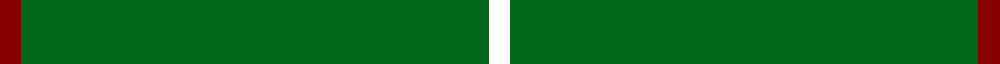

**Bands:** [KGGGGGR](/stripes/kgggggr/) · **Stripes:** [K G G G G G R](/stripes/stripes7/) K G G G G G R

This was sourced from tartans-authority.  It is a [7 band tartan](/bands/bands7/).

Original link http://www.tartansauthority.com/tartan-ferret/display/2234/

## Thread count
DR/4 G38 G4 G4 G38 G4 MY/4

## Palette
Each colour and its ΔE from the base-6 reference it is a variant of.

| Colour | Shade | Base | ΔE (OKLab) |
|---|---|---|---|
| DR | <code style="background-color:#880000;">#880000</code> `#880000` | R <code style="background-color:#CC0000;">#CC0000</code> | 0.15 |
| G | <code style="background-color:#006818;">#006818</code> `#006818` | G <code style="background-color:#006100;">#006100</code> | 0.02 |

# Sample pattern

## Nearest tartans

The nearest existing variants by ΔTartan distance.

1. [Walters (Personal)](/setts/s6/g2dp2g20g2g2dp1~x4/) — ΔT 1.53
1. [Kenmore Hunting](/setts/s7/r2g19g2g2g19g2lo2~x2/) — ΔT 1.53
1. [MacNab, Ancient](/setts/s5/dg62r7k4r4dg62~x2/) — ΔT 1.54
1. [Walters (Personal)](/setts/s10/g2dp2g20g2g2g1~x4/) — ΔT 1.81
1. [Welsh National](/setts/s8/r8g3r4g44w4~x2/) — ΔT 2.39
1. [Dewi Sant](/setts/s6/dg30r2dg8r1dg5w2/) — ΔT 2.47
1. [Bannockbane, hunting](/setts/s8/g2o2g15o1w1g15o2g2~x2/) — ΔT 2.50
1. [Highland Spring (1997)](/setts/s6/g23r3g7r3g23dp7~x2/) — ΔT 2.52
1. [Bannockbane Hunting](/setts/s8/dg2dy2dg15dy1w1dg15dy2dg2~x2/) — ΔT 2.59
1. [Loch Laggan](/setts/s10/r4g2r1g19k1g2~x4/) — ΔT 2.63

## Neighbour map

Every grey dot is one of 14299 variants placed by the first two principal components of the ΔTartan feature space (44% of its variance). Red is this tartan; blue dots are its nearest — click one to open its page.

<svg viewBox="0 0 640 380" role="img" style="max-width:100%;height:auto;border:1px solid #e0e0e0;border-radius:4px;display:block" xmlns="http://www.w3.org/2000/svg"><image href="/nn/cloud.v1.png" width="640" height="380"/><a href="/setts/s6/g2dp2g20g2g2dp1~x4/"><circle cx="626.0" cy="226.1" r="4" fill="#3465a4"><title>Walters (Personal)</title></circle></a><a href="/setts/s7/r2g19g2g2g19g2lo2~x2/"><circle cx="626.0" cy="276.2" r="4" fill="#3465a4"><title>Kenmore Hunting</title></circle></a><a href="/setts/s5/dg62r7k4r4dg62~x2/"><circle cx="626.0" cy="264.4" r="4" fill="#3465a4"><title>MacNab, Ancient</title></circle></a><a href="/setts/s10/g2dp2g20g2g2g1~x4/"><circle cx="626.0" cy="219.1" r="4" fill="#3465a4"><title>Walters (Personal)</title></circle></a><a href="/setts/s8/r8g3r4g44w4~x2/"><circle cx="576.1" cy="207.4" r="4" fill="#3465a4"><title>Welsh National</title></circle></a><a href="/setts/s6/dg30r2dg8r1dg5w2/"><circle cx="626.0" cy="202.2" r="4" fill="#3465a4"><title>Dewi Sant</title></circle></a><a href="/setts/s8/g2o2g15o1w1g15o2g2~x2/"><circle cx="626.0" cy="249.1" r="4" fill="#3465a4"><title>Bannockbane, hunting</title></circle></a><a href="/setts/s6/g23r3g7r3g23dp7~x2/"><circle cx="515.8" cy="278.0" r="4" fill="#3465a4"><title>Highland Spring (1997)</title></circle></a><a href="/setts/s8/dg2dy2dg15dy1w1dg15dy2dg2~x2/"><circle cx="626.0" cy="241.7" r="4" fill="#3465a4"><title>Bannockbane Hunting</title></circle></a><a href="/setts/s10/r4g2r1g19k1g2~x4/"><circle cx="589.1" cy="176.3" r="4" fill="#3465a4"><title>Loch Laggan</title></circle></a><circle cx="626.0" cy="256.6" r="5" fill="#c00000"/></svg>

ID: /setts/s7/k2g2g19g2g2g19r2~x2/
