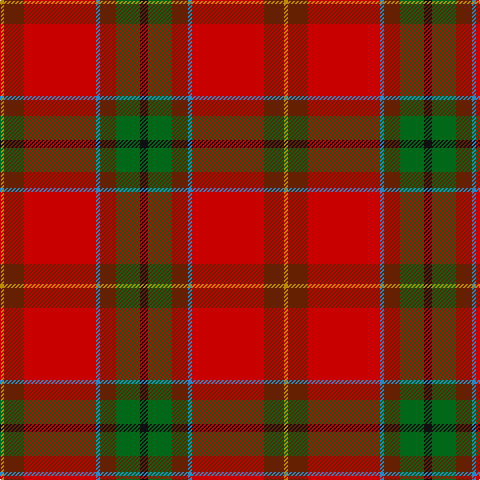

In pattern [KGGBRGY](/patterns/kggbrgy/).

This was sourced from tartans-authority.  It is a [7 stripes tartan](/stripes/stripes7/).

Original link http://www.tartansauthority.com/tartan-ferret/display/7803/

## Attestations

This cloth appears in 2 source records; the oldest owns this page.

- pre 2008 — Snelgrove (Name) (tartans-authority, [record](http://www.tartansauthority.com/tartan-ferret/display/7803/))
- undated — Snelgrove (register-of-tartans, [record](https://www.tartanregister.gov.uk/tartanDetails.aspx?ref=5765))

## Thread count
DY/4 T20 R72 B4 T16 G24 K/8

## Palette
Each colour and its ΔE from the base-6 reference it is a variant of.

| Colour | Shade | Base | ΔE (OKLab) |
|---|---|---|---|
| B | <code style="background-color:#2888C4;">#2888C4</code> `#2888C4` | B <code style="background-color:#2A418A;">#2A418A</code> | 0.21 |
| DY | <code style="background-color:#BC8C00;">#BC8C00</code> `#BC8C00` | Y <code style="background-color:#F2BF00;">#F2BF00</code> | 0.16 |
| G | <code style="background-color:#006818;">#006818</code> `#006818` | G <code style="background-color:#006100;">#006100</code> | 0.02 |
| K | <code style="background-color:#101010;">#101010</code> `#101010` | K <code style="background-color:#000000;">#000000</code> | 0.17 |
| R | <code style="background-color:#C80000;">#C80000</code> `#C80000` | R <code style="background-color:#CC0000;">#CC0000</code> | 0.01 |
| T | <code style="background-color:#642000;">#642000</code> `#642000` | G <code style="background-color:#006100;">#006100</code> | 0.21 |

# Sample pattern

## Nearest tartans

The nearest existing variants by ΔTartan distance.

1. [Mason (Personal)](/setts/s6/k7w2g2r31ra35y2x2~g003820-k101010-rb84c00-ra880000-we0e0e0-ybc8c00/) — ΔT 0.80
1. [Mason, David Elsworth (Personal)](/setts/s6/k7w2g2r31ra35y2x2~g0b3d2e-k010512-rda412d-ra89051b-wddd5af-yebaa57/) — ΔT 1.17
1. [Tartan Army Whisky](/setts/s8/r26g5ga7ra2b9y1ya1ga4x2~b441800-g006818-ga003820-rc80000-raa00000-yfcb464-yaec8048/) — ΔT 1.18
1. [MacQueen of Dalmagarry (Clan?)](/setts/s8/g3r4k1r26ga14r4b16w2x2~b440044-g289c18-ga5c6428-k101010-rc80000-wfcfcfc/) — ΔT 1.21
1. [Flowers of the Forest, The](/setts/s9/r2ra4ra2b5y3g13ra20ba2ra2x2~b2c2c80-ba441800-g5c6428-ra03400-rac80000-y48a4c0/) — ΔT 1.26
1. [Gordon of Abergeldie (Portrait)](/setts/s6/r63w4k4b18y4g50x2~b780078-g005830-k101010-rc80000-wfcfcfc-yd8b000/) — ΔT 1.31
1. [Drummond, (Fingask)](/setts/s8/r22b3y1g12r6b3ba3w1x2~b304080-ba5480b0-g008000-rc00000-we0e0e0-yf0c000/) — ΔT 1.34
1. [Spragg, Andrew](/setts/s7/r2g16ra1r2ra12y1ga1x2~g165041-ga547c73-ra62a2a-racc1100-yffe600/) — ΔT 1.39
1. [Gordon of Abergeldie (Red..) Portrait Tartan Tartan Number: 955. Earliest known date: 1723 This sett was reconstructed from a scarf in a painting of Rachael Gordon, hanging in Abergeldie Castle, painted by Alexander in 1723. The count and colour desciption was taken by the Lord Lyon in 1953. See products available Copyright © Blair Urquhart, Comrie, 2015](/setts/s6/r20w1k1ra6y1g18x2~g006818-k101010-rc80000-rab468ac-we0e0e0-ye8c000/) — ΔT 1.43
1. [Virginia Military Institute, New Market](/setts/s9/w6r25ra2g3ra30k3ra2r30y6x2~g006818-k101010-rc80000-ra888888-we0e0e0-ye8c000/) — ΔT 1.44

## Neighbour map

Every grey dot is one of 15726 variants placed by the first two principal components of the ΔTartan feature space (44% of its variance). Red is this tartan; blue dots are its nearest — click one to open its page.

<svg viewBox="0 0 640 380" role="img" style="max-width:100%;height:auto;border:1px solid #e0e0e0;border-radius:4px;display:block" xmlns="http://www.w3.org/2000/svg"><image href="/nn/cloud.v1.png" width="640" height="380"/><a href="/setts/s6/k7w2g2r31ra35y2x2~g003820-k101010-rb84c00-ra880000-we0e0e0-ybc8c00/"><circle cx="305.4" cy="146.7" r="4" fill="#3465a4"><title>Mason (Personal)</title></circle></a><a href="/setts/s6/k7w2g2r31ra35y2x2~g0b3d2e-k010512-rda412d-ra89051b-wddd5af-yebaa57/"><circle cx="282.2" cy="132.7" r="4" fill="#3465a4"><title>Mason, David Elsworth (Personal)</title></circle></a><a href="/setts/s8/r26g5ga7ra2b9y1ya1ga4x2~b441800-g006818-ga003820-rc80000-raa00000-yfcb464-yaec8048/"><circle cx="262.2" cy="93.3" r="4" fill="#3465a4"><title>Tartan Army Whisky</title></circle></a><a href="/setts/s8/g3r4k1r26ga14r4b16w2x2~b440044-g289c18-ga5c6428-k101010-rc80000-wfcfcfc/"><circle cx="271.9" cy="112.9" r="4" fill="#3465a4"><title>MacQueen of Dalmagarry (Clan?)</title></circle></a><a href="/setts/s9/r2ra4ra2b5y3g13ra20ba2ra2x2~b2c2c80-ba441800-g5c6428-ra03400-rac80000-y48a4c0/"><circle cx="291.4" cy="150.6" r="4" fill="#3465a4"><title>Flowers of the Forest, The</title></circle></a><a href="/setts/s6/r63w4k4b18y4g50x2~b780078-g005830-k101010-rc80000-wfcfcfc-yd8b000/"><circle cx="241.7" cy="141.0" r="4" fill="#3465a4"><title>Gordon of Abergeldie (Portrait)</title></circle></a><a href="/setts/s8/r22b3y1g12r6b3ba3w1x2~b304080-ba5480b0-g008000-rc00000-we0e0e0-yf0c000/"><circle cx="307.7" cy="115.9" r="4" fill="#3465a4"><title>Drummond, (Fingask)</title></circle></a><a href="/setts/s7/r2g16ra1r2ra12y1ga1x2~g165041-ga547c73-ra62a2a-racc1100-yffe600/"><circle cx="301.8" cy="151.9" r="4" fill="#3465a4"><title>Spragg, Andrew</title></circle></a><a href="/setts/s6/r20w1k1ra6y1g18x2~g006818-k101010-rc80000-rab468ac-we0e0e0-ye8c000/"><circle cx="253.5" cy="132.3" r="4" fill="#3465a4"><title>Gordon of Abergeldie (Red..) Portrait Tartan Tartan Number: 955. Earliest known date: 1723 This sett was reconstructed from a scarf in a painting of Rachael Gordon, hanging in Abergeldie Castle, painted by Alexander in 1723. The count and colour desciption was taken by the Lord Lyon in 1953. See products available Copyright © Blair Urquhart, Comrie, 2015</title></circle></a><a href="/setts/s9/w6r25ra2g3ra30k3ra2r30y6x2~g006818-k101010-rc80000-ra888888-we0e0e0-ye8c000/"><circle cx="282.5" cy="125.1" r="4" fill="#3465a4"><title>Virginia Military Institute, New Market</title></circle></a><circle cx="288.5" cy="136.3" r="5" fill="#c00000"/></svg>

ID: /setts/s7/k2g6ga4b1r18ga5y1x4~b2888c4-g006818-ga642000-k101010-rc80000-ybc8c00/
