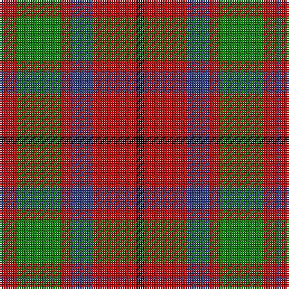

In pattern [BRGRBRK](/stripes/brgrbrk/).

This was sourced from weddslist.  It is a [7 stripe tartan](/stripes/stripes7/).

Original link http://www.weddslist.com/cgi-bin/tartans/pg.pl?source=sts

## Also known as

This cloth is also recorded under:

- MacBean, MacElvain

## Thread count
K/4 R24 B12 R6 G24 R8 B/2

## Palette
Each colour and the base-6 reference it is a variant of.

| Colour | Shade | Base |
|---|---|---|
| B | <code style="background-color:#304080;">#304080</code> `oklch(39.4% 0.109 270.2)` <small>#304080</small> | B <code style="background-color:#2A418A;">#2A418A</code> |
| G | <code style="background-color:#008000;">#008000</code> `oklch(52.0% 0.177 142.5)` <small>#008000</small> | G <code style="background-color:#006100;">#006100</code> |
| K | <code style="background-color:#000000;">#000000</code> `oklch(0.0% 0.000 0.0)` <small>#000000</small> | K <code style="background-color:#000000;">#000000</code> |
| R | <code style="background-color:#C00000;">#C00000</code> `oklch(50.7% 0.208 29.2)` <small>#C00000</small> | R <code style="background-color:#CC0000;">#CC0000</code> |

# Sample pattern

## Nearest tartans

The nearest existing variants by ΔTartan distance, with this tartan at the top so the swatches line up against it.

ΔTartan

Tartan

Sett

—

<a href="/ttd/edit/#slug=k2r12db6r3g12r4db1~x2">MacBean, MacElvain</a> <a class="nn-out" href="/setts/s7/k2r12db6r3g12r4db1~x2/" title="open its dictionary page">↗</a>

0.58

<a href="/ttd/edit/#slug=dg28r4dp25w5r22dg27r4dp2~x2">New Glasgow (Canada)</a> <a class="nn-out" href="/setts/s8/dg28r4dp25w5r22dg27r4dp2~x2/" title="open its dictionary page">↗</a>

0.62

<a href="/ttd/edit/#slug=k2r12db6r3dg12r4db1~x2">MacBean/MacElvain</a> <a class="nn-out" href="/setts/s7/k2r12db6r3dg12r4db1~x2/" title="open its dictionary page">↗</a>

0.78

<a href="/ttd/edit/#slug=dp1r5g15r3dp9r10w1~x4">Geddes</a> <a class="nn-out" href="/setts/s7/dp1r5g15r3dp9r10w1~x4/" title="open its dictionary page">↗</a>

0.81

<a href="/ttd/edit/#slug=r6g16r4db12r16t1r2~x2">MacQuarrie 2</a> <a class="nn-out" href="/setts/s7/r6g16r4db12r16t1r2~x2/" title="open its dictionary page">↗</a>

0.85

<a href="/ttd/edit/#slug=r4k2r24k6db6g16r3~x2">MacDuff</a> <a class="nn-out" href="/setts/s7/r4k2r24k6db6g16r3~x2/" title="open its dictionary page">↗</a>

0.88

<a href="/ttd/edit/#slug=r6dg16r4db12r16lb1r2~x2">MacQuarrie LO</a> <a class="nn-out" href="/setts/s7/r6dg16r4db12r16lb1r2~x2/" title="open its dictionary page">↗</a>

0.91

<a href="/ttd/edit/#slug=t2k2r27dg27k12t12r27k2t2~x2">MacNaughton</a> <a class="nn-out" href="/setts/s9/t2k2r27dg27k12t12r27k2t2~x2/" title="open its dictionary page">↗</a>

0.91

<a href="/ttd/edit/#slug=dp8r3ly1r3dg14r3ly1~x4">Logan - 1819 (with yellow)</a> <a class="nn-out" href="/setts/s7/dp8r3ly1r3dg14r3ly1~x4/" title="open its dictionary page">↗</a>

0.91

<a href="/ttd/edit/#slug=dp8r3ly1r3g14r3ly1~x4">Logan with Yellow</a> <a class="nn-out" href="/setts/s7/dp8r3ly1r3g14r3ly1~x4/" title="open its dictionary page">↗</a>

0.92

<a href="/ttd/edit/#slug=k2o20k8dg18o3w2~x2">Celtic Combat</a> <a class="nn-out" href="/setts/s6/k2o20k8dg18o3w2~x2/" title="open its dictionary page">↗</a>

## Neighbour map

Every grey dot is one of 14299 variants placed by the first two principal components of the ΔTartan feature space (44% of its variance). Red is this tartan; blue dots are its nearest — click one to open its page.

<svg viewBox="0 0 640 380" role="img" style="max-width:100%;height:auto;border:1px solid #e0e0e0;border-radius:4px;display:block" xmlns="http://www.w3.org/2000/svg"><image href="/nn/cloud.v1.png" width="640" height="380"/><a href="/setts/s8/dg28r4dp25w5r22dg27r4dp2~x2/"><circle cx="249.7" cy="188.7" r="4" fill="#3465a4"><title>New Glasgow (Canada)</title></circle></a><a href="/setts/s7/k2r12db6r3dg12r4db1~x2/"><circle cx="260.0" cy="198.1" r="4" fill="#3465a4"><title>MacBean/MacElvain</title></circle></a><a href="/setts/s7/dp1r5g15r3dp9r10w1~x4/"><circle cx="243.5" cy="187.3" r="4" fill="#3465a4"><title>Geddes</title></circle></a><a href="/setts/s7/r6g16r4db12r16t1r2~x2/"><circle cx="288.7" cy="195.2" r="4" fill="#3465a4"><title>MacQuarrie 2</title></circle></a><a href="/setts/s7/r4k2r24k6db6g16r3~x2/"><circle cx="261.2" cy="178.3" r="4" fill="#3465a4"><title>MacDuff</title></circle></a><a href="/setts/s7/r6dg16r4db12r16lb1r2~x2/"><circle cx="268.3" cy="186.1" r="4" fill="#3465a4"><title>MacQuarrie LO</title></circle></a><a href="/setts/s9/t2k2r27dg27k12t12r27k2t2~x2/"><circle cx="252.2" cy="165.9" r="4" fill="#3465a4"><title>MacNaughton</title></circle></a><a href="/setts/s7/dp8r3ly1r3dg14r3ly1~x4/"><circle cx="248.6" cy="180.2" r="4" fill="#3465a4"><title>Logan - 1819 (with yellow)</title></circle></a><a href="/setts/s7/dp8r3ly1r3g14r3ly1~x4/"><circle cx="247.4" cy="177.9" r="4" fill="#3465a4"><title>Logan with Yellow</title></circle></a><a href="/setts/s6/k2o20k8dg18o3w2~x2/"><circle cx="237.3" cy="204.2" r="4" fill="#3465a4"><title>Celtic Combat</title></circle></a><circle cx="250.2" cy="196.7" r="5" fill="#c00000"/></svg>

ID: /setts/s7/k2r12db6r3g12r4db1~x2/
