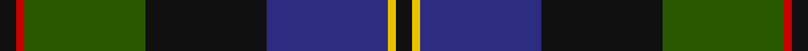
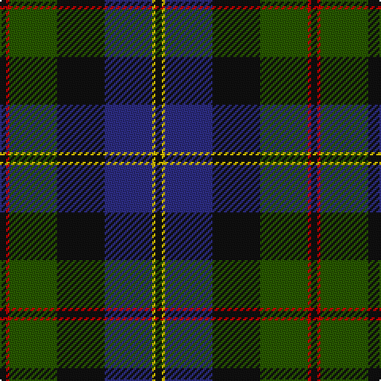

In pattern [KRGKBYK](/stripes/krgkbyk/).

This was sourced from register-of-tartans.  It is a [7 stripe tartan](/stripes/stripes7/).

Original link https://www.tartanregister.gov.uk/tartanDetails.aspx?ref=2310

## Attestations

This cloth appears in 2 source records; the oldest owns this page.

- 01/01/1951 — MacCaskill (Personal) (register-of-tartans, [record](https://www.tartanregister.gov.uk/tartanDetails.aspx?ref=2310))
- 1951 — MacCaskill (Name) (tartans-authority, [record](http://www.tartansauthority.com/tartan-ferret/display/1152/))

## Register references

External register numbers recorded for this tartan.

- Scottish Register of Tartans: [2310](https://www.tartanregister.gov.uk/tartanDetails.aspx?ref=2310)
- Scottish Tartans Authority (ITI): 1152
- Scottish Tartans World Register: 1152

## Thread count
K/4 R2 G30 K30 DB30 Y2 K/4

## Palette
Each colour and the base-6 reference it is a variant of.

| Colour | Shade | Base |
|---|---|---|
| DB | <code style="background-color:#2C2C80;">#2C2C80</code> `oklch(35.0% 0.138 276.6)` <small>#2C2C80</small> | B <code style="background-color:#2A418A;">#2A418A</code> |
| G | <code style="background-color:#285800;">#285800</code> `oklch(41.0% 0.122 135.8)` <small>#285800</small> | G <code style="background-color:#006100;">#006100</code> |
| K | <code style="background-color:#101010;">#101010</code> `oklch(17.3% 0.000 89.9)` <small>#101010</small> | K <code style="background-color:#000000;">#000000</code> |
| R | <code style="background-color:#C80000;">#C80000</code> `oklch(52.3% 0.215 29.2)` <small>#C80000</small> | R <code style="background-color:#CC0000;">#CC0000</code> |
| Y | <code style="background-color:#E8C000;">#E8C000</code> `oklch(81.9% 0.168 93.7)` <small>#E8C000</small> | Y <code style="background-color:#F2BF00;">#F2BF00</code> |

# Sample pattern

## Nearest tartans

The nearest existing variants by ΔTartan distance.

1. [MacPhedran/MacFadzean](/setts/s7/dg3db12lb1k12dg13r2dg2~x2/) — ΔT 0.63
1. [MacWilliam Clan Tartan Tartan Number: 1417. Earliest known date: pre 1880 Mentioned in the pattern book 'Clans Originaux' produced in Paris in 1880 by J. Claude Fres Et Cie. It is similar in style and colour to the MacKay tartan both from Sutherland in the North of Scotland See products available Copyright © Blair Urquhart, Comrie, 2015](/setts/s6/dy2g12k10r1db16r2~x2/) — ΔT 0.69
1. [Thomas of Craigie (Personal)](/setts/s8/ly2k4ly1dg16k14db23k4r1~x2/) — ΔT 0.78
1. [MacPhail Hunting](/setts/s6/r2db23k14dg16k2w2~x2/) — ΔT 0.79
1. [MacThomas Clan Tartan Tartan Number: 407. Earliest known date: 1975 Designed by David Thomas - former director of the Strathmore Woollen Co. in Forfar who still (in 2011) weave this tartan. Adopted by Clan Society in 1975, and registered with Lord Lyon in 1979. See products available Copyright © Blair Urquhart, Comrie, 2015](/setts/s7/db3m2db22k11g24lp2g3~x2/) — ΔT 0.83
1. [Wilson's No.221](/setts/s6/r1dg14k14r2db14t1~x2/) — ΔT 0.84
1. [Scotch House 2000 Original](/setts/s8/db22r3db2r3db2k17g18lo4~x2/) — ΔT 0.84
1. [Bailies of Bennachie (Corporate)](/setts/s7/g27r2g4r15db26k2db6~x2/) — ΔT 0.87
1. [Guelph, City Of](/setts/s8/g12k1g2r1g2k10db10lo1~x4/) — ΔT 0.88
1. [McEwan '1856', The](/setts/s7/db2dy3db16k18g18k2r2~x2/) — ΔT 0.92

## Neighbour map

Every grey dot is one of 14299 variants placed by the first two principal components of the ΔTartan feature space (44% of its variance). Red is this tartan; blue dots are its nearest — click one to open its page.

<svg viewBox="0 0 640 380" role="img" style="max-width:100%;height:auto;border:1px solid #e0e0e0;border-radius:4px;display:block" xmlns="http://www.w3.org/2000/svg"><image href="/nn/cloud.v1.png" width="640" height="380"/><a href="/setts/s7/dg3db12lb1k12dg13r2dg2~x2/"><circle cx="220.5" cy="203.4" r="4" fill="#3465a4"><title>MacPhedran/MacFadzean</title></circle></a><a href="/setts/s6/dy2g12k10r1db16r2~x2/"><circle cx="214.2" cy="200.7" r="4" fill="#3465a4"><title>MacWilliam Clan Tartan Tartan Number: 1417. Earliest known date: pre 1880 Mentioned in the pattern book 'Clans Originaux' produced in Paris in 1880 by J. Claude Fres Et Cie. It is similar in style and colour to the MacKay tartan both from Sutherland in the North of Scotland See products available Copyright © Blair Urquhart, Comrie, 2015</title></circle></a><a href="/setts/s8/ly2k4ly1dg16k14db23k4r1~x2/"><circle cx="235.2" cy="165.9" r="4" fill="#3465a4"><title>Thomas of Craigie (Personal)</title></circle></a><a href="/setts/s6/r2db23k14dg16k2w2~x2/"><circle cx="214.9" cy="209.8" r="4" fill="#3465a4"><title>MacPhail Hunting</title></circle></a><a href="/setts/s7/db3m2db22k11g24lp2g3~x2/"><circle cx="233.8" cy="194.8" r="4" fill="#3465a4"><title>MacThomas Clan Tartan Tartan Number: 407. Earliest known date: 1975 Designed by David Thomas - former director of the Strathmore Woollen Co. in Forfar who still (in 2011) weave this tartan. Adopted by Clan Society in 1975, and registered with Lord Lyon in 1979. See products available Copyright © Blair Urquhart, Comrie, 2015</title></circle></a><a href="/setts/s6/r1dg14k14r2db14t1~x2/"><circle cx="201.8" cy="211.0" r="4" fill="#3465a4"><title>Wilson's No.221</title></circle></a><a href="/setts/s8/db22r3db2r3db2k17g18lo4~x2/"><circle cx="188.4" cy="189.3" r="4" fill="#3465a4"><title>Scotch House 2000 Original</title></circle></a><a href="/setts/s7/g27r2g4r15db26k2db6~x2/"><circle cx="240.9" cy="194.9" r="4" fill="#3465a4"><title>Bailies of Bennachie (Corporate)</title></circle></a><a href="/setts/s8/g12k1g2r1g2k10db10lo1~x4/"><circle cx="220.1" cy="187.8" r="4" fill="#3465a4"><title>Guelph, City Of</title></circle></a><a href="/setts/s7/db2dy3db16k18g18k2r2~x2/"><circle cx="186.6" cy="214.4" r="4" fill="#3465a4"><title>McEwan '1856', The</title></circle></a><circle cx="234.1" cy="192.7" r="5" fill="#c00000"/></svg>

ID: /setts/s7/k2r1dg15k15db15ly1k2~x2/
