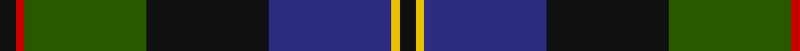

In pattern [KRGKBYK](/patterns/krgkbyk/).

This was sourced from register-of-tartans.  It is a [7 stripes tartan](/stripes/stripes7/).

Original link https://www.tartanregister.gov.uk/tartanDetails.aspx?ref=2310

## Attestations

This cloth appears in 2 source records; the oldest owns this page.

- 01/01/1951 — MacCaskill (Personal) (register-of-tartans, [record](https://www.tartanregister.gov.uk/tartanDetails.aspx?ref=2310))
- 1951 — MacCaskill (Name) (tartans-authority, [record](http://www.tartansauthority.com/tartan-ferret/display/1152/))

## Register references

External register numbers recorded for this tartan.

- Scottish Register of Tartans: [2310](https://www.tartanregister.gov.uk/tartanDetails.aspx?ref=2310)
- Scottish Tartans Authority (ITI): 1152
- Scottish Tartans World Register: 1152

## Thread count
K/4 R2 G30 K30 DB30 Y2 K/4

## Palette
Each colour and its ΔE from the base-6 reference it is a variant of.

| Colour | Shade | Base | ΔE (OKLab) |
|---|---|---|---|
| DB | <code style="background-color:#2C2C80;">#2C2C80</code> `#2C2C80` | B <code style="background-color:#2A418A;">#2A418A</code> | 0.06 |
| G | <code style="background-color:#285800;">#285800</code> `#285800` | G <code style="background-color:#006100;">#006100</code> | 0.03 |
| K | <code style="background-color:#101010;">#101010</code> `#101010` | K <code style="background-color:#000000;">#000000</code> | 0.17 |
| R | <code style="background-color:#C80000;">#C80000</code> `#C80000` | R <code style="background-color:#CC0000;">#CC0000</code> | 0.01 |
| Y | <code style="background-color:#E8C000;">#E8C000</code> `#E8C000` | Y <code style="background-color:#F2BF00;">#F2BF00</code> | 0.02 |

# Sample pattern

## Nearest tartans

The nearest existing variants by ΔTartan distance.

1. [MacCaskill Family Tartan Tartan Number: 1152. Earliest known date: 1951 Miss M.MacDougal of the Inverness Museum wrote (7th September 1951) :- ''Herewith pattern of the MacAskill which Messrs Pringle made at the request of an old man of this name. As you can see it is a variant of the MacLeod...?" . . . wherein the colors of stripes and their guards are reversed. Designed for a farmer - Kenneth MacAskill, Milton of Leys. See products available Copyright © Blair Urquhart, Comrie, 2015](/setts/s7/k2r1g15k15b15y1k2~b2c2c80-g006818-k101010-rc80000-ye8c000~x2/) — ΔT 0.42
1. [MacPhedran/MacFadzean](/setts/s7/g3b12w1k12g13r2g2~b2c2c80-g285800-k101010-rc80000-wc0c0c0~x2/) — ΔT 0.63
1. [MacWilliam Clan Tartan Tartan Number: 1417. Earliest known date: pre 1880 Mentioned in the pattern book 'Clans Originaux' produced in Paris in 1880 by J. Claude Fres Et Cie. It is similar in style and colour to the MacKay tartan both from Sutherland in the North of Scotland See products available Copyright © Blair Urquhart, Comrie, 2015](/setts/s6/g2ga12k10r1b16r2~b2c2c80-g604000-ga006818-k101010-rc80000~x2/) — ΔT 0.69
1. [Thomas of Craigie (Personal)](/setts/s8/y2k4y1g16k14b23k4r1~b202060-g285800-k101010-rc80000-ye8c000~x2/) — ΔT 0.78
1. [MacPhail Hunting](/setts/s6/r2b23k14g16k2w2~b2c4084-g005020-k101010-rdc0000-we0e0e0~x2/) — ΔT 0.79
1. [MacThomas Clan Tartan Tartan Number: 407. Earliest known date: 1975 Designed by David Thomas - former director of the Strathmore Woollen Co. in Forfar who still (in 2011) weave this tartan. Adopted by Clan Society in 1975, and registered with Lord Lyon in 1979. See products available Copyright © Blair Urquhart, Comrie, 2015](/setts/s7/b3r2b22k11g24w2g3~b2c2c80-g006818-k101010-ra00048-wc49cd8~x2/) — ΔT 0.83
1. [Wilson's No.221](/setts/s6/b1ba14r2k14g14r1~b3c82af-ba2c4084-g005020-k101010-rdc0000~x2/) — ΔT 0.84
1. [Scotch House 2000 Original](/setts/s8/b22r3b2r3b2k17g18y4~b202060-g006818-k101010-rc80000-ya08858~x2/) — ΔT 0.84
1. [Bailies of Bennachie (Corporate)](/setts/s7/g27r2g4ra15b26k2b6~b2c2c80-g006818-k101010-r880000-raa00000~x2/) — ΔT 0.86
1. [Guelph, City Of](/setts/s8/g12k1g2r1g2k10b10y1~b1c0070-g006818-k101010-r880000-yd09800~x4/) — ΔT 0.88

## Neighbour map

Every grey dot is one of 15726 variants placed by the first two principal components of the ΔTartan feature space (44% of its variance). Red is this tartan; blue dots are its nearest — click one to open its page.

<svg viewBox="0 0 640 380" role="img" style="max-width:100%;height:auto;border:1px solid #e0e0e0;border-radius:4px;display:block" xmlns="http://www.w3.org/2000/svg"><image href="/nn/cloud.v1.png" width="640" height="380"/><a href="/setts/s7/k2r1g15k15b15y1k2~b2c2c80-g006818-k101010-rc80000-ye8c000~x2/"><circle cx="219.2" cy="182.3" r="4" fill="#3465a4"><title>MacCaskill Family Tartan Tartan Number: 1152. Earliest known date: 1951 Miss M.MacDougal of the Inverness Museum wrote (7th September 1951) :- ''Herewith pattern of the MacAskill which Messrs Pringle made at the request of an old man of this name. As you can see it is a variant of the MacLeod...?&quot; . . . wherein the colors of stripes and their guards are reversed. Designed for a farmer - Kenneth MacAskill, Milton of Leys. See products available Copyright © Blair Urquhart, Comrie, 2015</title></circle></a><a href="/setts/s7/g3b12w1k12g13r2g2~b2c2c80-g285800-k101010-rc80000-wc0c0c0~x2/"><circle cx="217.6" cy="197.7" r="4" fill="#3465a4"><title>MacPhedran/MacFadzean</title></circle></a><a href="/setts/s6/g2ga12k10r1b16r2~b2c2c80-g604000-ga006818-k101010-rc80000~x2/"><circle cx="211.2" cy="194.7" r="4" fill="#3465a4"><title>MacWilliam Clan Tartan Tartan Number: 1417. Earliest known date: pre 1880 Mentioned in the pattern book 'Clans Originaux' produced in Paris in 1880 by J. Claude Fres Et Cie. It is similar in style and colour to the MacKay tartan both from Sutherland in the North of Scotland See products available Copyright © Blair Urquhart, Comrie, 2015</title></circle></a><a href="/setts/s8/y2k4y1g16k14b23k4r1~b202060-g285800-k101010-rc80000-ye8c000~x2/"><circle cx="232.0" cy="159.7" r="4" fill="#3465a4"><title>Thomas of Craigie (Personal)</title></circle></a><a href="/setts/s6/r2b23k14g16k2w2~b2c4084-g005020-k101010-rdc0000-we0e0e0~x2/"><circle cx="211.7" cy="204.2" r="4" fill="#3465a4"><title>MacPhail Hunting</title></circle></a><a href="/setts/s7/b3r2b22k11g24w2g3~b2c2c80-g006818-k101010-ra00048-wc49cd8~x2/"><circle cx="230.6" cy="189.4" r="4" fill="#3465a4"><title>MacThomas Clan Tartan Tartan Number: 407. Earliest known date: 1975 Designed by David Thomas - former director of the Strathmore Woollen Co. in Forfar who still (in 2011) weave this tartan. Adopted by Clan Society in 1975, and registered with Lord Lyon in 1979. See products available Copyright © Blair Urquhart, Comrie, 2015</title></circle></a><a href="/setts/s6/b1ba14r2k14g14r1~b3c82af-ba2c4084-g005020-k101010-rdc0000~x2/"><circle cx="198.6" cy="203.2" r="4" fill="#3465a4"><title>Wilson's No.221</title></circle></a><a href="/setts/s8/b22r3b2r3b2k17g18y4~b202060-g006818-k101010-rc80000-ya08858~x2/"><circle cx="185.3" cy="183.9" r="4" fill="#3465a4"><title>Scotch House 2000 Original</title></circle></a><a href="/setts/s7/g27r2g4ra15b26k2b6~b2c2c80-g006818-k101010-r880000-raa00000~x2/"><circle cx="238.3" cy="189.3" r="4" fill="#3465a4"><title>Bailies of Bennachie (Corporate)</title></circle></a><a href="/setts/s8/g12k1g2r1g2k10b10y1~b1c0070-g006818-k101010-r880000-yd09800~x4/"><circle cx="216.6" cy="182.9" r="4" fill="#3465a4"><title>Guelph, City Of</title></circle></a><circle cx="230.9" cy="186.3" r="5" fill="#c00000"/></svg>

ID: /setts/s7/k2r1g15k15b15y1k2~b2c2c80-g285800-k101010-rc80000-ye8c000~x2/
