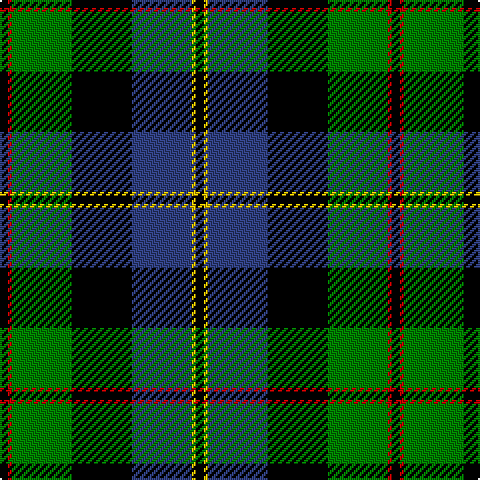

In pattern [KRGKBYK](/patterns/krgkbyk/).

This was sourced from weddslist.  It is a [7 stripes tartan](/stripes/stripes7/).

Original link http://www.weddslist.com/cgi-bin/tartans/pg.pl?source=sts

## Thread count
K/4 R2 G30 K30 B30 Y2 K/4

## Palette
Each colour and its ΔE from the base-6 reference it is a variant of.

| Colour | Shade | Base | ΔE (OKLab) |
|---|---|---|---|
| B | <code style="background-color:#304080;">#304080</code> `#304080` | B <code style="background-color:#2A418A;">#2A418A</code> | 0.02 |
| G | <code style="background-color:#008000;">#008000</code> `#008000` | G <code style="background-color:#006100;">#006100</code> | 0.10 |
| K | <code style="background-color:#000000;">#000000</code> `#000000` | K <code style="background-color:#000000;">#000000</code> | 0.00 |
| R | <code style="background-color:#C00000;">#C00000</code> `#C00000` | R <code style="background-color:#CC0000;">#CC0000</code> | 0.03 |
| Y | <code style="background-color:#F0C000;">#F0C000</code> `#F0C000` | Y <code style="background-color:#F2BF00;">#F2BF00</code> | 0.00 |

# Sample pattern

## Nearest tartans

The nearest existing variants by ΔTartan distance.

1. [Lochaber](/setts/s8/g3r1g18k20r1b18ba1g2~b304080-ba5480b0-g008000-k000000-rc00000~x4/) — ΔT 0.71
1. [MacPhail, hunting](/setts/s6/r2b23k14g16k2w2~b304080-g008000-k000000-rc00000-we0e0e0~x2/) — ΔT 0.79
1. [MacPhadran](/setts/s7/g3b12y1k12g13r2g2~b304080-g008000-k000000-rc00000-yb0b0b0~x2/) — ΔT 0.79
1. [MacFadzean, MacPhedran](/setts/s7/g3b12w1k12g13r2g2~b304080-g008000-k000000-rc00000-we0e0e0~x2/) — ΔT 0.80
1. [Wilson's, No 221](/setts/s6/b1ba14r2k14g14r1~b5480b0-ba304080-g008000-k000000-rc00000~x2/) — ΔT 0.81
1. [Russell, or Mitchell or Hunter or Galbraith](/setts/s6/k2g12k12r1b12w2~b304080-g008000-k000000-rc00000-we0e0e0~x2/) — ΔT 0.83
1. [MacLeod, Macleod of Harris](/setts/s7/r3k2g15k10b20k2y2~b304080-g008000-k000000-rc00000-yf0c000~x2/) — ΔT 0.84
1. [Whitson](/setts/s8/w4k1g18k17b13r1b3r1~b304080-g008000-k000000-rc00000-we0e0e0~x2/) — ΔT 0.89
1. [MacWilliam](/setts/s6/r2g12k10ra1b16ra2~b304080-g008000-k000000-r806050-rac00000~x2/) — ΔT 0.89
1. [MacNeil 5](/setts/s6/w1b12k12g12k5y1~b304080-g008000-k000000-we0e0e0-yf0c000~x4/) — ΔT 0.92

## Neighbour map

Every grey dot is one of 15726 variants placed by the first two principal components of the ΔTartan feature space (44% of its variance). Red is this tartan; blue dots are its nearest — click one to open its page.

<svg viewBox="0 0 640 380" role="img" style="max-width:100%;height:auto;border:1px solid #e0e0e0;border-radius:4px;display:block" xmlns="http://www.w3.org/2000/svg"><image href="/nn/cloud.v1.png" width="640" height="380"/><a href="/setts/s8/g3r1g18k20r1b18ba1g2~b304080-ba5480b0-g008000-k000000-rc00000~x4/"><circle cx="185.5" cy="142.4" r="4" fill="#3465a4"><title>Lochaber</title></circle></a><a href="/setts/s6/r2b23k14g16k2w2~b304080-g008000-k000000-rc00000-we0e0e0~x2/"><circle cx="163.3" cy="186.0" r="4" fill="#3465a4"><title>MacPhail, hunting</title></circle></a><a href="/setts/s7/g3b12y1k12g13r2g2~b304080-g008000-k000000-rc00000-yb0b0b0~x2/"><circle cx="165.1" cy="179.7" r="4" fill="#3465a4"><title>MacPhadran</title></circle></a><a href="/setts/s7/g3b12w1k12g13r2g2~b304080-g008000-k000000-rc00000-we0e0e0~x2/"><circle cx="163.0" cy="178.7" r="4" fill="#3465a4"><title>MacFadzean, MacPhedran</title></circle></a><a href="/setts/s6/b1ba14r2k14g14r1~b5480b0-ba304080-g008000-k000000-rc00000~x2/"><circle cx="138.0" cy="180.6" r="4" fill="#3465a4"><title>Wilson's, No 221</title></circle></a><a href="/setts/s6/k2g12k12r1b12w2~b304080-g008000-k000000-rc00000-we0e0e0~x2/"><circle cx="132.6" cy="190.3" r="4" fill="#3465a4"><title>Russell, or Mitchell or Hunter or Galbraith</title></circle></a><a href="/setts/s7/r3k2g15k10b20k2y2~b304080-g008000-k000000-rc00000-yf0c000~x2/"><circle cx="147.6" cy="179.0" r="4" fill="#3465a4"><title>MacLeod, Macleod of Harris</title></circle></a><a href="/setts/s8/w4k1g18k17b13r1b3r1~b304080-g008000-k000000-rc00000-we0e0e0~x2/"><circle cx="139.2" cy="143.8" r="4" fill="#3465a4"><title>Whitson</title></circle></a><a href="/setts/s6/r2g12k10ra1b16ra2~b304080-g008000-k000000-r806050-rac00000~x2/"><circle cx="166.9" cy="178.2" r="4" fill="#3465a4"><title>MacWilliam</title></circle></a><a href="/setts/s6/w1b12k12g12k5y1~b304080-g008000-k000000-we0e0e0-yf0c000~x4/"><circle cx="153.8" cy="198.9" r="4" fill="#3465a4"><title>MacNeil 5</title></circle></a><circle cx="174.3" cy="166.9" r="5" fill="#c00000"/></svg>

ID: /setts/s7/k2r1g15k15b15y1k2~b304080-g008000-k000000-rc00000-yf0c000~x2/
