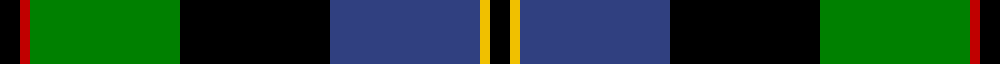

This page is one **sett** — a single exact thread-count. It belongs to the [tartan](/tartans/k2r1g15k15b15y1k2/)
(the same proportion at any scale), whose colour order is pattern [KRGKBYK](/stripes/krgkbyk/).

Sourced from weddslist.  It is a [7 stripe tartan](/stripes/stripes7/).

Original link http://www.weddslist.com/cgi-bin/tartans/pg.pl?source=sts

2 attestations — the source records this cloth was collapsed from (oldest owns this page)

<ul>
<li>undated — MacCaskill (weddslist, <a href="http://www.weddslist.com/cgi-bin/tartans/pg.pl?source=sts">record</a>)</li>
<li>undated — MacCaskill Family Tartan Tartan Number: 1152. Earliest known date: 1951 Miss M.MacDougal of the Inverness Museum wrote (7th September 1951) :- ''Herewith pattern of the MacAskill which Messrs Pringle made at the request of an old man of this name. As you can see it is a variant of the MacLeod...?" . . . wherein the colors of stripes and their guards are reversed. Designed for a farmer - Kenneth MacAskill, Milton of Leys. See products available Copyright © Blair Urquhart, Comrie, 2015 (house-of-tartan, <a href="http://www.house-of-tartan.scotland.net/house/TartanViewjs.asp?colr=Def&tnam=1152">record</a>)</li>
</ul>

## Thread count
K/4 R2 G30 K30 B30 Y2 K/4

## Palette
Each colour and the base-6 reference it is a variant of.

| Colour | Shade | Base |
|---|---|---|
| B | <code style="background-color:#304080;">#304080</code> `oklch(39.4% 0.109 270.2)` <small>#304080</small> | B <code style="background-color:#2A418A;">#2A418A</code> |
| G | <code style="background-color:#008000;">#008000</code> `oklch(52.0% 0.177 142.5)` <small>#008000</small> | G <code style="background-color:#006100;">#006100</code> |
| K | <code style="background-color:#000000;">#000000</code> `oklch(0.0% 0.000 0.0)` <small>#000000</small> | K <code style="background-color:#000000;">#000000</code> |
| R | <code style="background-color:#C00000;">#C00000</code> `oklch(50.7% 0.208 29.2)` <small>#C00000</small> | R <code style="background-color:#CC0000;">#CC0000</code> |
| Y | <code style="background-color:#F0C000;">#F0C000</code> `oklch(82.7% 0.169 90.5)` <small>#F0C000</small> | Y <code style="background-color:#F2BF00;">#F2BF00</code> |

# Sample pattern

## Nearest tartans

The nearest existing variants by ΔTartan distance, with this tartan at the top so the swatches line up against it.

ΔTartan

Tartan

Sett

—

<a href="/ttd/edit/#slug=k2r1g15k15db15ly1k2~x2">MacCaskill</a> <a class="nn-out" href="/setts/s7/k2r1g15k15db15ly1k2~x2/" title="open its dictionary page">↗</a>

0.71

<a href="/ttd/edit/#slug=g3r1g18k20r1db18t1g2~x4">Lochaber</a> <a class="nn-out" href="/setts/s8/g3r1g18k20r1db18t1g2~x4/" title="open its dictionary page">↗</a>

0.79

<a href="/ttd/edit/#slug=r2db23k14g16k2w2~x2">MacPhail, hunting</a> <a class="nn-out" href="/setts/s6/r2db23k14g16k2w2~x2/" title="open its dictionary page">↗</a>

0.79

<a href="/ttd/edit/#slug=g3db12lr1k12g13r2g2~x2">MacPhadran</a> <a class="nn-out" href="/setts/s7/g3db12lr1k12g13r2g2~x2/" title="open its dictionary page">↗</a>

0.81

<a href="/ttd/edit/#slug=r1g14k14r2db14t1~x2">Wilson's, No 221</a> <a class="nn-out" href="/setts/s6/r1g14k14r2db14t1~x2/" title="open its dictionary page">↗</a>

0.83

<a href="/ttd/edit/#slug=k2g12k12r1db12w2~x2">Russell, or Mitchell or Hunter or Galbraith</a> <a class="nn-out" href="/setts/s6/k2g12k12r1db12w2~x2/" title="open its dictionary page">↗</a>

0.84

<a href="/ttd/edit/#slug=r3k2g15k10db20k2ly2~x2">MacLeod, Macleod of Harris</a> <a class="nn-out" href="/setts/s7/r3k2g15k10db20k2ly2~x2/" title="open its dictionary page">↗</a>

0.89

<a href="/ttd/edit/#slug=w4k1g18k17db13r1db3r1~x2">Whitson</a> <a class="nn-out" href="/setts/s8/w4k1g18k17db13r1db3r1~x2/" title="open its dictionary page">↗</a>

0.89

<a href="/ttd/edit/#slug=r2db16r1k10g12o2~x2">MacWilliam</a> <a class="nn-out" href="/setts/s6/r2db16r1k10g12o2~x2/" title="open its dictionary page">↗</a>

0.92

<a href="/ttd/edit/#slug=w1db12k12g12k5ly1~x4">MacNeil 5</a> <a class="nn-out" href="/setts/s6/w1db12k12g12k5ly1~x4/" title="open its dictionary page">↗</a>

0.99

<a href="/ttd/edit/#slug=r3k2dg15k10db21k1ly2">MacLeod</a> <a class="nn-out" href="/setts/s7/r3k2dg15k10db21k1ly2/" title="open its dictionary page">↗</a>

## Neighbour map

Every grey dot is one of 14299 variants placed by the first two principal components of the ΔTartan feature space (44% of its variance). Red is this tartan; blue dots are its nearest — click one to open its page.

<svg viewBox="0 0 640 380" role="img" style="max-width:100%;height:auto;border:1px solid #e0e0e0;border-radius:4px;display:block" xmlns="http://www.w3.org/2000/svg"><image href="/nn/cloud.v1.png" width="640" height="380"/><a href="/setts/s8/g3r1g18k20r1db18t1g2~x4/"><circle cx="189.6" cy="143.5" r="4" fill="#3465a4"><title>Lochaber</title></circle></a><a href="/setts/s6/r2db23k14g16k2w2~x2/"><circle cx="167.2" cy="186.2" r="4" fill="#3465a4"><title>MacPhail, hunting</title></circle></a><a href="/setts/s7/g3db12lr1k12g13r2g2~x2/"><circle cx="168.9" cy="180.1" r="4" fill="#3465a4"><title>MacPhadran</title></circle></a><a href="/setts/s6/r1g14k14r2db14t1~x2/"><circle cx="141.9" cy="181.7" r="4" fill="#3465a4"><title>Wilson's, No 221</title></circle></a><a href="/setts/s6/k2g12k12r1db12w2~x2/"><circle cx="136.7" cy="190.3" r="4" fill="#3465a4"><title>Russell, or Mitchell or Hunter or Galbraith</title></circle></a><a href="/setts/s7/r3k2g15k10db20k2ly2~x2/"><circle cx="151.4" cy="179.5" r="4" fill="#3465a4"><title>MacLeod, Macleod of Harris</title></circle></a><a href="/setts/s8/w4k1g18k17db13r1db3r1~x2/"><circle cx="143.4" cy="144.3" r="4" fill="#3465a4"><title>Whitson</title></circle></a><a href="/setts/s6/r2db16r1k10g12o2~x2/"><circle cx="170.5" cy="179.4" r="4" fill="#3465a4"><title>MacWilliam</title></circle></a><a href="/setts/s6/w1db12k12g12k5ly1~x4/"><circle cx="157.8" cy="198.6" r="4" fill="#3465a4"><title>MacNeil 5</title></circle></a><a href="/setts/s7/r3k2dg15k10db21k1ly2/"><circle cx="203.0" cy="161.7" r="4" fill="#3465a4"><title>MacLeod</title></circle></a><circle cx="178.3" cy="167.3" r="5" fill="#c00000"/></svg>

ID: /setts/s7/k2r1g15k15db15ly1k2~x2/
