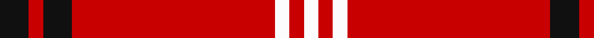

**Bands:** [KRKRWRW](/stripes/krkrwrw/) · **Stripes:** [K R K R W R W](/stripes/stripes7/) K R K R W R W

This was sourced from tartans-authority.  It is a [7 band tartan](/bands/bands7/).

Original link http://www.tartansauthority.com/tartan-ferret/display/7207/

## Thread count
K/16 R8 K16 R112 W8 R8 W/8

## Palette
Each colour and its ΔE from the base-6 reference it is a variant of.

| Colour | Shade | Base | ΔE (OKLab) |
|---|---|---|---|
| K | <code style="background-color:#101010;">#101010</code> `#101010` | K <code style="background-color:#000000;">#000000</code> | 0.17 |
| R | <code style="background-color:#C80000;">#C80000</code> `#C80000` | R <code style="background-color:#CC0000;">#CC0000</code> | 0.01 |
| W | <code style="background-color:#FCFCFC;">#FCFCFC</code> `#FCFCFC` | W <code style="background-color:#F7F7F7;">#F7F7F7</code> | 0.01 |

# Sample pattern

## Nearest tartans

The nearest existing variants by ΔTartan distance.

1. [Duke of Sussex](/setts/s7/r18g1k5g1k1g1r9~x2/) — ΔT 0.95
1. [Virgin](/setts/s8/r51o2r6k10r2k4o3k3~x2/) — ΔT 1.12
1. [Aberdeen Football Club (2002)](/setts/s8/k4r4ly2r41k4r4k12w2~x2/) — ΔT 1.25
1. [Rose](/setts/s9/dg2r28db6r5db2r2db2r11lb2/) — ΔT 1.43
1. [Howard, Vincent (Personal)](/setts/s6/r65g16r4dp4r4w5~x2/) — ΔT 1.45
1. [Loch Morar](/setts/s5/r38w9r3dr9w3~x2/) — ΔT 1.47
1. [Loch Morar Trade Tartan Tartan Number: 1701. Earliest known date: pre 2003 Nothing See products available Copyright © Blair Urquhart, Comrie, 2015](/setts/s5/r38w9r3do9w3~x2/) — ΔT 1.51
1. [Howard, Vincent (Personal)](/setts/s6/r65dg16r4dp4r4w5~x2/) — ΔT 1.52
1. [Rose](/setts/s9/g4r32db9r6db2r3db2r12w3~x2/) — ΔT 1.55
1. [Oilmens (Corporate)](/setts/s8/ly4k1r30k15r24k2r4k1~x4/) — ΔT 1.58

## Neighbour map

Every grey dot is one of 14313 variants placed by the first two principal components of the ΔTartan feature space (44% of its variance). Red is this tartan; blue dots are its nearest — click one to open its page.

<svg viewBox="0 0 640 380" role="img" style="max-width:100%;height:auto;border:1px solid #e0e0e0;border-radius:4px;display:block" xmlns="http://www.w3.org/2000/svg"><image href="/nn/cloud.v1.png" width="640" height="380"/><a href="/setts/s7/r18g1k5g1k1g1r9~x2/"><circle cx="489.1" cy="155.8" r="4" fill="#3465a4"><title>Duke of Sussex</title></circle></a><a href="/setts/s8/r51o2r6k10r2k4o3k3~x2/"><circle cx="519.0" cy="117.4" r="4" fill="#3465a4"><title>Virgin</title></circle></a><a href="/setts/s8/k4r4ly2r41k4r4k12w2~x2/"><circle cx="436.1" cy="116.0" r="4" fill="#3465a4"><title>Aberdeen Football Club (2002)</title></circle></a><a href="/setts/s9/dg2r28db6r5db2r2db2r11lb2/"><circle cx="492.5" cy="143.4" r="4" fill="#3465a4"><title>Rose</title></circle></a><a href="/setts/s6/r65g16r4dp4r4w5~x2/"><circle cx="504.0" cy="149.4" r="4" fill="#3465a4"><title>Howard, Vincent (Personal)</title></circle></a><a href="/setts/s5/r38w9r3dr9w3~x2/"><circle cx="413.2" cy="182.7" r="4" fill="#3465a4"><title>Loch Morar</title></circle></a><a href="/setts/s5/r38w9r3do9w3~x2/"><circle cx="415.1" cy="182.4" r="4" fill="#3465a4"><title>Loch Morar Trade Tartan Tartan Number: 1701. Earliest known date: pre 2003 Nothing See products available Copyright © Blair Urquhart, Comrie, 2015</title></circle></a><a href="/setts/s6/r65dg16r4dp4r4w5~x2/"><circle cx="509.2" cy="152.2" r="4" fill="#3465a4"><title>Howard, Vincent (Personal)</title></circle></a><a href="/setts/s9/g4r32db9r6db2r3db2r12w3~x2/"><circle cx="464.0" cy="145.6" r="4" fill="#3465a4"><title>Rose</title></circle></a><a href="/setts/s8/ly4k1r30k15r24k2r4k1~x4/"><circle cx="494.1" cy="144.2" r="4" fill="#3465a4"><title>Oilmens (Corporate)</title></circle></a><circle cx="476.5" cy="146.3" r="5" fill="#c00000"/></svg>

ID: /setts/s7/k2r1k2r14w1r1w1~x8/
