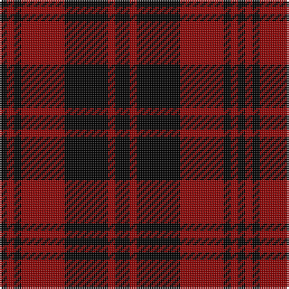

In pattern [KRKRKRK](/patterns/krkrkrk/).

This was sourced from register-of-tartans.  It is a [7 stripes tartan](/stripes/stripes7/).

Original link https://www.tartanregister.gov.uk/tartanDetails.aspx?ref=5031

## Attestations

This cloth appears in 2 source records; the oldest owns this page.

- 01/01/1730 — Campbell of Lochlane (register-of-tartans, [record](https://www.tartanregister.gov.uk/tartanDetails.aspx?ref=5031))
- 1730 — Campbell of Lochlane (Artefact) (tartans-authority, [record](http://www.tartansauthority.com/tartan-ferret/display/3799/))

## Register references

External register numbers recorded for this tartan.

- Scottish Register of Tartans: [5031](https://www.tartanregister.gov.uk/tartanDetails.aspx?ref=5031)
- Scottish Tartans Authority (ITI): 3799

## Thread count
K/4 DR4 K4 DR24 K24 DR4 K/8

## Palette
Each colour and its ΔE from the base-6 reference it is a variant of.

| Colour | Shade | Base | ΔE (OKLab) |
|---|---|---|---|
| DR | <code style="background-color:#8C0000;">#8C0000</code> `#8C0000` | R <code style="background-color:#CC0000;">#CC0000</code> | 0.14 |
| K | <code style="background-color:#000000;">#000000</code> `#000000` | K <code style="background-color:#000000;">#000000</code> | 0.00 |

# Sample pattern

## Nearest tartans

The nearest existing variants by ΔTartan distance.

1. [MacLeod of Raasay](/setts/s5/k6r1k6r9k1~k000000-rc00000~x4/) — ΔT 1.38
1. [Erskine](/setts/s6/k6r3k28r28k3r6~k000000-rc00000~x2/) — ΔT 1.42
1. [Romsdal, Tresfjord](/setts/s5/k2r4k7ra1k1~k000000-r800000-rac00000~x2/) — ΔT 1.55
1. [MacQueen](/setts/s6/k2r6k2r6k12y1~k000000-raa0000-yaaaa00~x2/) — ΔT 1.57
1. [Cameron, Black & Red (dress)](/setts/s6/k1r4k1r4k13r1~k000000-rc00000~x4/) — ΔT 1.60
1. [MacLeod of Raasay Clan Tartan Tartan Number: 1172. Earliest known date: c.1815-20 The thread count given is from the Provost MacBean Collection sample, which is very similar to to the sample in the collection of the Highland Society of London: K2 R18 K12 R2 K16. The design seems likely to be derived from the Vestiarium Scoticum, and would therefore be later than 1829. See products available Copyright © Blair Urquhart, Comrie, 2015](/setts/s5/k6r1k6r9k1~k101010-rc80000~x4/) — ΔT 1.73
1. [MacQueen](/setts/s6/k2r6k2r6k12y1~k000000-rc00000-yf0c000~x2/) — ΔT 1.73
1. [MacLeod of Raasay (Highland Society of London)](/setts/s5/k13r2k13r19k2~k101010-rc80000~x2/) — ΔT 1.73
1. [MacQueen](/setts/s6/k2r6k2r6k12y1~k000000-rc80000-yc8c800~x2/) — ΔT 1.77
1. [Erskine](/setts/s6/k31r4k47r47k4r31~k000000-rc00000~x2/) — ΔT 1.78

## Neighbour map

Every grey dot is one of 15726 variants placed by the first two principal components of the ΔTartan feature space (44% of its variance). Red is this tartan; blue dots are its nearest — click one to open its page.

<svg viewBox="0 0 640 380" role="img" style="max-width:100%;height:auto;border:1px solid #e0e0e0;border-radius:4px;display:block" xmlns="http://www.w3.org/2000/svg"><image href="/nn/cloud.v1.png" width="640" height="380"/><a href="/setts/s5/k6r1k6r9k1~k000000-rc00000~x4/"><circle cx="347.2" cy="267.5" r="4" fill="#3465a4"><title>MacLeod of Raasay</title></circle></a><a href="/setts/s6/k6r3k28r28k3r6~k000000-rc00000~x2/"><circle cx="340.0" cy="234.7" r="4" fill="#3465a4"><title>Erskine</title></circle></a><a href="/setts/s5/k2r4k7ra1k1~k000000-r800000-rac00000~x2/"><circle cx="385.8" cy="271.2" r="4" fill="#3465a4"><title>Romsdal, Tresfjord</title></circle></a><a href="/setts/s6/k2r6k2r6k12y1~k000000-raa0000-yaaaa00~x2/"><circle cx="330.4" cy="225.6" r="4" fill="#3465a4"><title>MacQueen</title></circle></a><a href="/setts/s6/k1r4k1r4k13r1~k000000-rc00000~x4/"><circle cx="415.6" cy="221.0" r="4" fill="#3465a4"><title>Cameron, Black &amp; Red (dress)</title></circle></a><a href="/setts/s5/k6r1k6r9k1~k101010-rc80000~x4/"><circle cx="368.0" cy="270.1" r="4" fill="#3465a4"><title>MacLeod of Raasay Clan Tartan Tartan Number: 1172. Earliest known date: c.1815-20 The thread count given is from the Provost MacBean Collection sample, which is very similar to to the sample in the collection of the Highland Society of London: K2 R18 K12 R2 K16. The design seems likely to be derived from the Vestiarium Scoticum, and would therefore be later than 1829. See products available Copyright © Blair Urquhart, Comrie, 2015</title></circle></a><a href="/setts/s6/k2r6k2r6k12y1~k000000-rc00000-yf0c000~x2/"><circle cx="324.6" cy="221.1" r="4" fill="#3465a4"><title>MacQueen</title></circle></a><a href="/setts/s5/k13r2k13r19k2~k101010-rc80000~x2/"><circle cx="373.1" cy="268.2" r="4" fill="#3465a4"><title>MacLeod of Raasay (Highland Society of London)</title></circle></a><a href="/setts/s6/k2r6k2r6k12y1~k000000-rc80000-yc8c800~x2/"><circle cx="323.2" cy="220.2" r="4" fill="#3465a4"><title>MacQueen</title></circle></a><a href="/setts/s6/k31r4k47r47k4r31~k000000-rc00000~x2/"><circle cx="326.2" cy="249.5" r="4" fill="#3465a4"><title>Erskine</title></circle></a><circle cx="354.2" cy="262.7" r="5" fill="#c00000"/></svg>

ID: /setts/s7/k2r1k6r6k1r1k1~k000000-r8c0000~x4/
