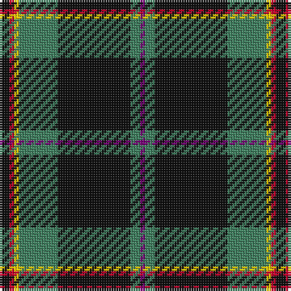

In pattern [BGKGYRK](/patterns/bgkgyrk/).

This was sourced from register-of-tartans.  It is a [7 stripes tartan](/stripes/stripes7/).

Original link https://www.tartanregister.gov.uk/tartanDetails.aspx?ref=11015

## Thread count
K/4 R2 Y2 G16 K30 G4 P/2

## Palette
Each colour and its ΔE from the base-6 reference it is a variant of.

| Colour | Shade | Base | ΔE (OKLab) |
|---|---|---|---|
| G | <code style="background-color:#408060;">#408060</code> `#408060` | G <code style="background-color:#006100;">#006100</code> | 0.14 |
| K | <code style="background-color:#101010;">#101010</code> `#101010` | K <code style="background-color:#000000;">#000000</code> | 0.17 |
| P | <code style="background-color:#780078;">#780078</code> `#780078` | B <code style="background-color:#2A418A;">#2A418A</code> | 0.17 |
| R | <code style="background-color:#C8002C;">#C8002C</code> `#C8002C` | R <code style="background-color:#CC0000;">#CC0000</code> | 0.03 |
| Y | <code style="background-color:#FCCC00;">#FCCC00</code> `#FCCC00` | Y <code style="background-color:#F2BF00;">#F2BF00</code> | 0.04 |

# Sample pattern

## Nearest tartans

The nearest existing variants by ΔTartan distance.

1. [Coalfields Regeneration Trust, The](/setts/s7/k2r1y1g8k15g2b1~b780078-g789484-k101010-ra00000-ye8c000~x4/) — ΔT 0.50
1. [Highlands of Durham (Corporate)](/setts/s6/r6b4w2g27b37y2~b1c1c1c-g408060-rc80000-wfcfcfc-ye8c000~x2/) — ΔT 0.84
1. [Vipont (Yellow line)](/setts/s7/r3g14k2b2g14k36y3~b9058d8-g006818-k101010-rc80000-ye8c000~x2/) — ΔT 0.91
1. [Hydesville Tower (Corporate)](/setts/s7/g30b6r2b2y2b15w2~b202060-g285800-rc80000-we0e0e0-yfccc00~x2/) — ΔT 1.04
1. [Highlands of Durham](/setts/s10/b37g27w2b4r6b4w2g27b37y2~b1c1c1c-g408060-rc80000-wfcfcfc-ye8c000~x2/) — ΔT 1.04
1. [Todd](/setts/s9/b40g3k3g12w3g3w3g3r3~b14283c-g285800-k101010-rc80000-wfcfcfc~x2/) — ΔT 1.08
1. [Highlands of Durham #2](/setts/s10/k37g27w2k4r6k4w2g27k37y2~g006818-k101010-rc80000-wf8f8f8-ye8c000~x2/) — ΔT 1.15
1. [New York State Troopers](/setts/s7/b6ba4b2w2b25k26y4~b575757-ba551a8b-k101010-wffffff-yd9d919~x2/) — ΔT 1.16
1. [Asheville Firefighters, The](/setts/s6/k17g48y4r10w12g4~g004028-k101010-rc80000-wa8ace8-yffe600/) — ΔT 1.16
1. [Corrie](/setts/s8/b14r1b1r1b6ra14w1ra1~b1c1c1c-r98481c-ra888888-we0e0e0~x4/) — ΔT 1.19

## Neighbour map

Every grey dot is one of 15726 variants placed by the first two principal components of the ΔTartan feature space (44% of its variance). Red is this tartan; blue dots are its nearest — click one to open its page.

<svg viewBox="0 0 640 380" role="img" style="max-width:100%;height:auto;border:1px solid #e0e0e0;border-radius:4px;display:block" xmlns="http://www.w3.org/2000/svg"><image href="/nn/cloud.v1.png" width="640" height="380"/><a href="/setts/s7/k2r1y1g8k15g2b1~b780078-g789484-k101010-ra00000-ye8c000~x4/"><circle cx="308.2" cy="151.9" r="4" fill="#3465a4"><title>Coalfields Regeneration Trust, The</title></circle></a><a href="/setts/s6/r6b4w2g27b37y2~b1c1c1c-g408060-rc80000-wfcfcfc-ye8c000~x2/"><circle cx="299.2" cy="159.8" r="4" fill="#3465a4"><title>Highlands of Durham (Corporate)</title></circle></a><a href="/setts/s7/r3g14k2b2g14k36y3~b9058d8-g006818-k101010-rc80000-ye8c000~x2/"><circle cx="301.1" cy="160.2" r="4" fill="#3465a4"><title>Vipont (Yellow line)</title></circle></a><a href="/setts/s7/g30b6r2b2y2b15w2~b202060-g285800-rc80000-we0e0e0-yfccc00~x2/"><circle cx="304.4" cy="162.3" r="4" fill="#3465a4"><title>Hydesville Tower (Corporate)</title></circle></a><a href="/setts/s10/b37g27w2b4r6b4w2g27b37y2~b1c1c1c-g408060-rc80000-wfcfcfc-ye8c000~x2/"><circle cx="309.4" cy="148.7" r="4" fill="#3465a4"><title>Highlands of Durham</title></circle></a><a href="/setts/s9/b40g3k3g12w3g3w3g3r3~b14283c-g285800-k101010-rc80000-wfcfcfc~x2/"><circle cx="301.4" cy="136.6" r="4" fill="#3465a4"><title>Todd</title></circle></a><a href="/setts/s10/k37g27w2k4r6k4w2g27k37y2~g006818-k101010-rc80000-wf8f8f8-ye8c000~x2/"><circle cx="309.8" cy="153.2" r="4" fill="#3465a4"><title>Highlands of Durham #2</title></circle></a><a href="/setts/s7/b6ba4b2w2b25k26y4~b575757-ba551a8b-k101010-wffffff-yd9d919~x2/"><circle cx="255.5" cy="167.0" r="4" fill="#3465a4"><title>New York State Troopers</title></circle></a><a href="/setts/s6/k17g48y4r10w12g4~g004028-k101010-rc80000-wa8ace8-yffe600/"><circle cx="259.4" cy="178.9" r="4" fill="#3465a4"><title>Asheville Firefighters, The</title></circle></a><a href="/setts/s8/b14r1b1r1b6ra14w1ra1~b1c1c1c-r98481c-ra888888-we0e0e0~x4/"><circle cx="323.4" cy="167.9" r="4" fill="#3465a4"><title>Corrie</title></circle></a><circle cx="317.6" cy="158.5" r="5" fill="#c00000"/></svg>

ID: /setts/s7/k2r1y1g8k15g2b1~b780078-g408060-k101010-rc8002c-yfccc00~x2/
