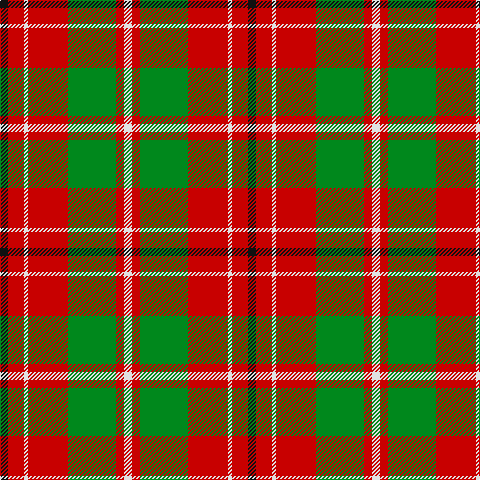

In pattern [KRWRGRW](/stripes/krwrgrw/).

This was sourced from tartans-authority.  It is a [7 stripe tartan](/stripes/stripes7/).

Original link http://www.tartansauthority.com/tartan-ferret/display/8223/

## Thread count
K/8 R16 LN4 R40 G48 R8 LN/8

## Palette
Each colour and the base-6 reference it is a variant of.

| Colour | Shade | Base |
|---|---|---|
| G | <code style="background-color:#00881C;">#00881C</code> `oklch(54.4% 0.175 144.2)` <small>#00881C</small> | G <code style="background-color:#006100;">#006100</code> |
| K | <code style="background-color:#101010;">#101010</code> `oklch(17.3% 0.000 89.9)` <small>#101010</small> | K <code style="background-color:#000000;">#000000</code> |
| LN | <code style="background-color:#E0E0E0;">#E0E0E0</code> `oklch(90.7% 0.000 89.9)` <small>#E0E0E0</small> | W <code style="background-color:#F7F7F7;">#F7F7F7</code> |
| R | <code style="background-color:#C80000;">#C80000</code> `oklch(52.3% 0.215 29.2)` <small>#C80000</small> | R <code style="background-color:#CC0000;">#CC0000</code> |

# Sample pattern

## Nearest tartans

The nearest existing variants by ΔTartan distance, with this tartan at the top so the swatches line up against it.

ΔTartan

Tartan

Sett

—

<a href="/ttd/edit/#slug=k2r4w1r10g12r2w2~x4">Starr (1978) (Name)</a> <a class="nn-out" href="/setts/s7/k2r4w1r10g12r2w2~x4/" title="open its dictionary page">↗</a>

0.92

<a href="/ttd/edit/#slug=r15k1ly2db3r2k1ly15~x6">Scrymgeour</a> <a class="nn-out" href="/setts/s7/r15k1ly2db3r2k1ly15~x6/" title="open its dictionary page">↗</a>

0.92

<a href="/ttd/edit/#slug=r15k1ly2db3r2k1ly15~x3">Scrymgeour</a> <a class="nn-out" href="/setts/s7/r15k1ly2db3r2k1ly15~x3/" title="open its dictionary page">↗</a>

0.93

<a href="/ttd/edit/#slug=g28r7m7g14m7r48k4~x2">MacNab 6</a> <a class="nn-out" href="/setts/s7/g28r7m7g14m7r48k4~x2/" title="open its dictionary page">↗</a>

0.93

<a href="/ttd/edit/#slug=k2r16g6r3g8w1~x2">MacAulay</a> <a class="nn-out" href="/setts/s6/k2r16g6r3g8w1~x2/" title="open its dictionary page">↗</a>

0.94

<a href="/ttd/edit/#slug=k4r5k2lo21g8k2~x2">MacDuck #2</a> <a class="nn-out" href="/setts/s6/k4r5k2lo21g8k2~x2/" title="open its dictionary page">↗</a>

0.95

<a href="/ttd/edit/#slug=do5lo4do26lo26do4lo3w5~x2">Elgin District Tartan Tartan Number: 2196. Earliest known date: 1998 A sample of this tartan was recorded by the Scottish Tartans Society during the period 1970 to 1990. See products available Copyright © Blair Urquhart, Comrie, 2015</a> <a class="nn-out" href="/setts/s7/do5lo4do26lo26do4lo3w5~x2/" title="open its dictionary page">↗</a>

0.95

<a href="/ttd/edit/#slug=g9r2g9r14k1w2~x2">MacGregor of Balquidder (Logan)</a> <a class="nn-out" href="/setts/s6/g9r2g9r14k1w2~x2/" title="open its dictionary page">↗</a>

1.00

<a href="/ttd/edit/#slug=g9r2g9r14k1w2~x4">MacGregor of Balquidder - 1831 (Clan</a> <a class="nn-out" href="/setts/s6/g9r2g9r14k1w2~x4/" title="open its dictionary page">↗</a>

1.02

<a href="/ttd/edit/#slug=db6lo25dy16k2db3~x2">Prince of Orange #2</a> <a class="nn-out" href="/setts/s5/db6lo25dy16k2db3~x2/" title="open its dictionary page">↗</a>

1.03

<a href="/ttd/edit/#slug=db1r12g6ly1g6db1~x4">Cetoloni (Personal)</a> <a class="nn-out" href="/setts/s6/db1r12g6ly1g6db1~x4/" title="open its dictionary page">↗</a>

## Neighbour map

Every grey dot is one of 14299 variants placed by the first two principal components of the ΔTartan feature space (44% of its variance). Red is this tartan; blue dots are its nearest — click one to open its page.

<svg viewBox="0 0 640 380" role="img" style="max-width:100%;height:auto;border:1px solid #e0e0e0;border-radius:4px;display:block" xmlns="http://www.w3.org/2000/svg"><image href="/nn/cloud.v1.png" width="640" height="380"/><a href="/setts/s7/r15k1ly2db3r2k1ly15~x6/"><circle cx="267.0" cy="149.1" r="4" fill="#3465a4"><title>Scrymgeour</title></circle></a><a href="/setts/s7/r15k1ly2db3r2k1ly15~x3/"><circle cx="267.0" cy="149.1" r="4" fill="#3465a4"><title>Scrymgeour</title></circle></a><a href="/setts/s7/g28r7m7g14m7r48k4~x2/"><circle cx="289.3" cy="186.9" r="4" fill="#3465a4"><title>MacNab 6</title></circle></a><a href="/setts/s6/k2r16g6r3g8w1~x2/"><circle cx="315.2" cy="181.0" r="4" fill="#3465a4"><title>MacAulay</title></circle></a><a href="/setts/s6/k4r5k2lo21g8k2~x2/"><circle cx="247.2" cy="181.5" r="4" fill="#3465a4"><title>MacDuck #2</title></circle></a><a href="/setts/s7/do5lo4do26lo26do4lo3w5~x2/"><circle cx="263.2" cy="188.5" r="4" fill="#3465a4"><title>Elgin District Tartan Tartan Number: 2196. Earliest known date: 1998 A sample of this tartan was recorded by the Scottish Tartans Society during the period 1970 to 1990. See products available Copyright © Blair Urquhart, Comrie, 2015</title></circle></a><a href="/setts/s6/g9r2g9r14k1w2~x2/"><circle cx="298.1" cy="198.9" r="4" fill="#3465a4"><title>MacGregor of Balquidder (Logan)</title></circle></a><a href="/setts/s6/g9r2g9r14k1w2~x4/"><circle cx="289.3" cy="194.3" r="4" fill="#3465a4"><title>MacGregor of Balquidder - 1831 (Clan</title></circle></a><a href="/setts/s5/db6lo25dy16k2db3~x2/"><circle cx="277.3" cy="200.3" r="4" fill="#3465a4"><title>Prince of Orange #2</title></circle></a><a href="/setts/s6/db1r12g6ly1g6db1~x4/"><circle cx="288.3" cy="197.8" r="4" fill="#3465a4"><title>Cetoloni (Personal)</title></circle></a><circle cx="264.8" cy="177.1" r="5" fill="#c00000"/></svg>

ID: /setts/s7/k2r4w1r10g12r2w2~x4/
